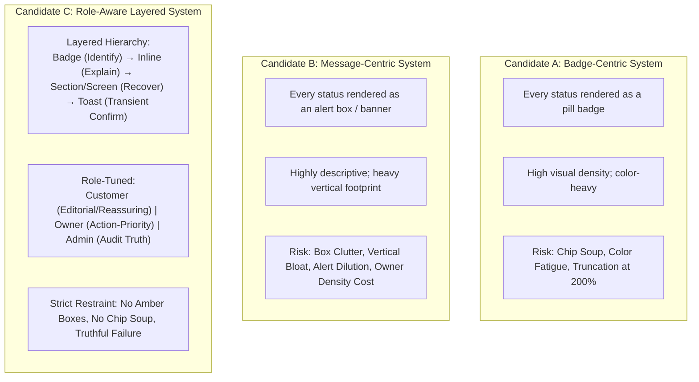

# Phase 4G — Content & State Presentation System Evaluation

**Document Version:** 1.0.0
**Phase:** Phase 4G — Content & State Presentation System
**Status:** `PILOT_EVALUATION_DRAFT`
**Purpose:** Comparative architectural evaluation of candidate state presentation systems against KONFRM Business Canon, Founder Rules, and Multi-Role UX Requirements.

---

## 1. Candidate Presentation Hypotheses (Section 40)

To resolve the state presentation requirements of KONFRM without preconceptions, three structurally distinct candidate systems were formulated and evaluated:

### Candidate A: Badge-Centric System
- **Core Concept:** Primary delivery mechanism for all statuses and states is a compact pill badge or chip.
- **Hypothesis:** Maximizes screen efficiency and provides a uniform, highly scannable UI across all screens.
- **Observed Failure Modes:**
  - *Explanatory Integrity & Recovery Failure:* High-stakes states (e.g. rejected booking, payment failure, changed quote) cannot fit necessary explanatory copy into a compact badge. A badge alone cannot satisfy the recovery contract.
  - *Status-Chip Soup:* Screens accumulate multiple colored pills (e.g. Property status + Payment status + Booking status + Verification badge) creating chaotic visual noise (a major system design quality defect).
  - *Color Over-Dependence:* Users must decipher subtle color distinctions between badges to understand urgency.
  - *Empirical 200% Scaling Impact:* Under true 200% text scaling (`candidate_a_customer_bookings_200.png`), badges wrap into 3 vertical rows without horizontal clipping, but the dense pill wrapping degrades readability without providing actionable explanation.
  - **Verdict:** **FAILS HARD GATE** (`STATE_EXPLANATION_AND_RECOVERY_CONTRACT: FAIL`). A global badge-only architecture cannot represent the four critical state questions for Error, Conflict, Unauthorized, or consequential failure.

---

### Candidate B: Message-Centric System
- **Core Concept:** Primary delivery mechanism is an explicit, boxed message card or banner for every status change, notice, or process milestone.
- **Hypothesis:** Maximizes user understanding by providing complete, self-contained explanatory boxes everywhere.
- **Fair Evaluation:**
  - *Founder Rule MR-17 Compliance:* Candidate B renders using neutral/slate containers (`#F1F5F9`, border `#CBD5E1`) and does NOT violate Founder Rule MR-17. It is not inherently an amber/yellow violation.
  - *Role Fit & Structural Congruence Failure:* Stacking boxed alert containers on routine Customer states contradicts the approved Open Editorial structural model (Phase 4E).
  - *Useful Density Degradation:* On Owner operational hubs, boxed message banners consume excessive vertical space, pushing urgent operational queue items off-screen.
  - *Alert Salience Dilution:* When normal procedural milestones (e.g. approved pending payment) look like large alert banners, truly critical alerts lose perceptual prominence.
  - **Verdict:** **VALID_ALTERNATIVE_NOT_SELECTED (NO HARD GATE FAILURE)** — Passes all Hard Gates including MR-17 with neutral slate containers, but rejected as global default due to Customer Open Editorial contradiction, Owner useful density loss, box fatigue, and alert salience dilution.

---

### Candidate C: Role-Aware Layered State System
- **Core Concept:** A disciplined, multi-layered delivery hierarchy governed by information density, consequence, and role context:
  1. **Layer 1 — Identification (`STATUS_BADGE` / `LABEL`):** Used when the user simply needs to recognize a canonical state (e.g. a confirmed booking in a list, a published property). Uses subtle neutral or semantic tones; never overused.
  2. **Layer 2 — Contextual Explanation (`INLINE_TEXT` / `OPEN_TYPOGRAPHY`):** Used for normal process guidance (e.g. *"طلبك وصل للمالك وبانتظار قراره"*). Relies on clean typography on natural surfaces without box wrappers. Zero response SLA is promised.
  3. **Layer 3 — Actionable Recovery (`SECTION_ALERT` / `SCREEN_STATE`):** Used only when an operation fails, data is unavailable, or a user decision is required to proceed. Includes plain Arabic consequence and retry.
  4. **Layer 4 — Transient Confirmation (`TOAST`):** Reserved exclusively for routine, completed, low-risk actions (e.g. *"تم حفظ التغييرات"*). Exact duration is OPEN / component-and-platform-gated. Critical errors never use toasts.
  - *Consequential Decisions:* Irreversible, high-consequence decisions invoke the already-governed Phase 4F Dialog overlay surface. Dialogs are an existing overlay mechanism, not a fifth state-delivery layer in Phase 4G.
- **Role Alignment:**
  - *Customer:* Reassuring, editorial, open whitespace, calm status indicators.
  - *Owner:* Action-priority, high density, clear separation of pending vs available money.
  - *Admin:* Audit truth, structured data tables, failure fails closed with zero fake zero metrics.
- **Verdict:** **RECOMMENDED (STRONG CONSENSUS)** — Fully compliant with Canon, MR-17, Open Editorial architecture, and controlled Web reflow standards.

---

## 2. Evaluation Against the 15 Design Court Questions (Section 60)

| # | Question | Candidate A (Badge) | Candidate B (Message) | Candidate C (Layered - Recommended) |
| :-: | :--- | :--- | :--- | :--- |
| **1** | Default hierarchy for identifying vs explaining vs recovering? | Single flat badge layer for all. | Boxed alert banner for everything. | **Strict 4-tier layer:** Subtle Badge (Identify) → Inline Text (Explain) → Section/Screen Alert (Recover) → Toast (Transient Confirm). Consequential decisions invoke Phase 4F Dialog overlays. |
| **2** | When is badge enough? | Everywhere (Excessive). | Rarely (Replaced by boxes). | **When state identification is self-sufficient** (e.g. `CONFIRMED` in history list, `PUBLISHED` unit). |
| **3** | When is inline text enough? | Never (Forces badge). | Rarely (Forces box). | **For normal process progression** (e.g. booking request sent, wallet 24h payout eligibility notice). |
| **4** | When is persistent alert required? | Overflows badge space. | Used constantly. | **When an action is blocked, a section fails, or revalidation requires user attention.** |
| **5** | When is full-screen state appropriate? | Avoided improperly. | Overused. | **When top-level data cannot load at all, or a clean zero-data state requires dedicated redirection.** |
| **6** | When is toast allowed? | Overused for errors. | Deprecated. | **Only for transient confirmation of low-risk, completed actions.** Exact duration is OPEN / component-and-platform-gated. Never for critical errors. |
| **7** | How should normal Pending differ from Warning? | Badge-only presentation compresses normal process and caution into same delivery mechanism. | Same alert box. | **Normal Pending is neutral/soft-blue process state.** Warning is reserved for genuine caution, consequential risk, or action requiring elevated attention when supported by canonical context. |
| **8** | How should Error differ visually from Empty? | Similar badges. | Similar boxes. | **Empty explains normal absence with positive next action. Error explains failure with honest retry.** |
| **9** | How should Partial differ from Error? | Obscured. | Dual alert boxes. | **Successful sections stay interactive; failed section shows scoped alert + retry.** |
| **10** | How should Stale safe data be presented? | Stale badge. | Boxed informational banner. | **Retains safe content with neutral/soft-blue informational notice and retry.** (No amber box). |
| **11** | How should Unauthorized differ from Error? | Auth error badge. | Generic error box. | **Fails closed, clears private data, states session expiration, offers re-authentication CTA.** |
| **12** | How should Conflict / changed quote be explained? | Generic status badge. | Generic error banner. | **Dedicated review notice highlighting changed values, blocking submission until accepted.** |
| **13** | How should each role's tone differ? | Identical badges. | Identical banners. | **Customer: Reassuring. Owner: Action-priority / financial certainty. Admin: Structured audit truth.** |
| **14** | Which current Web behaviors must be rejected? | Chip soup. | Box fatigue / alert dilution. | **Reject amber session expired box (Screen 12); reject silent `.catch(() => [])` in Owner payout metadata; reject routine alert box clutter.** |
| **15** | Which exact semantic colors remain open? | Presumes colors. | Presumes colors. | **All exact semantic colors remain OPEN / token-gated.** Phase 4G governs semantic roles only. |

---

## 3. Specialized State Pattern Verification

### 3.1 True Empty vs Error Separation (Section 50)
The visual distinction between genuine data absence and server failure was tested and verified across three key domains:

1. **Customer Search:**
   - *True Empty (Zero Matches):* Compass icon, calm headline *"لا توجد نتائج تطابق بحثك"*, supportive copy suggesting adjusting dates or destination, and a primary `[إعادة ضبط الفلاتر]` button.
   - *Error State:* Alert icon, rose-tinted border, clear headline *"تعذر تحميل الإقامات"*, supportive copy stating network issue, and an explicit `[إعادة المحاولة]` button.
2. **Owner Booking Queue:**
   - *True Empty:* Calendar icon, calm headline *"لا توجد طلبات حجز حالياً"*, informative copy stating new requests will appear here immediately. Zero alert framing.
   - *Error State:* Scoped error panel inside the queue container, stating *"تعذر تحميل طلبات الحجز"* with retry CTA.
3. **Admin Verification Queue:**
   - *True Empty:* CheckCircle icon, headline *"قائمة المراجعة مكتملة بالكامل"*, confirming zero items currently pending.
   - *Error State:* Full table error replacement, headline *"تعذر تحميل قائمة المراجعة"*, confirming query failure without rendering misleading 0 counts.

### 3.2 Partial State Verification (Section 51)
- **Representative Scenario:** Owner Home Dashboard where Booking Requests load successfully, but Owner Wallet balance query encounters a network timeout.
- **Behavior:** The Booking Requests queue renders fully interactive with actionable decision buttons. The Wallet summary container renders an isolated neutral/soft-blue alert: *"تعذر تحميل بيانات المحفظة حالياً"* with an inline `[إعادة المحاولة]` button.
- **Integrity Rule:** Zero financial truth is fabricated; no `0 ج.م` fallback is rendered.

### 3.3 Stale Safe Data Verification (Section 51)
- **Representative Scenario:** Customer Explore feed where user previously retrieved property listings, but a background pull-to-refresh fails due to intermittent connectivity.
- **Behavior:** The previously retrieved property cards remain visible. A top informational banner (soft-blue/neutral, compliant with MR-17) explicitly states: *"تعذر تحديث النتائج. قد تكون الأسعار والتوافر قد تغيرت. يتم عرض آخر بيانات محفوظة."* with a subtle `[تحديث]` button.
- **Decision-Critical Integrity Contract:** Safe catalog read data may preserve listing recognition (title, location, photo); decision-critical prices and availability are NOT presented as freshly verified. Stale prices are explicitly marked non-current (*"آخر سعر معروف: 3,500 ج.م (يحتاج تحديث)"*) or withheld until refresh. Proceeding to property detail re-fetches canonical server truth fail-closed.

### 3.4 Conflict / Changed Quote Verification (Section 52)
- **Representative Scenario:** Customer Booking Request Review (Screen 07, matching C4 authority) where the nightly rate changed on the server between initial property viewing and checkout submission.
- **Behavior:** The submission CTA is disabled. A high-contrast informational card highlights the price difference:
  - *Old Total:* `3,200 ج.م` (Strikethrough)
  - *New Total:* `3,500 ج.م` (Highlighted)
  - *Explanation:* *"تم تحديث سعر الإقامة من قبل المالك. يرجى مراجعة القيمة الجديدة قبل إرسال الطلب."*
  - *Action:* `[موافق على السعر الجديد وإرسال الطلب]` and `[إلغاء والعودة]` (aligned exactly with Screen 07 C4 authority).

### 3.5 Accessibility & 200% Text Scaling Verification (Section 53, 55)
- Controlled Web pilot reflow passes across all states when root typography is scaled to 200%; native mobile accessibility acceptance is deferred to Phase 4I.
- Empirical candidate comparison at true 200% (`candidate_a/b/c_customer_bookings_200.png`):
  - *Candidate A:* Badges wrap into 3 vertical lines (`موافقة المالك`, `سداد العربون مطلوب`, `لتأكيد الحجز`, `BK-183223`), creating visual clutter without providing contextual explanation.
  - *Candidate B:* Explanatory box expands dramatically, consuming significant vertical height and pushing property card content down.
  - *Candidate C:* High-contrast status badge wraps naturally across 2 lines; ID wraps cleanly below; subtext and Primary CTA remain immediately legible and scannable without clipping or truncation.
- Color is never the sole carrier of semantic meaning; every state includes explicit textual Arabic labels.
