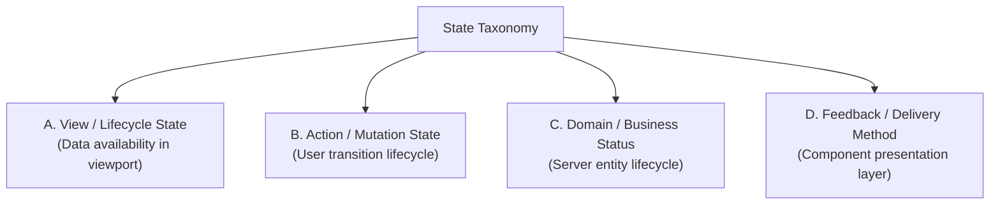

# Phase 4G — State Taxonomy & Content Grammar

**Document Version:** 1.0.0
**Phase:** Phase 4G — Content & State Presentation System
**Status:** `PILOT_TAXONOMY_DRAFT`
**Purpose:** Precise four-category taxonomy and content grammar governing state presentation across KONFRM.

---

## 1. Four-Category State Taxonomy (Section 7)

State presentations must never collapse distinct concerns into a generic "status". KONFRM strictly separates:

### Category A: View / Data-Lifecycle State
Governs whether the data requested for a screen or section exists, is in flight, failed, or is constrained by environment:
1. **`LOADING`**: Data request in flight. Layout structure preserved with Skeleton when shape is predictable; bounded progress/spinner when shape is variable or in-place action executes.
2. **`LOADED`**: Canonical data successfully retrieved and populated in viewport.
3. **`EMPTY`**: Data request succeeded, but canonical dataset genuinely contains 0 items. Must clearly answer: *What is absent? Why is it normal? What can the user do next?*
4. **`ERROR`**: Data request failed (network, server, or validation failure). **Must NEVER masquerade as Empty.** Identifies scope, plain-language failure, what remains safe, and retry path.
5. **`OFFLINE`**: Connectivity lost. Transactional data (money, availability) fails closed. Safe last-known read-only data may display with clear disconnected notice. **No offline mutation queue.**
6. **`UNAUTHORIZED`**: Authentication missing or expired. Distinct from Empty or generic Error. Fails closed, clears private session data, offers re-authentication with safe continuation intent.
7. **`PARTIAL`**: Independent section failed while others succeeded. Failed section shows scoped error/retry; successful sections remain usable. Never substitutes `0` or empty list for failed section.
8. **`STALE`**: Safe cached/last-known data remains visible after background refresh failure. Marked honestly with neutral/soft-blue informational notice and retry. **No yellow/amber boxed styling.**

---

### Category B: Action / Mutation State
Governs the in-flight state of a user-initiated command or form submission:
1. **`IDLE`**: Control ready for user input; validation passed or untouched.
2. **`SUBMITTING`**: Mutation in flight. Control disabled to prevent duplicate submission; label shows active in-flight wording (e.g. *"جارٍ إرسال الطلب..."*); context preserved. No fake success animations before server confirmation.
3. **`SUCCEEDED`**: Server confirmed command completion. Triggers state-appropriate feedback (Toast for low-risk routine tasks; Dedicated surface for high-consequence milestones).
4. **`FAILED`**: Server rejected mutation. Control returns to interactive state; specific error message displayed near decision point.
5. **`CONFLICTED`**: Server state changed while client was deciding (e.g. quote changed, dates booked). Blocks submission until user reviews and acknowledges the newly canonical truth.
6. **`DISABLED`**: Action temporarily unavailable due to unsatisfied product preconditions. When reason is non-obvious, truthful explanatory helper text is required.

---

### Category C: Domain / Business Status
Server-authoritative entity lifecycle enums (defined by Business Canon, presented by Design System):
- **Property**: `DRAFT`, `PENDING_REVIEW`, `PUBLISHED`, `REJECTED`, `PAUSED`
- **Booking**: `PENDING_OWNER_APPROVAL`, `APPROVED_PENDING_PAYMENT`, `CONFIRMED`, `REJECTED`, `CANCELLED`, `EXPIRED`
- **Payment**: `INITIATED`, `PENDING`, `SUCCEEDED`, `FAILED`
- **Owner Wallet Balance Buckets (`owner_wallets`)**: `AVAILABLE`, `PENDING` (releases 24h after check-in), `HELD`, `RESERVED_FOR_PAYOUT`
- **Payout Request Lifecycle (`payout_requests`, Migration 008)**: `PENDING_ADMIN_PROCESSING`, `PROCESSING`, `COMPLETED`, `UNKNOWN`, `FAILED`, `REJECTED`, `CANCELLED_BY_OWNER` (Owner presentation mapping: `PENDING`, `PROCESSING`, `COMPLETED`, `REJECTED`, `CANCELLED`)
- **Identity & Verification**: Owner KYC: `UNVERIFIED`, `PENDING_VERIFICATION`, `VERIFIED`, `REJECTED`. Customer Auth V2: specific verified contact attributes only; generic customer trust badge is not authorized (`CUSTOMER_IDENTITY_TRUST_BADGE: NOT_AUTHORIZED`).

*Governing Rule:* Process states (`PENDING_OWNER_APPROVAL`, `PENDING_REVIEW`, `Wallet PENDING`) are normal operational stages and **MUST NOT** be presented with warning/alarm visual semantics. Zero yellow/amber boxed UI (Founder Rule MR-17).

---

### Category D: Feedback / Message Delivery Method
The UI surface chosen to deliver state information (governed by the strict 4-layer state delivery hierarchy, with consequential decisions invoking Phase 4F Dialog overlays):
1. **Layer 1 — `STATUS_BADGE`**: Compact label identifying canonical entity status. Badges identify state; they do not substitute for required explanatory copy.
2. **Layer 2 — `INLINE_MESSAGE` / `OPEN_TYPOGRAPHY`**: Scoped helper text or status caption placed immediately adjacent to an input or data point on natural surfaces for normal process milestones.
3. **Layer 3 — `SECTION_ALERT` / `SCREEN_STATE`**: Persistent panel scoped to an individual card or full screen. Used when a section fails, an action is blocked, or explicit revalidation/recovery is required.
4. **Layer 4 — `TOAST`**: Transient floating notification (exact duration OPEN / component-and-platform-gated) confirming routine, completed low-risk actions. **Critical errors and mandatory actions must never rely solely on toasts.**
- *Consequential Decisions:* Irreversible, high-consequence decisions invoke the already-governed Phase 4F `DIALOG` overlay surface. Dialogs are an existing overlay mechanism, not a fifth state-delivery layer in Phase 4G.

---

## 2. The Four Critical State Questions (Section 6)

Every state presentation must answer up to four questions:

| Question | Purpose | Example: Customer Stale Search | Example: Owner Booking Conflict |
| :--- | :--- | :--- | :--- |
| **1. WHAT HAPPENED?** | Plain-language statement of the situation | *"تعذر تحديث نتائج البحث"* | *"تم تحديث سعر الإقامة من قبل المالك"* |
| **2. WHAT IS STILL TRUE?** | What safe context is preserved | *"النتائج المعروضة أدناه هي آخر نتائج تم جلبها"* | *"بيانات التواريخ وعدد الضيوف لا تزال كما اخترتها"* |
| **3. WHAT IS UNKNOWN / NOT CURRENT?** | Honest boundary of knowledge | *"قد لا تعكس النتائج أحدث تواريخ التوافر"* | *"السعر السابق لم يعد متاحًا للحجز"* |
| **4. WHAT CAN THE USER DO NEXT?** | Explicit actionable recovery path | `[إعادة التحديث]` | `[مراجعة السعر الجديد والمتابعة]` |

---

## 3. Detailed Presentation Grammar

### 3.1 Loading Grammar
- **Predictable Geometry (Feeds, Lists, Profiles):** Use structure-preserving skeleton loaders matching target aspect ratios (e.g. 1.4:1 property cards, metric cards). Avoid decorative skeleton art.
- **Dynamic / In-Place Operations (Calculations, Filters):** Use bounded progress indicator or subtle in-place spinner.
- **Context Preservation:** Loading a filter or refreshing a list must never blank out existing safe content if it can remain visible with an overlay indicator.

### 3.2 Empty vs Search Zero Results Grammar
- **Marketplace Empty (No Properties Exist):** Indicates genuine inventory absence.
  *Copy:* *"لا توجد إقامات منشورة حالياً"* / *"يتم إضافة وحدات جديدة باستمرار، تفقد التطبيق لاحقاً."*
- **Search Zero Results (Filters Too Restrictive):** Indicates mismatch with search criteria.
  *Copy:* *"لا توجد نتائج تطابق بحثك"* / *"جرّب تغيير الوجهة، أو تعديل التواريخ، أو إزالة بعض الفلاتر لعرض خيارات أكثر."*
  *Action:* `[إعادة ضبط الفلاتر]` (Primary Action).

### 3.3 Error Grammar (Scope & Hierarchy)
- **Screen-Blocking Error:** Used only when the primary payload of the screen failed completely and no safe prior data exists.
  *Structure:* Centered card / surface; clear plain Arabic headline; explanation of failure without technical jargon; prominent `[إعادة المحاولة]` button.
- **Section-Level Error:** Used when a subordinate query fails (e.g. Owner Wallet summary fails on Home, but Booking queue succeeded).
  *Structure:* Scoped inline alert inside the failed container. The rest of the screen remains fully interactive.
- **Zero Technical Leaks:** Forbidden phrases on Customer/Owner surfaces: `HTTP 500`, `Supabase`, `PostgreSQL`, `RPC`, `REST`, `fetch failed`, `exception`, `timeout error`.

### 3.4 Stale & Offline Grammar (Founder Rule MR-17 Compliance)
- **Founder Rule:** NO yellow/amber/orange boxed UI for stale notices.
- **Stale Visual Contract:** Neutral or soft-blue informational surface (`bg-slate-50 border-slate-200` or `bg-blue-50/50 border-blue-100`). Blue or neutral retry button.
- **Transactional Boundary:** Availability and money truth cannot be presented as "safely stale". If fresh availability cannot be verified, booking submission MUST fail closed.
- **Decision-Critical Data Contract:** Stale cached discovery cards may preserve recognition context (title, photos), but decision-critical data (prices, dates) must NOT appear freshly verified. Stale prices must be clearly marked non-current (e.g. *"آخر سعر معروف: 3,500 ج.م (يحتاج تحديث)"*) or withheld until refresh. Proceeding to detail or quote re-fetches canonical server truth fail-closed.

### 3.5 Conflict / Changed Truth Grammar
- **Trigger:** Server revalidation returns a price change, availability block, or status shift between initial review and submission.
- **Visual Presentation:** Scoped informational dialogue or dedicated review alert. Highlights the exact delta in bold Arabic.
- **Action Gate:** Disables previous submission CTA. Provides `[مراجعة الشروط الجديدة والمتابعة]` or `[إلغاء والعودة]`.

### 3.6 Unauthorized / Session Expired Grammar
- **Customer / Owner:** Private booking/wallet data must fail closed and clear immediately. Screen displays clear session expiration card: *"انتهت جلسة تسجيل الدخول"* / *"لحماية بياناتك، يرجى تسجيل الدخول مجددًا للمتابعة."* with `[تسجيل الدخول مجددًا]`. Interrupted intent (e.g. selected booking) preserved in memory where governed.
- **Admin:** Operational shell is blocked completely until canonical session is restored.

---

## 4. Role-Aware Content Tone & Microcopy Standards

| Dimension | Customer | Owner | Admin |
| :--- | :--- | :--- | :--- |
| **Primary Job** | Reassuring, simple, decision-oriented, trust-sensitive | Clear, operational, action-priority, financial certainty | Precise, efficient, audit truth, operational queue |
| **Tone** | Warm, respectful, clear, reassuring | Professional, direct, action-focused | Neutral, structured, concise, zero fluff |
| **Error Language** | *"تعذر إتمام العملية. تحقق من اتصالك وحاول مرة أخرى."* | *"تعذر تسجيل القرار على الطلب. يرجى إعادة المحاولة."* | *"فشل تحديث سجل المراجعة (خطوة غير مكتملة). تحقق من الصلاحيات وأعد المحاولة."* |
| **Empty Language** | *"قائمة المفضلة فارغة. استكشف الإقامات واحفظ ما يعجبك."* | *"لا توجد طلبات جديدة تحتاج قرارك اليوم."* | *"قائمة مراجعة الوحدات مكتملة بالكامل."* |
| **Forbidden Elements** | Internal commissions, 80/20 splits, database codes, fake scarcity badges | Vague financial metrics, decorative animations, marketing fluff | False zero counts, fake "all systems stable" when query failed |

### Formatting Standards:
- **Numerals:** Western Arabic numerals (`0-9`) exclusively (e.g. `1,600`, `2`, `14`).
- **Currency:** Canonical Egyptian Pound format: `1,600 ج.م`.
- **Bidirectional Isolation:** Technical IDs (`BK-183223`), phone numbers (`+201049892908`), and money values wrapped with proper LTR/RTL semantic tags (`dir="ltr"` or Unicode bidi marks).
