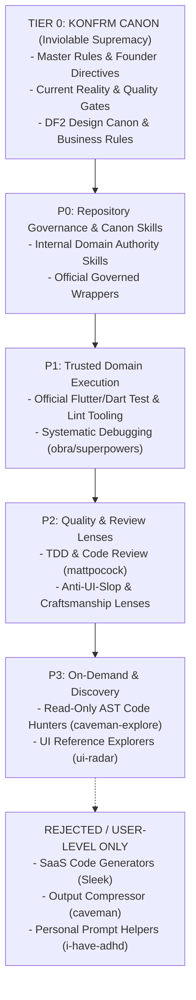
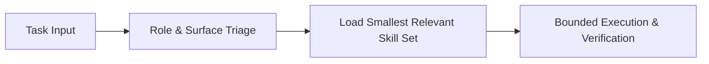

# KONFRM Agent Skills Governance V1
## Architectural Framework, Precedence Model, and Operational Safety Standards

**Document Version:** 1.0.0
**Status:** DRAFT — PENDING BRIDGE REVIEW
**Scope:** Universal Agent Tooling Architecture (Antigravity, Codex, Bridge)
**Target Repository:** `Essxm01/KONFRM`
**Base Anchor Main SHA:** `9c908d2756fba0d421e67959ecfbc13d0ca35f9b`
**Governing Authority:** KONFRM Canon, Master Rules (`docs/codex/KONFRM_MASTER_RULES.md`), Founder Operating Context (`docs/codex/KONFRM_FOUNDER_OPERATING_CONTEXT.md`)

---

## 1. Executive Summary & Purpose

As KONFRM advances its three-surface ecosystem—Customer Discovery & Booking (Flutter), Owner Operations & Availability (Flutter), and Admin Trust & Audit Operations (React 19 / Web)—agent coding autonomy must scale without compromising architectural consistency, business logic, security, or context efficiency.

The purpose of the **KONFRM Agent Skills Governance Framework (V1)** is to establish an immutable, conflict-safe operating boundary for integrating external and internal agent skills. This framework ensures that:
1. **Canon Inviolability:** No external skill, community tool, or generic industry standard may override, dilute, or contradict KONFRM Canon, Master Rules, or Founder decisions.
2. **Deterministic Precedence:** Every tool and skill operates at a clearly defined priority tier ($P0 \to P3$), resolving conflicts deterministically before code or design generation begins.
3. **Architectural Coherence:** Generic or conflicting guidance (e.g., generic BLoC/Clean Architecture vs. KONFRM Riverpod/Feature-First) is intercepted, adapted, or rejected.
4. **Context & Token Economy:** Skills are activated selectively based on role and task classification, eliminating context bloat and wasteful quota consumption.
5. **Security & Data Sovereignty:** Third-party skills requiring external network telemetry, SaaS subscriptions, or unvetted scripts are strictly isolated or rejected.

---

## 2. Inviolable Authority Hierarchy (Tier 0 — KONFRM Canon)

External skills do not define product architecture or marketplace rules; they serve purely as execution accelerators, diagnostic lenses, and craftsmanship guides.

All agent tools and skills are subordinate to **Tier 0 — KONFRM Canon**:



### Tier 0 Components
1. **Founder Explicit Decisions & Directives:** Highest governing authority (`docs/codex/KONFRM_FOUNDER_OPERATING_CONTEXT.md`).
2. **KONFRM Master Rules & Operating Contracts:** The constitutional operational rules for all agents (`docs/codex/KONFRM_MASTER_RULES.md`, `AGENTS.md`, `tasks/CURRENT_TASK.md`).
3. **Quality Gates & Verification Protocols:** Strict pass/fail acceptance criteria (`docs/codex/KONFRM_QUALITY_GATES.md`, Mobile UI QA Protocol).
4. **Design Authority (DF2 Canon):** Monochrome-first brand identity, yellow removal, `#276EF1` interaction accent candidate, Cairo typography, Arabic-first RTL, Western Arabic numerals, high useful density (`DESIGN_SYSTEM/`).
5. **Marketplace & Persistence Truth:** Supabase PostgreSQL canonical schema (`docs/DATABASE.md`) and immutable business invariants (`docs/BUSINESS_RULES.md`).

> [!CAUTION]
> If any instruction, default, heuristic, or template in an external skill conflicts with Tier 0 Canon, Tier 0 wins automatically. Agents must record the conflict in `docs/codex/KONFRM_DECISION_CONFLICTS.md` rather than adopting generic external patterns.

---

## 3. The KONFRM Skill Precedence Model (V1)

To govern tool activation and dispute resolution, all skills in the KONFRM ecosystem are classified into a five-level priority model:

### P0 — Project Canon & Repository Governance
- **Definition:** Native KONFRM skills and official governed wrappers authored specifically to enforce KONFRM standards.
- **Authority:** Full authority over repository design conventions, RTL layout, mobile ergonomics, and verification workflows.
- **Examples:**
  - `konfrm-product-ux`, `konfrm-mobile-design`, `konfrm-rtl-arabic`, `konfrm-accessibility`, `konfrm-visual-qa`
  - `konfrm-design-router`, `konfrm-design-reasoning`, `konfrm-design-court`
  - Existing governed wrappers: `frontend-design-wrapper`, `impeccable-wrapper`, `emil-wrapper`, `ui-ux-pro-max-wrapper`, `vercel-web-guidelines-wrapper`, `vercel-composition-wrapper`.

### P1 — Trusted Domain Execution
- **Definition:** Official, highly stable framework tools that provide rigorous mechanics for code execution, compilation, testing, and debugging, operating strictly within P0 boundaries.
- **Authority:** Implementation mechanics only. Cannot alter architecture, component contracts, or business logic.
- **Examples:**
  - Official Flutter skills: `flutter-add-widget-test`, `flutter-add-integration-test`, `flutter-use-http-package`
  - Official Dart skills: `dart-add-unit-test`, `dart-collect-coverage`, static analysis / linter tools
  - Systematic Debugging: `obra/superpowers/systematic-debugging` (4-phase root cause analysis).

### P2 — Quality & Review Lenses
- **Definition:** Advisory craftsmanship, testing methodologies, and heuristic critique tools that audit code quality and prevent generic "AI slop" without holding architectural authority.
- **Authority:** Advisory audit and critique only. Findings are evaluated against Canon before any changes are made.
- **Examples:**
  - Engineering Process: `mattpocock/tdd`, `mattpocock/code-review`, `mattpocock/codebase-design`
  - UI Craftsmanship: `uizze/anti-ui-slop` (adapted as a design review lens, subordinated to DF2 Canon).

### P3 — Experimental / On-Demand / Discovery
- **Definition:** Specialized search, discovery, and reference tools that are never auto-loaded into agent context and may only be invoked explicitly for bounded, read-only tasks.
- **Authority:** Advisory reference only. Zero authority to modify code or mandate design.
- **Examples:**
  - Exploration: `JuliusBrussee/caveman-explore` (read-only AST symbol hunter for cold-start navigation)
  - UI Inspiration: `uizze/ui-radar`, `Leonxlnx/taste-skill` (reference design benchmarks only).

### REJECTED / USER-LEVEL ONLY
- **Definition:** Tools that are fundamentally incompatible with KONFRM architecture, compromise security, degrade token efficiency, or belong exclusively in user personal client settings.
- **Status:** Explicitly prohibited from inclusion in repository `.agents/skills/` or CI/CD pipelines.
- **Examples:**
  - `ayghri/i-have-adhd`: Personal pacing/formatting preference; classified as **User-Level Only**.
  - `caveman` (prose compression): Rejects structured reports and degrades nuanced RTL/verification precision; classified as **Reject**.
  - `designed-by-ai/skills` (Sleek): SaaS-dependent external code generation targeting non-Flutter stacks with bearer tokens; classified as **Reject**.
  - `vercel-labs/skills` (`find-skills`): Unvetted on-the-fly network installations with telemetry; classified as **Reject**.

---

## 4. Mobile Architecture Conflict Audit & Invariants

KONFRM mobile applications operate under an authoritative architectural specification established across Phase 4 migrations. Any external skill introducing generic mobile patterns must be subordinated to these non-negotiable architectural invariants:

| Architectural Dimension | KONFRM Canonical Architecture | Conflicting Generic Guidance (To Be Rejected/Adapted) |
| :--- | :--- | :--- |
| **Framework & Language** | Flutter 3.x / Dart 3.x Native Mobile | React Native, SwiftUI, Web-wrappers, hybrid shells |
| **Directory Structure** | Feature-First (`lib/src/features/<feature_name>/...`) | Layer-first (`lib/controllers/`, `lib/views/`, `lib/models/`) |
| **Layering Model** | Presentation / Application / Data (3 layers) | Mandatory Domain layer, Clean Architecture over-engineering |
| **State Management** | Riverpod (strictly manual, without codegen initially) | BLoC, Cubit, Provider, ChangeNotifier, GetX, MobX |
| **Navigation & Routing**| `go_router` (declarative, type-safe route parameters) | `Navigator 1.0` push/pop, AutoRoute, Beamer |
| **Network Client** | `package:http` initially (lightweight, explicit error handling) | Dio (explicitly deferred), Retrofit, raw sockets |
| **Data Transfer Objects**| Manual DTOs, explicit serializers/adapters | `freezed`, `json_serializable` (codegen deferred) |
| **Offline & Mutation** | **Fail-Closed**; immediate transparent network error reporting | Optimistic offline mutation queues, background replay |
| **Financial Authority** | **Zero Local Computation**; server/database is absolute source of truth | Local fee math, client-side commission rounding, optimistic balance updates |
| **Credential Security** | `FlutterSecureStorage` abstraction, Customer/Owner isolation | Unencrypted SharedPreferences, shared multi-role tokens |

### Specific Skill Adaptation Rules
1. **`flutter-apply-architecture-best-practices`:**
   - *Conflict:* Upstream skill recommends Clean Architecture with mandatory UseCases, Domain Repositories, and BLoC.
   - *Governance Directive:* Must NOT be installed raw. Must be wrapped as `konfrm-flutter-architecture` which strips BLoC/Clean Architecture and injects Feature-First + Riverpod + Presentation/App/Data.
2. **`flutter-setup-declarative-routing`:**
   - *Governance Directive:* Must strictly enforce `go_router` route trees, deep linking schema (`konfrm://`), and role-based redirect guards (Customer vs Owner).
3. **`flutter-use-http-package`:**
   - *Governance Directive:* Approved as P1 execution skill. Enforces timeout configuration, structured HTTP status checking, and manual JSON decoding into immutable model records.

---

## 5. Marketplace Business-Rule Protections

External skills are strictly prohibited from inventing, modifying, or relaxing business rules, financial formulas, or transactional state machines.

Agents must enforce the following business invariants against any external suggestion:
1. **Booking Lifecycle Semantics:** The booking journey is an explicit, multi-party finite state machine:
   $$\text{Draft} \longrightarrow \text{Requested} \longrightarrow \text{Pending Owner Approval} \longrightarrow \begin{cases} \text{Confirmed} \\ \text{Declined} \\ \text{Expired} \\ \text{Cancelled} \end{cases}$$
   No skill may introduce instant auto-booking unless explicitly authorized by Founder decision.
2. **Platform Commission Split:** All booking financial calculations are performed exclusively by Supabase stored procedures and backend functions:
   $$\text{Total Rent Paid} = \text{Base Price} + \text{Cleaning Fee} + \text{Security Deposit}$$
   $$\text{Platform Commission} = 20\% \times \text{Base Rental Earnings}$$
   $$\text{Owner Payout} = 80\% \times \text{Base Rental Earnings} + \text{Cleaning Fee}$$
   External skills must never implement client-side fee arithmetic or alter split percentages.
3. **Calendar Availability Blocking:** Dates are blocked immediately upon request creation or owner reservation. No optimistic overlapping bookings are permitted.
4. **Security Deposit Handling:** Deposits are held in escrow and released only upon post-checkout inspection window expiry or mutual release.
5. **Wallet Ledger Immutability:** Owner balances are append-only transactional ledgers. No skill may implement direct balance overwrites.

---

## 6. Design Authority Protection (DF2 Canon)

All external UI/Design skills (`uizze`, `taste-skill`, `Sleek`, `impeccable`, `emilkowalski`) are classified as **Advisory Lenses** and must not override KONFRM Design System Canon:

1. **Brand Triangle (Trust / Clarity / Vitality):**
   - **Monochrome-First:** Deep black (`#000000` / `#111111`) and neutral gray scales (`#767676`, `#E5E5E5`, `#F6F6F6`) form the core visual structure.
   - **Yellow Removal:** The legacy yellow brand accent is completely eradicated.
   - **Restrained Interaction Accent:** Candidate blue (`#276EF1`) is reserved exclusively for primary interactive states, key CTAs, and active selection.
2. **High Useful Density:** Information hierarchy must prioritize operational certainty over decorative whitespace. Screens must display actionable property, booking, and financial data with clear grouping.
3. **Typography & Platform Geometry:**
   - Arabic & Latin typography: Cairo font family with calibrated optical scale.
   - Provisional geometry: 8dp spatial grid, restrained corner radii (4dp–12dp), avoiding exaggerated cartoon pill shapes unless explicitly specified.
4. **Arabic-First & Native RTL:**
   - Physical left/right styling is strictly forbidden; logical directional properties (`start`, `end`, `directional`) are mandatory.
   - Default numerals: Western Arabic digits (`0-9`) are standard across Arabic and English interfaces.
   - Egyptian currency formatting: Canonical format `1,600 ج.م` with strict Bidi sub-run isolation.
5. **Zero Deceptive Patterns:**
   - Synthetic scarcity counters ("Only 1 left!"), fabricated view counters ("32 people watching"), or fake social proof are strictly forbidden by Founder directive.
6. **External Design Skill Classification:**
   - **UIZZE `anti-ui-slop`:** Class: `DESIGN_REVIEW`. Used to catch generic AI card layouts, low contrast, and inert touch targets. Subordinated to DF2 palette and tokens.
   - **UIZZE `ui-radar`:** Class: `DESIGN_REFERENCE`. Used to query real-world UX patterns. Advisory only.
   - **Leonxlnx `taste-skill`:** Class: `DESIGN_REFERENCE`. Aesthetic critique only. Cannot introduce unapproved colors or fonts.
   - **`designed-by-ai` Sleek:** Class: `NOT_AUTHORITY` / `REJECT`. Incompatible SaaS code generator.

---

## 7. Skill Activation Model & Classification Engine

To preserve agent focus and prevent token exhaustion, skills must NOT be globally loaded into every prompt or agent session. Instead, skills are activated through a **Three-Step Classification Engine**:



### Standard Activation Schema
Every skill authorized in KONFRM must declare an immutable activation profile:

```yaml
skill_definition:
  name: "flutter-improving-accessibility"
  source: "flutter/agent-plugins"
  trust_level: "P1_TRUSTED_DOMAIN"
  profile: ["CUSTOMER_FLUTTER", "OWNER_FLUTTER", "QA_REVIEW"]
  activation: "EXPLICIT_OR_SCOPED"
  trigger: "Flutter UI component authoring, semantic tree modification, accessibility audit"
  required_inputs: "Target widget source, semantic node expectations"
  output_expectation: "Semantics widget integration, accessible labels, verified contrast"
  forbidden_overrides: "Cannot modify DF2 color tokens, typography scales, or layout architecture"
  conflict_resolution: "DF2 Canon supersedes upstream accessibility heuristics"
  token_cost_class: "MEDIUM"
  network_requirement: "NONE (Local only)"
  mutation_permissions: "Dart widget and test files only"
```

---

## 8. Token Economics & Context Efficiency Strategy

Every instruction loaded into an agent's context window consumes memory, reduces reasoning capacity, and increases latency. The KONFRM token strategy enforces strict efficiency standards:

### Context Budgeting by Agent Role
- **Universal Core Baseline:** Mandatory core files (`AGENTS.md`, `INDEX.md`, `CURRENT_STATE.md`, `CURRENT_TASK.md`, `KONFRM_MASTER_RULES.md`) consume $\sim 12\text{k} - 16\text{k}$ tokens.
- **Skill Allocation Ceiling:** Total skill instructions loaded for any single execution task must not exceed **$10\text{k}$ tokens**. Loading all available skills simultaneously would consume $>50\text{k}$ tokens, degrading agent reasoning quality.

### Evaluation of Caveman & Output Compression
The audit evaluated the Caveman ecosystem (`JuliusBrussee/caveman`):
- **Finding on `caveman` (Prose Compression):**
  - Upstream claim: Compresses output tokens by forcing terse, caveman-style agent responses.
  - *Reality in KONFRM:* Agent output tokens represent $<5\%$ of total token cost in complex coding workflows; input context and reasoning tokens represent $>95\%$. Furthermore, terseness degrades structured verification handshakes, RTL bidirectional analysis, and root cause debugging logs.
  - *Decision:* **REJECT** for global project governance.
- **Finding on `caveman-explore` (Repository Exploration):**
  - Upstream purpose: High-speed, read-only AST symbol locator outputting `path:line` references.
  - *Reality in KONFRM:* When an agent enters a cold-start session or investigates an unfamiliar directory, loading whole files consumes tens of thousands of tokens. `caveman-explore` provides targeted locator queries without loading entire files into conversation context.
  - *Decision:* **ON_DEMAND** (invoked as an isolated subagent explorer, never active in the primary agent context).

---

## 9. Loop Factory Architectural Evaluation

The audit evaluated `JuliusBrussee/Loop-Factory` against KONFRM's established workflow.

### Core Architecture Comparison
| Concept | Loop Factory Mechanism | KONFRM Established Architecture | Decision |
| :--- | :--- | :--- | :--- |
| **Task Management** | Rogue folders (`inbox/`, `active/`, `archive/`) | Canonical `tasks/CURRENT_TASK.md` + `docs/CURRENT_STATE.md` | **REJECT** (Prevents dual sources of truth) |
| **Requirements Challenge** | "Grill Gate" (interactive interrogation before coding) | Pre-implementation discovery & Founder escalation | **ADAPT** (Adopt as mandatory pre-flight gate on ambiguous tasks) |
| **Verification Gate** | Independent reviewer subagent checking specs | Codex P1/P2 specialist review + physical Android validation | **DUPLICATE** (KONFRM already enforces stricter verification) |
| **Spec Synchronization**| "Spec Backpropagation" (syncing spec changes during execution) | Repository Memory Maintenance (`AGENTS.md` protocol) | **ADAPT** (Mandate immediate update of `CURRENT_TASK.md` upon finding drift) |
| **Loop Iteration** | Unbounded autonomous loop until pass | Strict bounded iterations with clear blocker escalation | **REJECT** (Unbounded autonomy risks infinite loops and token drain) |

**Conclusion:** Do NOT install the Loop Factory repository wholesale. Adapt its two strongest intellectual concepts (**Grill Gate** and **Spec Backpropagation**) directly into KONFRM's existing workflow rules.

---

## 10. Security, Trust & Environmental Audit

Every skill introduced into the repository must undergo a rigorous security audit before activation:

1. **Zero External SaaS Dependencies for Core Code:**
   - Skills requiring external paid APIs or bearer tokens (e.g. `SLEEK_API_KEY` in Sleek) are prohibited from core development. All generation and testing must run locally and deterministically.
2. **Zero Unauthorized Network Telemetry:**
   - Skills that phone home or send code snippets to external analytics endpoints (e.g., telemetry in package discovery tools) are forbidden.
3. **No Unaudited Install Scripts:**
   - Running arbitrary shell scripts (`curl | sh`, post-install npm hooks) inside skills is strictly prohibited. Skills must consist solely of static markdown instructions and inspected local tools.
4. **Filesystem Mutation Restrictions:**
   - External skills may only touch files within their target profile (e.g. Flutter skills cannot touch backend SQL migrations; backend skills cannot touch UI components).
5. **License Compliance:**
   - All integrated skills must possess permissive open-source licenses (MIT, Apache 2.0, BSD-3-Clause). Copyleft or proprietary licenses are rejected.

---

## 11. Version Pinning & Vendoring Policy

To prevent supply chain poisoning, unexpected behavior drift, or broken agent workflows, external skills are subject to strict version pinning:

1. **No Auto-Upgrades (`latest` is Forbidden):**
   - No skill in `.agents/skills/` may pull dynamically from remote HEAD, latest tags, or unpinned npm/github links.
2. **Vendored Snapshot Pattern:**
   - When an external skill is approved, its exact upstream markdown source is snapshot and committed locally into:
     `docs/ai/skills/<skill-name>/vendor/UPSTREAM_SKILL.md`
   - The authoritative KONFRM wrapper is authored at:
     `docs/ai/skills/<skill-name>/SKILL.md`
   - The runtime discovery shim is placed at:
     `.agents/skills/<skill-name>/SKILL.md`
3. **Commit SHA & Audit Metadata:**
   - Every wrapper must document: Upstream URL, Pinned Commit SHA, Audit Date, Auditor Agent/Human, and Permitted Profile.
4. **Upgrades Require Explicit Review:**
   - Updating a skill requires a dedicated git diff review against the pinned snapshot, conflict evaluation against Canon, and Bridge approval.

---

## 12. Implementation Roadmap & Guardrails

The rollout of the Agent Skills Governance Framework follows a strict 4-phase sequence:

- **Phase 1 (This Mission):** Architecture, Registry, Profiles, and Install Plan specification only. **ZERO code changes, zero skill installations.**
- **Phase 2 (Bridge Review & Approval):** Founder and Bridge inspect governance artifacts and authorize specific P1/P2 candidate integrations.
- **Phase 3 (Pilot Vendoring):** Controlled vendoring of P1 Flutter/Dart testing skills and Systematic Debugging into `docs/ai/skills/`.
- **Phase 4 (Profile-Based Activation):** Updating context router to activate skills based on task classification.
