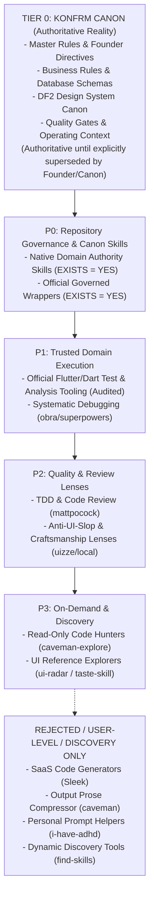
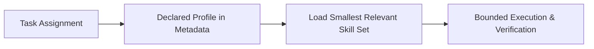

# KONFRM Agent Skills Governance V1
## Architectural Framework, Precedence Model, and Operational Safety Standards

**Document Version:** 1.1.0
**Status:** DRAFT — PENDING BRIDGE REVIEW
**Scope:** Universal Agent Tooling Architecture (Antigravity, Codex, Bridge)
**Target Repository:** `Essxm01/KONFRM`
**Base Anchor Main SHA:** `9c908d2756fba0d421e67959ecfbc13d0ca35f9b`
**Governing Authority:** KONFRM Canon, Master Rules (`docs/codex/KONFRM_MASTER_RULES.md`), Founder Operating Context (`docs/codex/KONFRM_FOUNDER_OPERATING_CONTEXT.md`)

---

## 1. Executive Summary & Purpose

As KONFRM advances its three-surface ecosystem—Customer Discovery & Booking (Flutter), Owner Operations & Availability (Flutter), and Admin Trust & Audit Operations (React 19 / Web)—agent coding autonomy must scale without compromising architectural consistency, business logic, security, or context efficiency.

The purpose of the **KONFRM Agent Skills Governance Framework (V1)** is to establish an immutable, conflict-safe operating boundary for evaluating and integrating external and internal agent skills. This framework ensures that:
1. **Canon Supremacy:** No external skill, community tool, or generic industry standard may override, dilute, or contradict KONFRM Canon, Master Rules, or Founder decisions. Tier 0 Canon is authoritative until explicitly superseded by a later accepted Founder or Canon decision.
2. **Deterministic Precedence:** Every tool and skill operates at a clearly defined priority tier ($P0 \to P3$), resolving conflicts deterministically before code or design generation begins.
3. **Architectural Coherence:** Generic or conflicting guidance (e.g., generic MVVM/ChangeNotifier/layer-first vs. KONFRM Riverpod/Feature-First) is intercepted, adapted, or rejected.
4. **Context & Token Economy:** Skills are activated selectively based on role and task classification, eliminating context bloat and wasteful quota consumption. Qualitative token budgets are enforced.
5. **Security & Data Sovereignty:** Third-party skills requiring external network telemetry, SaaS subscriptions, or unvetted scripts are strictly isolated or rejected.
6. **No Duplicate Source of Truth:** This Governance layer does not redefine or duplicate mutable financial formulas, booking state machines, wallet rules, or design tokens. It references authoritative Canon repositories.

---

## 2. Inviolable Authority Hierarchy (Tier 0 — KONFRM Canon)

External skills do not define product architecture or marketplace rules; they serve purely as execution accelerators, diagnostic lenses, and craftsmanship guides.

All agent tools and skills are strictly subordinate to **Tier 0 — KONFRM Canon**:

### Tier 0 Components & Authority Lifecyle
1. **Founder Explicit Decisions & Directives:** Highest governing authority (`docs/codex/KONFRM_FOUNDER_OPERATING_CONTEXT.md`).
2. **KONFRM Master Rules & Operating Contracts:** The constitutional operational rules for all agents (`docs/codex/KONFRM_MASTER_RULES.md`, `AGENTS.md`, `tasks/CURRENT_TASK.md`).
3. **Quality Gates & Verification Protocols:** Strict pass/fail acceptance criteria (`docs/codex/KONFRM_QUALITY_GATES.md`, Mobile UI QA Protocol).
4. **Design Authority (DF2 Canon):** Mobile Foundation v1.7 published state, monochrome-first identity, yellow eradication, Cairo typography, Arabic-first RTL, Western Arabic numerals, component-scoped geometry (`DESIGN_SYSTEM/`).
5. **Marketplace & Persistence Truth:** Supabase PostgreSQL canonical schema (`docs/DATABASE.md`) and immutable business invariants (`docs/BUSINESS_RULES.md`).

> [!IMPORTANT]
> **CANON LIFECYCLE RULE:**
> Tier 0 Canon is authoritative until explicitly superseded by a later accepted Founder or Canon decision. Founder decisions can intentionally evolve product architecture and business rules. External skills and tools can NEVER do so.
>
> If an external skill conflicts with Tier 0 Canon, Tier 0 wins automatically. Routine external skill mismatches are documented in the Skills Registry and adaptation wrappers. Do NOT pollute `docs/codex/KONFRM_DECISION_CONFLICTS.md` with generic skill mismatches; reserve that log strictly for genuine conflicts between authoritative project decisions.

---

## 3. The KONFRM Skill Precedence Model (V1)

To govern tool activation and dispute resolution, all skills in the KONFRM ecosystem are classified into a five-level priority model:

### P0 — Project Canon & Repository Governance
- **Definition:** Native KONFRM skills and official governed wrappers authored specifically to enforce KONFRM standards.
- **Authority:** Full authority over repository design conventions, RTL layout, mobile ergonomics, and verification workflows.
- **Examples (All Verified Active on Audited Base):**
  - Native: `konfrm-product-ux`, `konfrm-mobile-design`, `konfrm-rtl-arabic`, `konfrm-accessibility`, `konfrm-visual-qa`, `konfrm-design-router`, `konfrm-design-reasoning`, `konfrm-design-court`.
  - Governed Wrappers: `frontend-design-wrapper`, `impeccable-wrapper`, `emil-wrapper`, `ui-ux-pro-max-wrapper`, `vercel-web-guidelines-wrapper`, `vercel-composition-wrapper`.

### P1 — Trusted Domain Execution
- **Definition:** Official, highly stable framework tools that provide rigorous mechanics for code execution, compilation, testing, and debugging, operating strictly within P0 boundaries.
- **Authority:** Implementation mechanics only. Cannot alter architecture, component contracts, or business logic.
- **Examples:**
  - Official Flutter skills: `flutter-add-widget-test`, `flutter-build-responsive-layout`, `flutter-fix-layout-issues`, `flutter-use-http-package`
  - Official Dart skills: `dart-add-unit-test`, `dart-run-static-analysis` (governed read-only execution), `dart-collect-coverage`
  - Systematic Debugging: `obra/superpowers/systematic-debugging` (4-phase root cause analysis).

### P2 — Quality & Review Lenses
- **Definition:** Advisory craftsmanship, testing methodologies, and heuristic critique tools that audit code quality and prevent generic "AI slop" without holding architectural authority.
- **Authority:** Advisory audit and critique only. Findings are evaluated against Canon before any changes are made.
- **Examples:**
  - Engineering Process: `mattpocock/skills` (`tdd`, `code-review`, `codebase-design`)
  - UI Craftsmanship: `uizze/anti-ui-slop` (local skill instructions adapted as a design review lens, subordinated to DF2 Canon).

### P3 — Experimental / On-Demand / Discovery
- **Definition:** Specialized search, discovery, and reference tools that are never auto-loaded into agent context and may only be invoked explicitly for bounded, read-only tasks.
- **Authority:** Advisory reference only. Zero authority to modify code or mandate design.
- **Examples:**
  - Exploration: `JuliusBrussee/caveman-explore` (read-only AST symbol hunter for cold-start navigation; classified as `EXPERIMENTAL / ON_DEMAND`)
  - UI Inspiration: `uizze/ui-radar` (local reference instructions), `Leonxlnx/taste-skill` (reference design benchmarks only).

### REJECTED / USER-LEVEL / DISCOVERY ONLY
- **Definition:** Tools that are fundamentally incompatible with KONFRM architecture, compromise security, degrade token efficiency, or belong outside core execution.
- **Status:** Explicitly prohibited from inclusion in repository `.agents/skills/` or production CI/CD pipelines.
- **Examples:**
  - `ayghri/i-have-adhd`: Personal pacing/formatting preference; classified as **`USER_LEVEL_ONLY`** (user client configuration, never repository).
  - `caveman` (prose compression): Rejects structured reports, eliminates audit handshakes, and degrades nuanced RTL/verification precision; classified as **`REJECT`**.
  - `designed-by-ai/skills` (Sleek): SaaS-dependent external code generator requiring paid `SLEEK_API_KEY` and targeting React Native/HTML (stack mismatch with Flutter); classified as **`REJECT`**.
  - `vercel-labs/skills` (`find-skills`): Dynamic runtime discovery tool that bypasses deterministic version pinning; classified as **`DISCOVERY_ONLY_OUTSIDE_EXECUTION`** (prohibited during task execution).
  - `dart-setup-ffi-assets`: Unneeded native C/Rust interop; classified as **`REJECT`**.

---

## 4. Mobile Architecture Conflict Audit & Invariants

KONFRM mobile applications operate under an authoritative architectural specification established across Phase 4 migrations. External skills introducing generic mobile patterns must be subordinated to these non-negotiable architectural invariants:

| Architectural Dimension | KONFRM Canonical Architecture | Actual Upstream Guidance in `flutter-apply-architecture-best-practices` | Conflict & Governance Action |
| :--- | :--- | :--- | :--- |
| **Directory Structure** | **Feature-First** (`lib/src/features/<feature_name>/...`) | Hybrid: Feature-grouped UI, but layer-grouped Data/Domain (`lib/data/`, `lib/domain/`) | **ADAPT:** Strip hybrid structure; enforce strict Feature-First. |
| **Layering Model** | **3 Layers:** Presentation / Application / Data | UI + Data layering, with optional Domain (Use Cases) layer | **ADAPT:** Presentation / Application (Riverpod controllers) / Data (no mandatory domain layer). |
| **State Management** | **Riverpod** (strictly manual, without codegen initially) | MVVM with `ChangeNotifier` / `Listenable` | **ADAPT:** Strip MVVM / `ChangeNotifier`; enforce Riverpod `NotifierProvider` / `AsyncNotifierProvider`. |
| **Data Models** | Manual DTOs, explicit serializers/adapters | Recommends `freezed` or `built_value` | **ADAPT:** Defer code generation; enforce manual DTOs. |
| **Offline & Caching** | **Fail-Closed**; immediate transparent network error reporting | Recommends local caching, offline sync, and automatic retry | **ADAPT:** Strip offline sync/mutation queues; enforce fail-closed network handling. |
| **Financial Authority** | **Zero Local Computation**; server/database is absolute truth | Generic client-side data transformation | **ENFORCE:** Client performs zero financial arithmetic. |
| **Credential Storage** | Secure storage **abstraction** mandatory (concrete implementation deferred) | Platform storage plugins | **ENFORCE:** Preserve credential abstraction; do not hardcode concrete implementation. |
| **Deep Linking** | Deep-link architecture preserved, concrete rollout deferred | Declarative routing | **ENFORCE:** Do not invent unapproved URL schemes (e.g. `konfrm://`). |

> [!NOTE]
> **UPSTREAM REALITY CORRECTION:**
> Upstream `flutter-apply-architecture-best-practices` recommends MVVM with `ChangeNotifier`, UI+Data layering, optional domain use cases, hybrid directory structure, and `freezed`/`built_value`. It does **not** mandate BLoC, Cubit, or a mandatory 4-layer Clean Architecture. The conflict with KONFRM is nonetheless real (Riverpod vs. ChangeNotifier, Feature-First vs. Hybrid, Fail-Closed vs. Offline Sync). The skill must be adapted via `konfrm-flutter-architecture` to address these specific, verified divergences.

---

## 5. Marketplace Business-Rule Protections

> [!CRITICAL]
> **NO DUPLICATE BUSINESS RULES IN GOVERNANCE:**
> External skills MUST defer to the authoritative KONFRM Business Rules (`docs/BUSINESS_RULES.md`) and Master Rules (`docs/codex/KONFRM_MASTER_RULES.md`). This Skills Governance document does NOT redefine financial formulas, booking state machines, wallet rules, or payment policy.

Skills and agents must respect existing authoritative invariants without inventing or modifying business logic:
1. **Booking Model:** Bookings are **REQUESTS**, not instant bookings. No payment occurs prior to Owner approval.
2. **Stay Length Invariant:** Valid booking durations are strictly **2 to 30 nights**.
3. **Availability State Invariants:**
   - `PENDING_OWNER_APPROVAL` does **NOT** block calendar availability.
   - `APPROVED_PENDING_PAYMENT` and `CONFIRMED` **DO** block calendar availability.
   - Availability checks and mutations must **FAIL CLOSED**.
4. **Financial Authority & Split:**
   - All financial state and formulas are owned exclusively by the server/database.
   - Deposit equals the actual first-night price.
   - Platform commission equals 20% of the Deposit only.
   - Owner receives 80% of the Deposit.
   - Remaining balance equals total rental amount minus Deposit (zero platform commission on Remaining; Remaining collection workflow is explicitly `OPEN / UNDECIDED`).
   - Deposit handling must **not** canonically be called "Escrow".
   - Cleaning fees do not participate in the platform commission formula.
5. **Cancellation & Refunds:** The complete cancellation/refund matrix remains `OPEN / UNDECIDED` pending Founder decision, except for specific accepted invariants.

---

## 6. Design Authority Protection (DF2 Canon)

All external UI/Design skills are classified as **Advisory Lenses** and must not override KONFRM Design System Canon.

### Brand Identity & Nuance
1. **Brand Triangle:** Trust, Clarity, Vitality.
2. **Monochrome-First Identity:** Deep black and neutral gray scales form the core visual foundation. Legacy yellow is completely eradicated.
3. **Primary Black Nuance:** Mobile Primary Black (`#000000`) is **`SYSTEM-VALIDATED PROVISIONAL`** for governed primary usage. Logo black does not automatically mandate all UI black.
4. **Interaction Accent Role:** Blue is an interaction accent candidate only. The exact blue hue remains **`OPEN`** (`#276EF1` is a provisional candidate, not final Canon).

### Status of Design Values (Open vs. Provisional)
To prevent agents from prematurely freezing unapproved tokens, the following explicit statuses govern all design evaluations:

| Design Dimension | Authoritative Governance Status | Rule for External Skills |
| :--- | :--- | :--- |
| **Mobile Foundation Published State** | **DF2 Mobile Foundation v1.7** (from Phase 4H) | All mobile work must target v1.7. |
| **Exact Primary Black** | `SYSTEM-VALIDATED PROVISIONAL` (`#000000`) | Governed primary usage; do not treat as universal UI black. |
| **Exact Interaction Blue** | **`OPEN`** (`#276EF1` is candidate only) | Skills must not canonize `#276EF1` as immutable brand truth. |
| **Exact Neutral Scale** | **`OPEN`** | Do not list specific neutral hex values as final Canon. |
| **Semantic Colors (Success/Error/Warning)**| **`OPEN`** | Skills must not mandate external semantic palettes. |
| **Elevation & Shadows** | **`OPEN`** | Skills must not invent unapproved elevation drops. |
| **Modal Scrim & Overlay** | **`OPEN`** | Treat scrim values as provisional implementation candidates. |
| **Toast Duration & Animation** | **`OPEN`** | Treat toast timing heuristics as candidates requiring validation. |
| **Spacing System** | Authoritative Scale: **`4 / 8 / 12 / 16 / 24 / 32`** | Do NOT collapse into a generic "8dp grid". Page Inset is `16` provisional. |
| **Component Geometry** | Component-Scoped:  • Primary Button Radius: `6` provisional (`PRIMARY_ONLY`) • Field Radius: `8` (`FIELD_ONLY`) • Structural Card Radius: `12` provisional • Sheet Top Radius: `16` provisional • Dialog Radius: `12` provisional | Skills must NEVER collapse geometry into a generic "4–12dp" range. Secondary button radius is `OPEN`. |
| **Native Form Field Height** | **`OPEN`** | Maintain touch accessibility ($\ge 48\text{dp}$ target). |
| **Native Focus Indicators** | **`OPEN`** | Follow platform-appropriate accessible focus indicators. |
| **Sheet Detents & Motion Curves**| **`OPEN`** | Heuristic curves from skills are advisory candidates only. |
| **Typography Foundation** | **Cairo** font family | Optical scale calibrated for Arabic-first and Latin script. |
| **Numeral Standard** | **Western Arabic digits (`0-9`)** | Standard default across both Arabic and English interfaces. |
| **Egyptian Currency Standard** | **`1,600 ج.م`** canonical format | Strict Bidi sub-run isolation. |
| **Deceptive Patterns** | **STRICTLY PROHIBITED** | No synthetic scarcity badges, fake timers, or fabricated social proof. |

---

## 7. Skill Activation Model & Classification Engine

Skills must NOT be globally loaded into every prompt or agent session. They are activated based on the declared execution profile for the task:

### Profile Declaration Standard
- **Execution Metadata:** The active skill profile is declared in the execution prompt or task mission metadata (e.g. `PROFILE: CUSTOMER_FLUTTER`).
- **Documentation Preservation:** Small, routine execution tasks do **NOT** require editing `tasks/CURRENT_TASK.md` merely to record a profile declaration. `CURRENT_TASK.md` is updated only when the task itself warrants persistent repository state.

---

## 8. Qualitative Token Economics & Context Strategy

Every instruction loaded into an agent's context window consumes memory, reduces reasoning capacity, and increases latency. Hard token numbers and percentages vary across models and context windows; therefore, KONFRM governance enforces **qualitative token classes**:

### Qualitative Token Footprint Classes
- **`VERY_LOW`:** Compact, targeted utility ($\le 1$ page of instructions; minimal context footprint).
- **`LOW`:** Focused single-purpose skill with clear boundaries.
- **`MEDIUM`:** Multi-section workflow guidance or comprehensive testing pattern.
- **`HIGH`:** Broad multi-layer framework; requires strict scoping to prevent context bloat.

### Evaluation of Caveman Tools
- **`caveman` (Prose Compressor):**
  - *Finding:* Forcing agents into caveman-style terse prose saves a negligible fraction of total workflow tokens, while destroying structured audit envelopes, obscuring root-cause reasoning, and degrading nuanced Arabic RTL verification reports.
  - *Decision:* **`REJECT`** for repository governance.
- **`caveman-explore` (Repository Symbol Hunter):**
  - *Finding:* A read-only AST symbol and line locator using compact `path:line` references. It has potential to help cold-start exploration without loading full source files.
  - *Decision:* **`EXPERIMENTAL / ON_DEMAND`**. Must remain strictly read-only. Full adoption is deferred until a dedicated KONFRM pilot proves its locator accuracy and demonstrates zero risk of missed dependencies.

---

## 9. Loop Factory Architectural Evaluation & Backpropagation Policy

The audit evaluated `JuliusBrussee/Loop-Factory` against KONFRM's established operating contracts:

### Core Concept Disposition
- **Rogue Folder Structure (`inbox/`, `active/`, `archive/`):** **`REJECT`**. Directly conflicts with canonical `tasks/CURRENT_TASK.md` and `docs/CURRENT_STATE.md`.
- **Grill Gate (Interactive Pre-flight Interrogation):** **`ADAPT`**. Adopted as an orchestration protocol rule for ambiguous tasks to challenge underspecified requirements before implementation.
- **Spec Backpropagation (Syncing Runtime Discoveries to Memory):** **`ADAPT WITH STRICT SEPARATION OF POWERS`**.

### Authoritative Backpropagation Governance Policy
Execution agents must not prematurely mutate repository truth:
- **`PROPOSE_BACKPROP` (Available to All Execution Agents):**
  Any agent discovering new, verified runtime facts (e.g. layout constraints, unexpected dependencies, test failures) may report them in its execution summary and propose a documentation update.
- **`AUTHORITATIVE_BACKPROP_WRITE` (Bridge / Explicitly Authorized Missions Only):**
  Only Bridge Orchestration or a designated documentation-reconciliation task (following full evidence verification) is authorized to write updates to `docs/CURRENT_STATE.md`, `tasks/CURRENT_TASK.md`, or Canon documents.

---

## 10. Security, Trust & Environmental Audit

Every external skill must be audited across security and operational dimensions:

1. **Local Skill Instructions vs. Optional MCP Services (The UIZZE Principle):**
   - **Local Skill Instructions:** Static markdown guides (e.g. `anti-ui-slop`) that run locally with zero external network access. Approved as advisory craftsmanship lenses.
   - **Optional External MCP Services:** Network-connected services (e.g. UIZZE hosted screen database, Sleek REST API) requiring network access, external authentication, or bearer tokens. **Prohibited from default agent environments.** Requires explicit, separate Founder approval before any connection.
2. **Sleek Rejection Rationale:**
   - Requires external SaaS bearer token (`SLEEK_API_KEY`).
   - Implementation targets are React Native and HTML; incompatible with KONFRM native Flutter architecture.
   - Represents an unnecessary competing design authority.
   - Classification: **`REJECT`**.
3. **Dynamic Discovery Tools (`find-skills`):**
   - Natural-language runtime skill discovery bypasses KONFRM's deterministic, Bridge-approved version pinning.
   - Classification: **`DISCOVERY_ONLY_OUTSIDE_EXECUTION`**. Prohibited from active development sessions.
4. **Dart Static Analysis Automation Guardrails:**
   - Upstream `dart-run-static-analysis` permits automated fixes (`dart fix --apply`, `dart format .`) and diagnostic ignores.
   - **KONFRM Guardrail:** Automated fixes must run as dry-run first (`dart fix --dry-run`); repo-wide automated formatting or fixes are forbidden; inline diagnostic suppression (`// ignore:`) to force green CI is strictly prohibited.
5. **Flutter Integration Testing Safety:**
   - Integration test skills must not casually mutate production `lib/main.dart` with Flutter Driver extensions. A dedicated test entrypoint (e.g. `lib/main_test.dart`) is mandatory.

---

## 11. Version Pinning & Vendoring Policy

To prevent supply-chain vulnerabilities, API drift, or broken agent workflows, external skills are subject to strict version pinning:

1. **No Auto-Upgrades (`latest` is Forbidden):**
   - No skill in `.agents/skills/` may pull dynamically from remote HEAD, latest tags, or unpinned links.
2. **Audited Commit SHA Requirement:**
   - Every vendored skill must record its verified, 40-character commit SHA (`AUDITED_COMMIT`), upstream file path, audit date, and license.
3. **The Three-File Vendoring Pattern:**
   - Upstream markdown snapshot committed to: `docs/ai/skills/<skill-name>/vendor/UPSTREAM_SKILL.md`
   - Authoritative KONFRM wrapper committed to: `docs/ai/skills/<skill-name>/SKILL.md`
   - Runtime discovery shim placed at: `.agents/skills/<skill-name>/SKILL.md`
4. **Upgrade Lifecycle:**
   - Upgrades require generating an upstream git diff, conducting a Canon conflict review, updating the wrapper guardrails, and obtaining explicit Bridge signoff.

---

## 12. Implementation Roadmap & Guardrails

The rollout of the Agent Skills Governance Framework follows a strict 4-phase sequence:

- **Phase 1 (This Mission):** Architecture, Registry, Profiles, and Install Plan specification only. **ZERO code changes, zero skill installations, zero git state modifications outside the 4 governance documents.**
- **Phase 2 (Bridge Review & Approval):** Founder and Bridge inspect remediated governance artifacts and authorize specific P1/P2 candidate integrations.
- **Phase 3 (Pilot Vendoring):** Controlled vendoring of P1 Flutter/Dart testing skills and Systematic Debugging into `docs/ai/skills/`.
- **Phase 4 (Profile-Based Activation):** Updating context router to activate skills based on declared task profiles.
