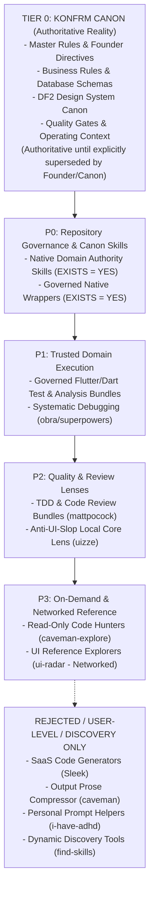
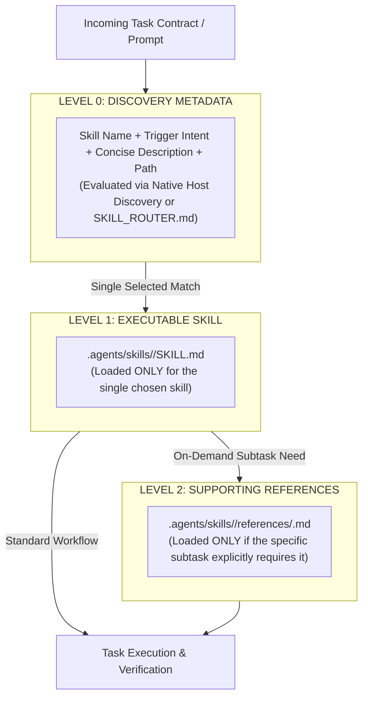

# KONFRM Agent Skills Governance V1
## Runtime Architecture, Skill Bundles, Precedence Model, and Operational Safety Standards

**Document Version:** 1.3.0
**Status:** DRAFT — PENDING FINAL BRIDGE APPROVAL
**Scope:** Universal Agent Tooling Architecture (Antigravity, Codex, Bridge)
**Target Repository:** `Essxm01/KONFRM`
**Base Anchor Main SHA:** `9c908d2756fba0d421e67959ecfbc13d0ca35f9b`
**Governing Authority:** KONFRM Canon, Master Rules (`docs/codex/KONFRM_MASTER_RULES.md`), Founder Operating Context (`docs/codex/KONFRM_FOUNDER_OPERATING_CONTEXT.md`)

---

## 1. Executive Summary & Purpose

As KONFRM advances its three-surface ecosystem—Customer Discovery & Booking (Flutter), Owner Operations & Availability (Flutter), and Admin Trust & Audit Operations (React 19 / Web)—agent coding autonomy must scale without compromising architectural consistency, business logic, security, or context efficiency.

The purpose of the **KONFRM Agent Skills Governance Framework (V1)** is to establish an immutable, conflict-safe operating boundary for evaluating, structuring, and integrating agent skills across both **Antigravity** and **Codex**.

### Core Governance Tenets
1. **Canon Supremacy:** No external skill, community tool, or generic industry standard may override, dilute, or contradict KONFRM Canon, Master Rules, or Founder decisions. Tier 0 Canon is authoritative until explicitly superseded by a later accepted Founder or Canon decision.
2. **Durable Business Authority (Zero Duplication):** External skills MUST NOT define, copy, reinterpret, or modify KONFRM financial formulas, booking state machines, wallet rules, availability semantics, payment policy, cancellation policy, or trust semantics. They must read the current authoritative Business Rules (`docs/BUSINESS_RULES.md`) and Master Rules (`docs/codex/KONFRM_MASTER_RULES.md`) applicable to the task. This governance framework does not duplicate mutable business truth.
3. **Repository-Local Authoritative Runtime:** KONFRM-governed skills are exclusively repository-local under `.agents/skills/`. Duplicate global installation in user home directories is strictly prohibited. Antigravity and Codex may support other user/global skills, but those are outside the KONFRM governed runtime and must not duplicate or override KONFRM skills.
4. **Shared Multi-Agent Runtime:** Both Antigravity and Codex consume the exact same repository-pinned skill bundles from `.agents/skills/`.
5. **Skill-Bundle Architecture (`KONFRM_SKILL_BUNDLE_V1`):** A skill is not assumed to be a single `SKILL.md` file. Bundles contain self-contained operational scripts, references, and normalized frontmatter with zero unresolvable dependencies.
6. **Separation of Contexts:** Execution context (`.agents/skills/`) is strictly separated from audit, provenance, and vendor snapshot context (`docs/ai/skills/`). Routine execution agents must never load historical vendor snapshots.
7. **Fast Discovery & Progressive Disclosure (`KONFRM_SKILL_DISCLOSURE_V1`):** Fast routing through direct deterministic path resolution, physically flat runtime directories, progressive disclosure (Metadata $\to$ `SKILL.md` $\to$ Supporting Reference), and strict prohibition of recursive filesystem scanning in routine tasks.

---

## 2. Inviolable Authority Hierarchy (Tier 0 — KONFRM Canon)

External skills do not define product architecture or marketplace rules; they serve purely as execution accelerators, diagnostic lenses, and craftsmanship guides.

All agent tools and skills are strictly subordinate to **Tier 0 — KONFRM Canon**:



### Tier 0 Components & Authority Lifecycle
1. **Founder Explicit Decisions & Directives:** Highest governing authority (`docs/codex/KONFRM_FOUNDER_OPERATING_CONTEXT.md`).
2. **KONFRM Master Rules & Operating Contracts:** The constitutional operational rules for all agents (`docs/codex/KONFRM_MASTER_RULES.md`, `AGENTS.md`, `tasks/CURRENT_TASK.md`).
3. **Quality Gates & Verification Protocols:** Strict pass/fail acceptance criteria (`docs/codex/KONFRM_QUALITY_GATES.md`, Mobile UI QA Protocol).
4. **Design Authority (DF2 Canon):** Mobile Foundation v1.7 published state, monochrome-first identity, yellow eradication, Cairo typography, Arabic-first RTL, Western Arabic numerals, component-scoped geometry (`DESIGN_SYSTEM/`).
5. **Marketplace & Persistence Truth:** Supabase PostgreSQL canonical schema (`docs/DATABASE.md`) and immutable business invariants (`docs/BUSINESS_RULES.md`).

> [!IMPORTANT]
> **CANON LIFECYCLE RULE:**
> Tier 0 Canon is authoritative until explicitly superseded by a later accepted Founder or Canon decision. Founder decisions can intentionally evolve product architecture and business rules. External skills and tools can NEVER do so.
>
> If an external skill conflicts with Tier 0 Canon, Tier 0 wins automatically. Routine external skill mismatches are documented in the Skills Registry and adaptation wrappers. Do NOT pollute `docs/codex/KONFRM_DECISION_CONFLICTS.md` with generic skill mismatches; reserve that log strictly for genuine conflicts between authoritative project decisions.

---

## 3. Runtime Architecture & The `KONFRM_SKILL_BUNDLE_V1` Standard

### 3.1 The Failure of Single-File Vendoring
Upstream skills are frequently multi-file bundles rather than isolated markdown files. For example:
- `obra/superpowers/systematic-debugging` references companion guides: `root-cause-tracing.md`, `defense-in-depth.md`, `condition-based-waiting.md`.
- `mattpocock/skills/tdd` references companion documents: `tests.md`, `mocking.md`.
- `uizze/uizze/anti-ui-slop` references an entire `reference/` suite: `new-work.md`, `operate.md`, `polish.md`, `distill.md`, `audit.md`, `craft.md`, `ios.md`.

Copying only a single root `SKILL.md` creates broken links, missing operational procedures, and runtime errors.

### 3.2 The `KONFRM_SKILL_BUNDLE_V1` Standard
All external skills approved for repository integration are structured as self-contained bundles:

```text
KONFRM-CANONICAL/
├── .agents/skills/<governed-skill-name>/      <-- RUNTIME SOURCE OF TRUTH (Antigravity & Codex)
│   ├── SKILL.md                              <-- Authoritative, self-contained executable skill
│   ├── references/                           <-- Bundled local supporting guides (RUNTIME_REQUIRED only)
│   ├── scripts/                              <-- Optional local validation scripts (scanned & audited)
│   └── assets/                               <-- Optional local reference templates
│
└── docs/ai/skills/<governed-skill-name>/       <-- GOVERNANCE & PROVENANCE REPOSITORY (Never loaded in routine runs)
    ├── AUDIT.md                              <-- Audit record, adaptation rationale, security classification
    ├── UPSTREAM_MANIFEST.md                  <-- Dependency manifest, upstream blobs, license provenance
    └── vendor/                               <-- Exact upstream snapshot as fetched at AUDITED_COMMIT
        ├── SKILL.md                          <-- Unmodified upstream SKILL.md
        └── ...                               <-- Upstream companion files
```

### 3.3 Runtime Source of Truth Rules
1. **`.agents/skills/<skill-name>/` is the Executable Truth:** KONFRM-governed skills are exclusively repository-local under `.agents/skills/`. Antigravity and Codex may support other user/global skills, but those are outside the KONFRM governed runtime and must not duplicate or override KONFRM skills.
2. **Self-Contained Executable `SKILL.md`:** The runtime `SKILL.md` contains valid frontmatter, triggering criteria, KONFRM Canon subordination, operational workflows, forbidden overrides, verification expectations, and relative links to bundled `references/`. It is **NOT** a pointer shim forcing agents to load documents from `docs/`.
3. **`docs/ai/skills/` is for Governance & Provenance:** This directory preserves historical upstream snapshots, audit findings, and license compliance. It is **never** loaded into routine execution contexts, preserving agent token budgets.
4. **No Competing Executable Copies:** There is exactly one executable version of each skill: `.agents/skills/<name>/SKILL.md`.

---

## 4. Physically Flat Runtime Layout & Governed Naming Taxonomy

### 4.1 Physically Flat Runtime Layout
To eliminate host directory traversal latency and indexing ambiguities, the runtime skill directory must remain physically flat.

- **MANDATE:** Every executable skill must be a direct child directory of `.agents/skills/`.
- **FORBIDDEN:** Deeply nested category directory structures (e.g., `.agents/skills/flutter/testing/widget/...` or `.agents/skills/qa/debugging/...`).

```text
.agents/skills/
├── konfrm-systematic-debugging/
├── konfrm-flutter-widget-testing/
├── konfrm-dart-static-analysis/
├── konfrm-flutter-accessibility/
├── konfrm-rtl-arabic/
├── konfrm-mobile-design/
├── konfrm-code-review/
└── ...
```

**Architectural Rationale:**
- **Deterministic Direct Path:** The runtime path to any skill is always `.agents/skills/<skill-name>/SKILL.md`.
- **Host Agnostic:** Avoids relying on host-specific recursive directory indexing or glob depth limits.
- **Zero Ambiguity:** Eliminates duplicate or shadowing skill folders across nested trees.
- **Classification by Metadata:** Logical categorization is expressed through governed naming conventions and manifest metadata, not deep filesystem hierarchies.

### 4.2 Governed Naming Taxonomy
All runtime skill directory and bundle names must strictly adhere to standard domain prefixes:

| Prefix | Domain Scope & Responsibilities | Examples |
| :--- | :--- | :--- |
| `konfrm-core-*` | Universal project execution, triage, and orchestration helpers | `konfrm-core-router`, `konfrm-core-grill-gate` |
| `konfrm-flutter-*` | Customer and Owner Flutter mobile application execution | `konfrm-flutter-widget-testing`, `konfrm-flutter-layout-fixer`, `konfrm-flutter-architecture` |
| `konfrm-web-*` | Admin Web application (React 19 / Vite / TypeScript) | `konfrm-web-guidelines`, `konfrm-web-composition` |
| `konfrm-backend-*`| Backend API, Cloudflare Worker proxy, and Supabase PostgreSQL | `konfrm-backend-invariants`, `konfrm-backend-testing` |
| `konfrm-qa-*` | Verification, testing rigor, regression defense, code review | `konfrm-qa-systematic-debugging`, `konfrm-qa-code-review`, `konfrm-qa-visual-qa` |
| `konfrm-design-*` | Design lenses, UI dialectics, micro-polish, craftsmanship | `konfrm-design-router`, `konfrm-design-reasoning`, `konfrm-design-impeccable` |

**Naming Standards:**
- Must be unique, kebab-case, descriptive, and short enough for rapid matching.
- Once installed, runtime names must remain stable across versions.
- **FORBIDDEN Vague Names:** Generic identifiers such as `helper`, `utils`, `best-practices`, or `tools` are strictly prohibited.

---

## 5. Three-Level Progressive Disclosure (`KONFRM_SKILL_DISCLOSURE_V1`)

To maximize agent token availability and execution performance, KONFRM adopts the three-level progressive disclosure standard:

$$\text{TASK} \longrightarrow \text{LIGHTWEIGHT CLASSIFICATION} \longrightarrow \text{DIRECT SKILL PATH} \longrightarrow \text{ONLY REQUIRED REFERENCES}$$

Agents must NEVER load the entire skills catalog, read multiple `SKILL.md` files to decide, or preload companion documents.



### 5.1 Level 0 — Discovery Metadata
Used strictly to determine whether a skill is relevant to the active task.
- **Required Fields:** Skill name, trigger intent, concise description, and direct path.
- **Context Impact:** Near-zero overhead. Handled by native host tool discovery or compact fallback router.

### 5.2 Level 1 — `SKILL.md`
Loaded only for the specifically selected skill upon task activation.
- Contains operational procedures, Canon guardrails, step-by-step workflows, verification expectations, and relative links to local references.
- Never loads multiple competing skills simultaneously.

### 5.3 Level 2 — Supporting References
Companion deep-dive guides located in `.agents/skills/<name>/references/`.
- **Strict Rule:** Loaded **ONLY** when a specific subtask within the skill execution demands deeper instruction.
- *Example:* When executing `konfrm-systematic-debugging`, the agent opens `SKILL.md`. It opens `references/root-cause-tracing.md` **only** if data-flow tracing is required for the specific bug. It does **not** preload `defense-in-depth.md` or `condition-based-waiting.md` in advance.

### 5.4 Absolute Prohibition on Routine Recursive Filesystem Scanning
> [!CRITICAL]
> **NO RECURSIVE SKILL-CATALOG SCANNING IN ROUTINE TASKS:**
> During ordinary task execution, AI coding agents (Antigravity and Codex) **MUST NOT** recursively scan, search, or open files under `.agents/skills/` to discover what skill to use.
>
> Recursive skill-catalog scanning is permitted ONLY during:
> 1. Formal Skills Governance audits.
> 2. Pinned upstream upgrade workflows.
> 3. Skill registry rebuilding and manifest generation.
> 4. Explicit tooling maintenance missions authorized by Bridge.
>
> In all standard task execution, agents must resolve skills deterministically via host metadata or `.agents/SKILL_ROUTER.md`.

---

## 6. Deterministic Routing Architecture

### 6.1 Deterministic Routing Order
To prevent guess-and-check tool selection, agents follow an unambiguous five-step routing procedure:

1. **Step A — Host-Native Skill Metadata Matching:** Evaluate native host skill metadata (name, trigger intent, concise description) against the active task requirements.
2. **Step B — Compact Skill Router Fallback:** If ambiguity remains, or if the task is a high-risk governed operation, consult `.agents/SKILL_ROUTER.md`.
3. **Step C — Load Authoritative `SKILL.md`:** Open the exact resolved path `.agents/skills/<name>/SKILL.md`.
4. **Step D — Load Specific Reference on Demand:** If and only if a subtask requires detailed guidance, open the specific Level 2 reference file from `references/`.
5. **Step E — Base Agent Fallback (No Blind Scanning):** If no skill clearly matches, proceed using KONFRM Canon, Master Rules, and core agent capabilities. **Do NOT** scan the skill directory hunting for tools. **Do NOT** load unrelated skills "just in case".

### 6.2 Lightweight Skill Router (`.agents/SKILL_ROUTER.md`) Specification
The future compact file `.agents/SKILL_ROUTER.md` serves as a deterministic, human-readable routing lookup table.

- **Size Constraint:** Strictly limited to $\le 50$ lines.
- **Content:** Contains direct mappings from triggering task intents to runtime skill directories. It does **NOT** duplicate skill instructions.
- **Implementation Status:** Specified in this V1 architecture; created during the approved Phase 1 Pilot.

*Conceptual Schema:*
```markdown
# KONFRM Skill Router (Compact Fallback)

| Task Condition / Trigger Intent | Direct Skill Path | Activation Mode |
| :--- | :--- | :--- |
| BUG / TEST FAILURE / RUNTIME ERROR | `.agents/skills/konfrm-systematic-debugging/` | MANDATORY_ON_TRIGGER |
| FLUTTER WIDGET / SCREEN REGRESSION TEST | `.agents/skills/konfrm-flutter-widget-testing/` | MANDATORY_ON_TRIGGER |
| DART / FLUTTER STATIC ANALYSIS GATE | `.agents/skills/konfrm-dart-static-analysis/` | MANDATORY_ON_TRIGGER |
| ARABIC RTL / BIDI / NUMERAL FORMATTING | `.agents/skills/konfrm-rtl-arabic/` | MANDATORY_ON_TRIGGER |
| ACCESSIBILITY / SEMANTICS / SCREEN READER | `.agents/skills/konfrm-accessibility/` | MANDATORY_ON_TRIGGER |
| PR REVIEW / CLOSURE AUDIT | `.agents/skills/konfrm-code-review/` | MANDATORY_ON_TRIGGER |
| ADMIN WEB INTERFACE / TABLE ERGONOMICS | `.agents/skills/konfrm-web-guidelines/` | MANDATORY_ON_TRIGGER |
```

### 6.3 Machine-Readable Manifest (`.agents/SKILL_MANIFEST.yaml`) Specification
For future automated tooling, CI validation, and subagent lookup, a compact YAML manifest is designed:

- **Constraint:** One concise entry per governed skill; zero instruction text.
- **Fields:** `id`, `path`, `surface`, `trigger`, `activation`, `priority`, `network`.
- **Implementation Status:** Specified in this V1 architecture; authored during the approved Phase 1 Pilot.

*Example Specification Entry:*
```yaml
- id: konfrm-systematic-debugging
  path: skills/konfrm-systematic-debugging
  surface: universal
  trigger: bug_failure_unexpected_behavior
  activation: mandatory_on_trigger
  priority: P1
  network: local_only
```

---

## 7. Always-On Project Rules vs. Triggered Mandatory Skills

A critical governance failure is bloated "always-on" instruction sets. KONFRM strictly separates universal project constitutional rules from domain execution skills.

### 7.1 `ALWAYS_ON_PROJECT_RULE` (Universal Core Layer)
Constitutional rules that govern every agent turn without exception:
- KONFRM Canon Precedence (Tier 0 supremacy).
- Git Safety (branch checks, clean baseline, no history rewriting, no out-of-scope edits).
- Absolute Prohibition on Business Rule Invention (zero synthetic math, zero fabricated policies).
- No Random Guess-and-Check Fixes (root-cause diagnosis required before editing).
- Evidence-Based Quality Gates (runtime verification where mandated).

**Governance Rule:** These rules belong exclusively in the minimal, always-loaded project core (`AGENTS.md`, `tasks/CURRENT_TASK.md`, `docs/codex/KONFRM_MASTER_RULES.md`). They must remain concise. Agents **MUST NOT** build a massive "always-on" skill containing full project documentation.

### 7.2 `MANDATORY_ON_TRIGGER` (Triggered Execution Skills)
Skills that are NOT loaded by default, but become strictly mandatory the moment a matching condition is detected:

| Task Condition / Event Trigger | Mandatory Governed Skill | Activation Enforcement |
| :--- | :--- | :--- |
| **Bug / Test Failure / Build Error / Runtime Regression** | `konfrm-systematic-debugging` | Mandatory 4-phase RCA required before submitting code fix. |
| **Flutter Source Change — Pre-Completion Gate** | `konfrm-dart-static-analysis` | Mandatory zero-warning `dart analyze` check before task closure. |
| **Flutter Widget Implementation or Regression Test** | `konfrm-flutter-widget-testing` | Mandatory component testing pattern. |
| **Accessibility / Semantics / TalkBack Modification** | `konfrm-accessibility` (future: `konfrm-flutter-accessibility`) | Mandatory TalkBack / Semantics verification checklist. |
| **PR Review / Autonomous Closure Audit** | `konfrm-code-review` | Mandatory two-axis inspection checklist (Standards & Spec). |

---

## 8. Context Discipline, Execution vs. Audit Separation & Bridge Overrides

### 8.1 Smallest Sufficient Skill Set (Context Discipline)
Agents must activate only the minimal skill set required for the active task.
- **Recommended Ordinary Target:** **`1–3 active skills`** per task.
- This is a context-discipline engineering principle, not a fragile mechanical restriction.
- *Anti-Pattern:* For a simple Dart analysis task, loading systematic debugging, responsive layout, accessibility, code review, TDD, and design skills simultaneously is strictly forbidden.

### 8.2 Description Quality Standard
Every runtime skill description must be written specifically to make deterministic routing instantaneous:
- **Must Answer:**
  1. **WHEN to use:** Specific intent, trigger symptoms, and task classes.
  2. **WHAT task class it serves:** The exact domain, package, or lifecycle stage.
  3. **WHEN NOT to use:** Explicit boundary exclusions where ambiguity is likely.
- *Bad Description:* `Helps with Flutter.`
- *Good Description:* `Use when implementing or fixing KONFRM Flutter widget behavior, layout constraints, semantics, or widget regression tests. Do not use for Backend API or Admin Web work.`

### 8.3 Execution Context vs. Audit Context Boundary
To protect agent token quotas and execution speed:
- **Routine Execution Context:** Operates strictly within `.agents/skills/`. Routine agents must **NEVER** read files in `docs/ai/skills/<name>/vendor/`.
- **Audit Context:** Reserved strictly for explicit governance audits, upstream license checks, and version upgrade tasks.

### 8.4 Critical Task Explicit Overrides (Bridge Authority)
For high-risk, multi-step, or mission-critical tasks, Bridge Orchestration may explicitly mandate required skills directly within the task contract:

```markdown
Required skills:
- konfrm-systematic-debugging
- konfrm-dart-static-analysis
```

**Rule:** Explicit Bridge skill declarations take absolute precedence over auto-discovery ambiguity. This is a deliberate safety mechanism that guarantees execution discipline on complex workflows.

---

## 9. Multi-Agent Discovery & Global Scope Policy Correction

### 9.1 Shared Runtime for Antigravity and Codex
Both primary coding assistants operate against the unified repository-local skill tree:

```text
             KONFRM REPOSITORY ROOT
                       |
                .agents/skills/
                  /          \
                 /            \
        Antigravity            Codex
```

Both agents consume the exact same repository-pinned governed skill bundles. Host-specific variations are avoided unless a platform compatibility shim is demonstrably required.

### 9.2 Absolute Prohibition on Duplicate Global Installation
All KONFRM-specific and KONFRM-governed skills **MUST** be repository-local (`.agents/skills/`).
- **FORBIDDEN:** Installing or symlinking KONFRM skills into global agent directories (e.g. `~/.gemini/config/skills/`, `~/.codex/skills/`, `~/.claude/skills/`).
- **Rationale:** Duplicate global installations cause silent version drift, ambiguous precedence resolution across developer workstations, non-reproducible CI/CD behavior, and loss of git auditability.

### 9.3 Global Skill Policy & Path Correction
Global and user-level skill directories are strictly restricted to `PROJECT_AGNOSTIC_PERSONAL_UTILITIES`:
- **Correct Antigravity Global Scope:** `~/.gemini/config/skills/` (Documented global path; **not** `~/.gemini/antigravity/skills/`).
- Permitted global utilities include: personal response formatting preferences (e.g. `ayghri/i-have-adhd`), shell navigation shortcuts, or generic syntax highlighters.
- Global skills **MUST NOT** contain KONFRM business rules, architectural standards, DF2 design canon, quality gates, or mobile foundation tokens.
- **Multi-Product Policy:** Antigravity and Codex may support other user or global skills for generic tasks. However, those skills are outside the KONFRM governed runtime and must never duplicate or override KONFRM-governed skills.

---

## 10. Frontmatter Normalization & Dependency Manifest Standards

### 10.1 Host-Specific Frontmatter Normalization
Upstream skills frequently contain platform-locked metadata (e.g., `model: haiku`, `model: models/gemini-3.1-pro-preview`, Claude-specific tool lists, unsupported slash commands).
- **Rule:** The runtime `.agents/skills/<name>/SKILL.md` must normalize frontmatter for the shared Antigravity/Codex environment. Platform-specific hardcoded model parameters or tool locks are removed.
- Original upstream frontmatter is preserved verbatim in `docs/ai/skills/<name>/vendor/SKILL.md`.

### 10.2 Supporting File Dependency Manifest
Every approved skill bundle must declare a formal dependency manifest in `docs/ai/skills/<name>/UPSTREAM_MANIFEST.md`:
- Every upstream file is classified into one of three tiers:
  1. **`RUNTIME_REQUIRED`:** Essential companion guide required for the governed workflow; included in `.agents/skills/<name>/references/`.
  2. **`AUDIT_ONLY`:** Preserved in `docs/ai/skills/<name>/vendor/` for verification and security provenance; excluded from runtime.
  3. **`OMITTED_BY_GOVERNED_WRAPPER`:** Upstream file excluded because its functionality is superseded by KONFRM Canon or rejected (e.g. BLoC guides, iOS-only design rules).
- **Zero Broken Links:** No runtime `SKILL.md` may reference a local companion file that is not bundled within its `.agents/skills/<name>/` directory.

### 10.3 Sibling-Skill Dependency Resolution
Upstream skills often cross-reference other skills in their repository (e.g. `systematic-debugging` references `test-driven-development` and `verification-before-completion`).
- **Rule:** Unresolved cross-skill references are strictly prohibited. The governed wrapper must either:
  1. Map the reference to an existing KONFRM governed equivalent (e.g. mapping verification to KONFRM Quality Gates).
  2. Bundle the required capability as part of the approved pilot.
  3. Explicitly rewrite or remove the dependency in the runtime `SKILL.md`.

---

## 11. Network Security Classification Model

Rather than enforcing an unrealistic universal ban on external HTTP requests, KONFRM establishes a **Four-Tier Network Classification Model**:

| Network Security Class | Definition | Operational Rule in KONFRM | Examples |
| :--- | :--- | :--- | :--- |
| **`LOCAL_ONLY`** | 100% self-contained local execution; zero outbound network calls, telemetry, or API queries. | **Default Approved Class.** Operates freely in offline and local development environments. | `systematic-debugging`, `flutter-add-widget-test`, `dart-run-static-analysis`, `tdd` |
| **`NETWORK_OPTIONAL_EXPLICIT`** | Functions completely in local core mode by default, but possesses optional remote reference capabilities. | **Local Core Mode active by default.** Remote mode requires explicit, separate Founder approval before connection. | `anti-ui-slop` (Local Core vs. Remote Reference Mode) |
| **`NETWORK_REQUIRED_ON_DEMAND`** | Outbound network calls are required for the skill's primary function (e.g. live database queries). | **Prohibited from default runtime.** May only be invoked on-demand with explicit Founder authorization and audit logging. | `ui-radar` (calls `https://uizze.com/api/search...`) |
| **`REJECT_NETWORK_PROFILE`** | Requires external SaaS bearer tokens (`SLEEK_API_KEY`), phones home unconditionally, or performs unvetted code execution. | **Strictly Forbidden.** Banned from repository inclusion. | Sleek (`design-mobile-apps`), `find-skills` |

### UIZZE Split Architecture
- **`anti-ui-slop`:** Split into:
  - **Local Core Mode (Default):** Evaluates local component code against product briefs, hierarchy, interaction states, and DF2 Canon without any external network calls.
  - **Remote Reference Mode:** Connects to external UIZZE catalogues. Disabled by default; requires explicit authorization.
- **`ui-radar`:** Classified as `NETWORK_REQUIRED_ON_DEMAND`. Upstream code explicitly calls `GET https://uizze.com/api/search?...`. It is never classified as local-only.

---

## 12. Mobile Architecture Conflict Audit & Invariants

KONFRM mobile applications operate under an authoritative architectural specification established across Phase 4 migrations. External skills introducing generic mobile patterns must be subordinated to these non-negotiable architectural invariants:

| Architectural Dimension | KONFRM Canonical Architecture | Actual Upstream Guidance in `flutter-apply-architecture-best-practices` | Conflict & Governance Action |
| :--- | :--- | :--- | :--- |
| **Directory Structure** | **Feature-First** (`lib/src/features/<feature_name>/...`) | Hybrid: Feature-grouped UI, but layer-grouped Data/Domain (`lib/data/`, `lib/domain/`) | **ADAPT:** Strip hybrid structure; enforce strict Feature-First. |
| **Layering Model** | **3 Layers:** Presentation / Application / Data | UI + Data layering, with optional Domain (Use Cases) layer | **ADAPT:** Presentation / Application (Riverpod controllers) / Data (no mandatory domain layer). |
| **State Management** | **Riverpod** (strictly manual, without codegen initially) | MVVM with `ChangeNotifier` / `Listenable` | **ADAPT:** Strip MVVM / `ChangeNotifier`; enforce Riverpod `NotifierProvider` / `AsyncNotifierProvider`. |
| **Data Models** | Manual DTOs, explicit serializers/adapters | Recommends `freezed` or `built_value` | **ADAPT:** Defer code generation; enforce manual DTOs. |
| **Offline & Caching** | **Fail-Closed**; immediate transparent network error reporting | Recommends local caching, offline sync, and automatic retry | **ADAPT:** Strip offline sync/mutation queues; enforce fail-closed network handling. |
| **Financial Authority** | **Zero Local Computation**; server/database is absolute truth | Generic client-side data transformation | **ENFORCE:** Client performs zero financial arithmetic. |
| **Credential Storage** | Secure storage **abstraction** mandatory (concrete implementation deferred) | Platform storage plugins | **ENFORCE:** Preserve credential abstraction; do not hardcode concrete implementation. |
| **Deep Linking** | Deep-link architecture preserved, concrete rollout deferred | Declarative routing | **ENFORCE:** Do not invent unapproved URL schemes. |

---

## 13. Business Authority Protection (Durable Authority Rule)

> [!CRITICAL]
> **DURABLE BUSINESS AUTHORITY RULE (NO DUPLICATION):**
> External skills MUST NOT define, copy, reinterpret, or modify KONFRM financial formulas, booking state machines, wallet rules, availability semantics, payment policy, cancellation policy, or trust semantics.
>
> All agents and skills must read current authoritative Business Rules (`docs/BUSINESS_RULES.md`) and Master Rules (`docs/codex/KONFRM_MASTER_RULES.md`) directly. This Skills Governance document intentionally does not duplicate mutable business formulas or state transitions, preventing drift between governance and product reality.

---

## 14. Design Authority Protection (DF2 Canon)

All external UI/Design skills are classified as **Advisory Lenses** and must not override KONFRM Design System Canon.

### Brand Identity & Nuance
1. **Brand Triangle:** Trust, Clarity, Vitality.
2. **Monochrome-First Identity:** Deep black and neutral gray scales form the core visual foundation. Legacy yellow is completely eradicated.
3. **Primary Black Nuance:** Mobile Primary Black (`#000000`) is **`SYSTEM-VALIDATED PROVISIONAL`** for governed primary usage. Logo black does not automatically mandate universal UI black.
4. **Interaction Accent Role:** Blue is an interaction accent candidate only. The exact blue hue remains **`OPEN`** (`#276EF1` is a provisional candidate, not final Canon).

### Status of Design Values (Open vs. Provisional)
| Design Dimension | Authoritative Governance Status | Rule for External Skills |
| :--- | :--- | :--- |
| **Mobile Foundation Published State** | **DF2 Mobile Foundation v1.7** (from Phase 4H) | All mobile work must target v1.7. |
| **Exact Primary Black** | `SYSTEM-VALIDATED PROVISIONAL` (`#000000`) | Governed primary usage; do not treat as universal UI black. |
| **Exact Interaction Blue** | **`OPEN`** (`#276EF1` is candidate only) | Skills must not canonize `#276EF1` as immutable brand truth. |
| **Exact Neutral Scale** | **`OPEN`** | Do not list specific neutral hex values as final Canon. |
| **Semantic Colors (Success/Error/Warning)**| **`OPEN`** | Skills must not mandate external semantic palettes. |
| **Elevation & Shadows** | **`OPEN`** | Skills must not invent unapproved elevation drops. |
| **Modal Scrim & Overlay** | **`OPEN`** | Treat scrim values as provisional implementation candidates. |
| **Toast Duration & Animation** | **`OPEN`** | Treat toast timing heuristics as candidates requiring validation. |
| **Spacing System** | Authoritative Scale: **`4 / 8 / 12 / 16 / 24 / 32`** | Do NOT collapse into a generic "8dp grid". Page Inset is `16` provisional. |
| **Component Geometry** | Component-Scoped: <br>• Primary Button Radius: `6` provisional (`PRIMARY_ONLY`)<br>• Field Radius: `8` (`FIELD_ONLY`)<br>• Structural Card Radius: `12` provisional<br>• Sheet Top Radius: `16` provisional<br>• Dialog Radius: `12` provisional | Skills must NEVER collapse geometry into a generic "4–12dp" range. Secondary button radius is `OPEN`. |
| **Native Form Field Height** | **`OPEN`** | Maintain touch accessibility ($\ge 48\text{dp}$ target). |
| **Native Focus Indicators** | **`OPEN`** | Follow platform-appropriate accessible focus indicators. |
| **Sheet Detents & Motion Curves**| **`OPEN`** | Heuristic curves from skills are advisory candidates only. |
| **Typography Foundation** | **Cairo** font family | Optical scale calibrated for Arabic-first and Latin script. |
| **Numeral Standard** | **Western Arabic digits (`0-9`)** | Standard default across both Arabic and English interfaces. |
| **Egyptian Currency Standard** | **`1,600 ج.م`** canonical format | Strict Bidi sub-run isolation. |
| **Deceptive Patterns** | **STRICTLY PROHIBITED** | No synthetic scarcity badges, fake timers, or fabricated social proof. |

---

## 15. Context Efficiency Principle & Tool Evaluations

### 15.1 Context-Efficiency Governance Principle
> [!IMPORTANT]
> **GOVERNANCE PRINCIPLE:**
> Minimize irrelevant context, filesystem discovery, and redundant instruction loading through deterministic routing and progressive disclosure.
>
> The framework avoids claiming unsupported, unbenchmarked token savings. True efficiency gains will be evaluated empirically during the Phase 1 Pilot.

### 15.2 Qualitative Footprint Classes
- **`VERY_LOW`:** Compact, targeted utility ($\le 1$ page of instructions; minimal context footprint).
- **`LOW`:** Focused single-purpose skill with clear boundaries.
- **`MEDIUM`:** Multi-section workflow guidance or comprehensive testing pattern.
- **`HIGH`:** Broad multi-layer framework; requires strict scoping.

### 15.3 Evaluation of Caveman Tools
- **`caveman` (Prose Compressor):**
  - *Finding:* Its actual token benefit has not been benchmarked for KONFRM. Global prose compression directly conflicts with required structured verification reports, audit handshakes, and nuanced Arabic RTL analysis.
  - *Decision:* **`REJECT`** regardless of unmeasured token claims.
- **`caveman-explore` (Repository Symbol Hunter):**
  - *Finding:* A read-only AST symbol and line locator using compact `path:line` references.
  - *Decision:* **`EXPERIMENTAL / ON_DEMAND`**. Must remain strictly read-only. Full adoption is deferred until a dedicated KONFRM pilot proves its locator accuracy and demonstrates zero risk of missed dependencies.

---

## 16. Loop Factory Architectural Evaluation & Backpropagation Policy

### 16.1 Concept Disposition
- **Rogue Folder Structure (`inbox/`, `active/`, `archive/`):** **`REJECT`**. Directly conflicts with canonical `tasks/CURRENT_TASK.md` and `docs/CURRENT_STATE.md`.
- **Grill Gate (Interactive Pre-flight Interrogation):** **`ADAPT`**. Adopted as an orchestration protocol rule for ambiguous tasks to challenge underspecified requirements before implementation.
- **Spec Backpropagation (Syncing Runtime Discoveries to Memory):** **`ADAPT WITH STRICT SEPARATION OF POWERS`**.

### 16.2 Authoritative Backpropagation Governance Policy
- **`PROPOSE_BACKPROP` (Available to All Execution Agents):** Any agent discovering new, verified runtime facts may report them in its execution summary and propose documentation updates.
- **`AUTHORITATIVE_BACKPROP_WRITE` (Bridge / Explicitly Authorized Missions Only):** Only Bridge Orchestration or an explicitly designated documentation-reconciliation task (following full evidence verification) is authorized to write updates to `docs/CURRENT_STATE.md`, `tasks/CURRENT_TASK.md`, or Canon documents.

---

## 17. Phased Rollout, Pilot Discovery Evals, and Future Metrics

### 17.1 Phase 1: Representative Three-Skill Pilot
Before any wider rollout, exactly three representative governed skill bundles will be installed into `.agents/skills/`:
1. `konfrm-systematic-debugging` (Adapts `obra/superpowers/systematic-debugging`)
2. `konfrm-flutter-widget-testing` (Adapts `flutter/agent-plugins/flutter-add-widget-test`)
3. `konfrm-dart-static-analysis` (Adapts `dart-lang/skills/dart-run-static-analysis`)

### 17.2 Pilot Discovery and Efficiency Acceptance Gates
In addition to functional verification, the Phase 1 Pilot must explicitly evaluate discovery cost and context efficiency:

1. **Auto-Discovery Positive Evals:**
   - Without explicitly naming the skill:
     - A task describing a bug, test failure, or unexpected behavior must automatically route to `konfrm-systematic-debugging`.
     - A task describing Flutter widget testing or component verification must automatically route to `konfrm-flutter-widget-testing`.
     - A task describing Dart/Flutter code analysis or lint verification must automatically route to `konfrm-dart-static-analysis`.
2. **Negative Evals:**
   - Verify that irrelevant skills are **NOT** activated.
   - *Example:* A pure documentation edit or chore task must not load Flutter testing or systematic debugging skills.
   - *Example:* A backend task must not load mobile widget testing skills.
3. **Lookup Efficiency Checks:**
   - Verify agents do **NOT** recursively scan `.agents/skills/`.
   - Verify agents do **NOT** open all `SKILL.md` files to make a selection.
   - Verify agents do **NOT** open vendor/audit files in `docs/ai/skills/`.
   - Verify agents do **NOT** load unused Level 2 references.
4. **Direct Path Resolution Check:**
   - Selected skill must resolve directly from metadata or router to the exact path `.agents/skills/<name>/SKILL.md`.

### 17.3 Observable Pilot Evaluation Metrics
During the pilot, qualitative and observable metrics will be captured:
- **Selected Skill:** Match accuracy against task category.
- **Unexpected Skills Loaded:** Count of spurious skill activations (target: 0).
- **Runtime Skill Files Opened:** Count of `SKILL.md` files read (target: 1 per active domain).
- **Supporting References Opened:** Only specific Level 2 files needed for subtasks (target: $\le 1$).
- **Vendor/Audit Files Opened Unexpectedly:** Target: 0.
- **Routing Success / Failure:** Deterministic match vs. fallback requirement.
- **Activation Mode:** Explicit Bridge directive vs. automatic discovery.
- **Network Telemetry:** Confirmed 100% `LOCAL_ONLY` execution.
- **Broken Reference Count:** Target: 0.

---

## 18. Pre-Installation Security Checklist & Upgrade Protocol

### 18.1 Pre-Installation Security & Trust Verification Checklist
Before any single external skill bundle is approved for installation:
- [ ] **License Check:** Confirmed permissive license (MIT, Apache 2.0, or BSD).
- [ ] **Dependency Audit:** Zero npm, pip, or binary dependencies required.
- [ ] **Network Classification Required:** Explicitly classified into `LOCAL_ONLY`, `NETWORK_OPTIONAL_EXPLICIT`, `NETWORK_REQUIRED_ON_DEMAND`, or `REJECT_NETWORK_PROFILE`.
- [ ] **Secret Scan:** Confirmed zero requirement for API keys, bearer tokens, or cloud credentials.
- [ ] **Static Code Audit:** Inspected upstream markdown and scripts for hidden shell commands, malicious hooks, or eval expressions.
- [ ] **Canon Alignment:** Confirmed upstream instructions do not contradict DF2 palette, Arabic RTL, or business invariants.
- [ ] **Frontmatter Normalization:** Confirmed host-specific model metadata or unsupported tools are stripped.
- [ ] **Dependency Manifest Verified:** All `RUNTIME_REQUIRED` companion files exist and resolve locally; zero broken links.
- [ ] **Commit SHA Pinning:** Confirmed exact 40-character commit SHA is recorded and snapshot committed to `docs/ai/skills/<name>/vendor/`.
- [ ] **Flat Runtime Directory:** Placed as direct child of `.agents/skills/`.

### 18.2 Version Upgrade Protocol
1. **Trigger:** A compelling new capability or bugfix is identified in an upstream repository.
2. **Diff Generation:** Generate a git diff between the pinned commit SHA and proposed target SHA.
3. **Canon Conflict Review:** Inspect the diff for new architectural recommendations, breaking changes, or token bloat.
4. **Bundle Reconciliation:** Update `docs/ai/skills/<skill-name>/vendor/` snapshot, update `UPSTREAM_MANIFEST.md`, and adjust the runtime wrapper in `.agents/skills/<skill-name>/` with updated guardrails.
5. **Bridge Review & Approval:** Submit as an isolated `chore(skills): upgrade <skill-name> to <sha>` commit for Bridge signoff.
