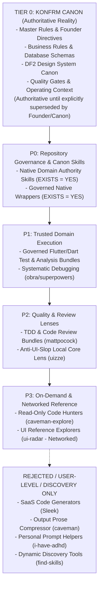

# KONFRM Agent Skills Governance V1
## Runtime Architecture, Skill Bundles, Precedence Model, and Operational Safety Standards

**Document Version:** 1.2.0
**Status:** DRAFT — PENDING FINAL BRIDGE APPROVAL
**Scope:** Universal Agent Tooling Architecture (Antigravity, Codex, Bridge)
**Target Repository:** `Essxm01/KONFRM`
**Base Anchor Main SHA:** `9c908d2756fba0d421e67959ecfbc13d0ca35f9b`
**Governing Authority:** KONFRM Canon, Master Rules (`docs/codex/KONFRM_MASTER_RULES.md`), Founder Operating Context (`docs/codex/KONFRM_FOUNDER_OPERATING_CONTEXT.md`)

---

## 1. Executive Summary & Purpose

As KONFRM advances its three-surface ecosystem—Customer Discovery & Booking (Flutter), Owner Operations & Availability (Flutter), and Admin Trust & Audit Operations (React 19 / Web)—agent coding autonomy must scale without compromising architectural consistency, business logic, security, or context efficiency.

The purpose of the **KONFRM Agent Skills Governance Framework (V1)** is to establish an immutable, conflict-safe operating boundary for evaluating, structuring, and integrating agent skills across both **Antigravity** and **Codex**.

### Core Governance Tenets
1. **Canon Supremacy:** No external skill, community tool, or generic industry standard may override, dilute, or contradict KONFRM Canon, Master Rules, or Founder decisions. Tier 0 Canon is authoritative until explicitly superseded by a later accepted Founder or Canon decision.
2. **Durable Business Authority (Zero Duplication):** External skills MUST NOT define, copy, reinterpret, or modify KONFRM financial formulas, booking state machines, wallet rules, availability semantics, payment policy, cancellation policy, or trust semantics. They must read the current authoritative Business Rules (`docs/BUSINESS_RULES.md`) and Master Rules (`docs/codex/KONFRM_MASTER_RULES.md`) applicable to the task. This governance framework does not duplicate mutable business truth.
3. **Repository-Local Authoritative Runtime:** All KONFRM-specific and governed skills reside strictly in the repository root at `.agents/skills/`. Duplicate global installation in user home directories is strictly prohibited.
4. **Shared Multi-Agent Runtime:** Both Antigravity and Codex consume the exact same repository-pinned skill bundles from `.agents/skills/`.
5. **Skill-Bundle Architecture (`KONFRM_SKILL_BUNDLE_V1`):** A skill is not assumed to be a single `SKILL.md` file. Bundles contain self-contained operational scripts, references, and normalized frontmatter with zero unresolvable dependencies.
6. **Separation of Contexts:** Execution context (`.agents/skills/`) is strictly separated from audit, provenance, and vendor snapshot context (`docs/ai/skills/`).

---

## 2. Inviolable Authority Hierarchy (Tier 0 — KONFRM Canon)

External skills do not define product architecture or marketplace rules; they serve purely as execution accelerators, diagnostic lenses, and craftsmanship guides.

All agent tools and skills are strictly subordinate to **Tier 0 — KONFRM Canon**:



### Tier 0 Components & Authority Lifecycle
1. **Founder Explicit Decisions & Directives:** Highest governing authority (`docs/codex/KONFRM_FOUNDER_OPERATING_CONTEXT.md`).
2. **KONFRM Master Rules & Operating Contracts:** The constitutional operational rules for all agents (`docs/codex/KONFRM_MASTER_RULES.md`, `AGENTS.md`, `tasks/CURRENT_TASK.md`).
3. **Quality Gates & Verification Protocols:** Strict pass/fail acceptance criteria (`docs/codex/KONFRM_QUALITY_GATES.md`, Mobile UI QA Protocol).
4. **Design Authority (DF2 Canon):** Mobile Foundation v1.7 published state, monochrome-first identity, yellow eradication, Cairo typography, Arabic-first RTL, Western Arabic numerals, component-scoped geometry (`DESIGN_SYSTEM/`).
5. **Marketplace & Persistence Truth:** Supabase PostgreSQL canonical schema (`docs/DATABASE.md`) and immutable business invariants (`docs/BUSINESS_RULES.md`).

> [!IMPORTANT]
> **CANON LIFECYCLE RULE:**
> Tier 0 Canon is authoritative until explicitly superseded by a later accepted Founder or Canon decision. Founder decisions can intentionally evolve product architecture and business rules. External skills and tools can NEVER do so.
>
> If an external skill conflicts with Tier 0 Canon, Tier 0 wins automatically. Routine external skill mismatches are documented in the Skills Registry and adaptation wrappers. Do NOT pollute `docs/codex/KONFRM_DECISION_CONFLICTS.md` with generic skill mismatches; reserve that log strictly for genuine conflicts between authoritative project decisions.

---

## 3. Runtime Architecture & The `KONFRM_SKILL_BUNDLE_V1` Standard

### 3.1 The Failure of Single-File Vendoring
Upstream skills are frequently multi-file bundles rather than isolated markdown files. For example:
- `obra/superpowers/systematic-debugging` references companion guides: `root-cause-tracing.md`, `defense-in-depth.md`, `condition-based-waiting.md`.
- `mattpocock/skills/tdd` references companion documents: `tests.md`, `mocking.md`.
- `uizze/uizze/anti-ui-slop` references an entire `reference/` suite: `new-work.md`, `operate.md`, `polish.md`, `distill.md`, `audit.md`, `craft.md`, `ios.md`.

Copying only a single root `SKILL.md` creates broken links, missing operational procedures, and runtime errors.

### 3.2 The `KONFRM_SKILL_BUNDLE_V1` Standard
All external skills approved for repository integration are structured as self-contained bundles:

```text
KONFRM-CANONICAL/
├── .agents/skills/<governed-skill-name>/      <-- RUNTIME SOURCE OF TRUTH (Antigravity & Codex)
│   ├── SKILL.md                              <-- Authoritative, self-contained executable skill
│   ├── references/                           <-- Bundled local supporting guides (RUNTIME_REQUIRED only)
│   ├── scripts/                              <-- Optional local validation scripts (scanned & audited)
│   └── assets/                               <-- Optional local reference templates
│
└── docs/ai/skills/<governed-skill-name>/       <-- GOVERNANCE & PROVENANCE REPOSITORY (Never loaded in routine runs)
    ├── AUDIT.md                              <-- Audit record, adaptation rationale, security classification
    ├── UPSTREAM_MANIFEST.md                  <-- Dependency manifest, upstream blobs, license provenance
    └── vendor/                               <-- Exact upstream snapshot as fetched at AUDITED_COMMIT
        ├── SKILL.md                          <-- Unmodified upstream SKILL.md
        └── ...                               <-- Upstream companion files
```

### 3.3 Runtime Source of Truth Rules
1. **`.agents/skills/<skill-name>/` is the Executable Truth:** AI coding agents (Antigravity and Codex) discover skills exclusively from `.agents/skills/`.
2. **Self-Contained Executable `SKILL.md`:** The runtime `SKILL.md` contains valid frontmatter, triggering criteria, KONFRM Canon subordination, operational workflows, forbidden overrides, verification expectations, and relative links to bundled `references/`. It is **NOT** a pointer shim forcing agents to load documents from `docs/`.
3. **`docs/ai/skills/` is for Governance & Provenance:** This directory preserves historical upstream snapshots, audit findings, and license compliance. It is **never** loaded into routine execution contexts, preserving agent token budgets.
4. **No Competing Executable Copies:** There is exactly one executable version of each skill: `.agents/skills/<name>/SKILL.md`.

---

## 4. Multi-Agent Discovery & Global Duplication Prohibition

### 4.1 Shared Runtime for Antigravity and Codex
Both primary coding assistants operate against the unified repository-local skill tree:

```text
             KONFRM REPOSITORY ROOT
                       |
                .agents/skills/
                  /          \
                 /            \
        Antigravity            Codex
```

Both agents consume the exact same repository-pinned governed skill bundles. Host-specific variations are avoided unless a platform compatibility shim is demonstrably required.

### 4.2 Absolute Prohibition on Duplicate Global Installation
All KONFRM-specific and KONFRM-governed skills **MUST** be repository-local (`.agents/skills/`).
- **FORBIDDEN:** Installing or symlinking KONFRM skills into global agent directories (e.g. `~/.gemini/antigravity/skills/`, `~/.codex/skills/`, `~/.claude/skills/`).
- **Rationale:** Duplicate global installations cause silent version drift, ambiguous precedence resolution across developer workstations, non-reproducible CI/CD behavior, and loss of git auditability.

### 4.3 Global Skill Policy
Global and user-level skill directories are strictly restricted to:
`PROJECT_AGNOSTIC_PERSONAL_UTILITIES`
- Permitted global utilities include: personal response formatting preferences (e.g. `ayghri/i-have-adhd`), shell navigation shortcuts, or generic syntax highlighters.
- Global skills **MUST NOT** contain KONFRM business rules, architectural standards, DF2 design canon, quality gates, or mobile foundation tokens.

---

## 5. Frontmatter Normalization & Dependency Manifest Standards

### 5.1 Host-Specific Frontmatter Normalization
Upstream skills frequently contain platform-locked metadata (e.g., `model: haiku`, `model: models/gemini-3.1-pro-preview`, Claude-specific tool lists, unsupported slash commands).
- **Rule:** The runtime `.agents/skills/<name>/SKILL.md` must normalize frontmatter for the shared Antigravity/Codex environment. Platform-specific hardcoded model parameters or tool locks are removed.
- Original upstream frontmatter is preserved verbatim in `docs/ai/skills/<name>/vendor/SKILL.md`.

### 5.2 Supporting File Dependency Manifest
Every approved skill bundle must declare a formal dependency manifest in `docs/ai/skills/<name>/UPSTREAM_MANIFEST.md`:
- Every upstream file is classified into one of three tiers:
  1. **`RUNTIME_REQUIRED`:** Essential companion guide required for the governed workflow; included in `.agents/skills/<name>/references/`.
  2. **`AUDIT_ONLY`:** Preserved in `docs/ai/skills/<name>/vendor/` for verification and security provenance; excluded from runtime.
  3. **`OMITTED_BY_GOVERNED_WRAPPER`:** Upstream file excluded because its functionality is superseded by KONFRM Canon or rejected (e.g. BLoC guides, iOS-only design rules).
- **Zero Broken Links:** No runtime `SKILL.md` may reference a local companion file that is not bundled within its `.agents/skills/<name>/` directory.

### 5.3 Sibling-Skill Dependency Resolution
Upstream skills often cross-reference other skills in their repository (e.g. `systematic-debugging` references `test-driven-development` and `verification-before-completion`).
- **Rule:** Unresolved cross-skill references are strictly prohibited. The governed wrapper must either:
  1. Map the reference to an existing KONFRM governed equivalent (e.g. mapping verification to KONFRM Quality Gates).
  2. Bundle the required capability as part of the approved pilot.
  3. Explicitly rewrite or remove the dependency in the runtime `SKILL.md`.

---

## 6. Network Security Classification Model

Rather than enforcing an unrealistic universal ban on external HTTP requests, KONFRM establishes a **Four-Tier Network Classification Model**:

| Network Security Class | Definition | Operational Rule in KONFRM | Examples |
| :--- | :--- | :--- | :--- |
| **`LOCAL_ONLY`** | 100% self-contained local execution; zero outbound network calls, telemetry, or API queries. | **Default Approved Class.** Operates freely in offline and local development environments. | `systematic-debugging`, `flutter-add-widget-test`, `dart-run-static-analysis`, `tdd` |
| **`NETWORK_OPTIONAL_EXPLICIT`** | Functions completely in local core mode by default, but possesses optional remote reference capabilities. | **Local Core Mode active by default.** Remote mode requires explicit, separate Founder approval before connection. | `anti-ui-slop` (Local Core vs. Remote Reference Mode) |
| **`NETWORK_REQUIRED_ON_DEMAND`** | Outbound network calls are required for the skill's primary function (e.g. live database queries). | **Prohibited from default runtime.** May only be invoked on-demand with explicit Founder authorization and audit logging. | `ui-radar` (calls `https://uizze.com/api/search...`) |
| **`REJECT_NETWORK_PROFILE`** | Requires external SaaS bearer tokens (`SLEEK_API_KEY`), phones home unconditionally, or performs unvetted code execution. | **Strictly Forbidden.** Banned from repository inclusion. | Sleek (`design-mobile-apps`), `find-skills` |

### UIZZE Split Architecture
- **`anti-ui-slop`:** Split into:
  - **Local Core Mode (Default):** Evaluates local component code against product briefs, hierarchy, interaction states, and DF2 Canon without any external network calls.
  - **Remote Reference Mode:** Connects to external UIZZE catalogues. Disabled by default; requires explicit authorization.
- **`ui-radar`:** Classified as `NETWORK_REQUIRED_ON_DEMAND`. Upstream code explicitly calls `GET https://uizze.com/api/search?...`. It is never classified as local-only.

---

## 7. Mobile Architecture Conflict Audit & Invariants

KONFRM mobile applications operate under an authoritative architectural specification established across Phase 4 migrations. External skills introducing generic mobile patterns must be subordinated to these non-negotiable architectural invariants:

| Architectural Dimension | KONFRM Canonical Architecture | Actual Upstream Guidance in `flutter-apply-architecture-best-practices` | Conflict & Governance Action |
| :--- | :--- | :--- | :--- |
| **Directory Structure** | **Feature-First** (`lib/src/features/<feature_name>/...`) | Hybrid: Feature-grouped UI, but layer-grouped Data/Domain (`lib/data/`, `lib/domain/`) | **ADAPT:** Strip hybrid structure; enforce strict Feature-First. |
| **Layering Model** | **3 Layers:** Presentation / Application / Data | UI + Data layering, with optional Domain (Use Cases) layer | **ADAPT:** Presentation / Application (Riverpod controllers) / Data (no mandatory domain layer). |
| **State Management** | **Riverpod** (strictly manual, without codegen initially) | MVVM with `ChangeNotifier` / `Listenable` | **ADAPT:** Strip MVVM / `ChangeNotifier`; enforce Riverpod `NotifierProvider` / `AsyncNotifierProvider`. |
| **Data Models** | Manual DTOs, explicit serializers/adapters | Recommends `freezed` or `built_value` | **ADAPT:** Defer code generation; enforce manual DTOs. |
| **Offline & Caching** | **Fail-Closed**; immediate transparent network error reporting | Recommends local caching, offline sync, and automatic retry | **ADAPT:** Strip offline sync/mutation queues; enforce fail-closed network handling. |
| **Financial Authority** | **Zero Local Computation**; server/database is absolute truth | Generic client-side data transformation | **ENFORCE:** Client performs zero financial arithmetic. |
| **Credential Storage** | Secure storage **abstraction** mandatory (concrete implementation deferred) | Platform storage plugins | **ENFORCE:** Preserve credential abstraction; do not hardcode concrete implementation. |
| **Deep Linking** | Deep-link architecture preserved, concrete rollout deferred | Declarative routing | **ENFORCE:** Do not invent unapproved URL schemes. |

---

## 8. Business Authority Protection (Durable Authority Rule)

> [!CRITICAL]
> **DURABLE BUSINESS AUTHORITY RULE (NO DUPLICATION):**
> External skills MUST NOT define, copy, reinterpret, or modify KONFRM financial formulas, booking state machines, wallet rules, availability semantics, payment policy, cancellation policy, or trust semantics.
>
> All agents and skills must read current authoritative Business Rules (`docs/BUSINESS_RULES.md`) and Master Rules (`docs/codex/KONFRM_MASTER_RULES.md`) directly. This Skills Governance document intentionally does not duplicate mutable business formulas or state transitions, preventing drift between governance and product reality.

---

## 9. Design Authority Protection (DF2 Canon)

All external UI/Design skills are classified as **Advisory Lenses** and must not override KONFRM Design System Canon.

### Brand Identity & Nuance
1. **Brand Triangle:** Trust, Clarity, Vitality.
2. **Monochrome-First Identity:** Deep black and neutral gray scales form the core visual foundation. Legacy yellow is completely eradicated.
3. **Primary Black Nuance:** Mobile Primary Black (`#000000`) is **`SYSTEM-VALIDATED PROVISIONAL`** for governed primary usage. Logo black does not automatically mandate universal UI black.
4. **Interaction Accent Role:** Blue is an interaction accent candidate only. The exact blue hue remains **`OPEN`** (`#276EF1` is a provisional candidate, not final Canon).

### Status of Design Values (Open vs. Provisional)
| Design Dimension | Authoritative Governance Status | Rule for External Skills |
| :--- | :--- | :--- |
| **Mobile Foundation Published State** | **DF2 Mobile Foundation v1.7** (from Phase 4H) | All mobile work must target v1.7. |
| **Exact Primary Black** | `SYSTEM-VALIDATED PROVISIONAL` (`#000000`) | Governed primary usage; do not treat as universal UI black. |
| **Exact Interaction Blue** | **`OPEN`** (`#276EF1` is candidate only) | Skills must not canonize `#276EF1` as immutable brand truth. |
| **Exact Neutral Scale** | **`OPEN`** | Do not list specific neutral hex values as final Canon. |
| **Semantic Colors (Success/Error/Warning)**| **`OPEN`** | Skills must not mandate external semantic palettes. |
| **Elevation & Shadows** | **`OPEN`** | Skills must not invent unapproved elevation drops. |
| **Modal Scrim & Overlay** | **`OPEN`** | Treat scrim values as provisional implementation candidates. |
| **Toast Duration & Animation** | **`OPEN`** | Treat toast timing heuristics as candidates requiring validation. |
| **Spacing System** | Authoritative Scale: **`4 / 8 / 12 / 16 / 24 / 32`** | Do NOT collapse into a generic "8dp grid". Page Inset is `16` provisional. |
| **Component Geometry** | Component-Scoped: <br>• Primary Button Radius: `6` provisional (`PRIMARY_ONLY`)<br>• Field Radius: `8` (`FIELD_ONLY`)<br>• Structural Card Radius: `12` provisional<br>• Sheet Top Radius: `16` provisional<br>• Dialog Radius: `12` provisional | Skills must NEVER collapse geometry into a generic "4–12dp" range. Secondary button radius is `OPEN`. |
| **Native Form Field Height** | **`OPEN`** | Maintain touch accessibility ($\ge 48\text{dp}$ target). |
| **Native Focus Indicators** | **`OPEN`** | Follow platform-appropriate accessible focus indicators. |
| **Sheet Detents & Motion Curves**| **`OPEN`** | Heuristic curves from skills are advisory candidates only. |
| **Typography Foundation** | **Cairo** font family | Optical scale calibrated for Arabic-first and Latin script. |
| **Numeral Standard** | **Western Arabic digits (`0-9`)** | Standard default across both Arabic and English interfaces. |
| **Egyptian Currency Standard** | **`1,600 ج.م`** canonical format | Strict Bidi sub-run isolation. |
| **Deceptive Patterns** | **STRICTLY PROHIBITED** | No synthetic scarcity badges, fake timers, or fabricated social proof. |

---

## 10. Qualitative Token Economics & Context Strategy

### Qualitative Footprint Classes
- **`VERY_LOW`:** Compact, targeted utility ($\le 1$ page of instructions; minimal context footprint).
- **`LOW`:** Focused single-purpose skill with clear boundaries.
- **`MEDIUM`:** Multi-section workflow guidance or comprehensive testing pattern.
- **`HIGH`:** Broad multi-layer framework; requires strict scoping.

### Evaluation of Caveman Tools
- **`caveman` (Prose Compressor):**
  - *Finding:* Its actual token benefit has not been benchmarked for KONFRM. Global prose compression directly conflicts with required structured verification reports, audit handshakes, and nuanced Arabic RTL analysis.
  - *Decision:* **`REJECT`** regardless of unmeasured token claims.
- **`caveman-explore` (Repository Symbol Hunter):**
  - *Finding:* A read-only AST symbol and line locator using compact `path:line` references.
  - *Decision:* **`EXPERIMENTAL / ON_DEMAND`**. Must remain strictly read-only. Full adoption is deferred until a dedicated KONFRM pilot proves its locator accuracy and demonstrates zero risk of missed dependencies.

---

## 11. Loop Factory Architectural Evaluation & Backpropagation Policy

### Concept Disposition
- **Rogue Folder Structure (`inbox/`, `active/`, `archive/`):** **`REJECT`**. Directly conflicts with canonical `tasks/CURRENT_TASK.md` and `docs/CURRENT_STATE.md`.
- **Grill Gate (Interactive Pre-flight Interrogation):** **`ADAPT`**. Adopted as an orchestration protocol rule for ambiguous tasks to challenge underspecified requirements before implementation.
- **Spec Backpropagation (Syncing Runtime Discoveries to Memory):** **`ADAPT WITH STRICT SEPARATION OF POWERS`**.

### Authoritative Backpropagation Governance Policy
- **`PROPOSE_BACKPROP` (Available to All Execution Agents):** Any agent discovering new, verified runtime facts may report them in its execution summary and propose documentation updates.
- **`AUTHORITATIVE_BACKPROP_WRITE` (Bridge / Explicitly Authorized Missions Only):** Only Bridge Orchestration or an explicitly designated documentation-reconciliation task (following full evidence verification) is authorized to write updates to `docs/CURRENT_STATE.md`, `tasks/CURRENT_TASK.md`, or Canon documents.

---

## 12. Phased Rollout & The Initial Three-Skill Pilot

Installation proceeds in phased, verifiable increments post-Bridge approval:

### Phase 1: Representative Three-Skill Pilot
Before any wider rollout, exactly three representative governed skill bundles will be installed into `.agents/skills/`:
1. `konfrm-systematic-debugging` (Adapts `obra/superpowers/systematic-debugging`)
2. `konfrm-flutter-widget-testing` (Adapts `flutter/agent-plugins/flutter-add-widget-test`)
3. `konfrm-dart-static-analysis` (Adapts `dart-lang/skills/dart-run-static-analysis`)

### Pilot Verification Gates
The pilot must verify:
- Antigravity discovers the bundles from repo-local `.agents/skills/`.
- Codex discovers the exact same repo-local versions.
- Descriptions trigger activation accurately without cross-talk.
- No global duplicate in user home directories takes precedence.
- Bundled references resolve locally without broken paths.
- Network activity is confirmed `LOCAL_ONLY`.
- Context footprint remains bounded.
