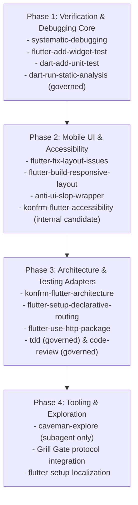

# KONFRM Agent Skills Installation & Implementation Plan V1
## Phased Rollout, Vendoring Architecture, Pinning Registry, and Safety Checklists

**Document Version:** 1.1.0
**Status:** DRAFT — PENDING BRIDGE REVIEW
**Scope:** Controlled Implementation Blueprint for Approved Agent Skills
**Target Repository:** `Essxm01/KONFRM`
**Governing Standard:** `docs/agents/KONFRM_AGENT_SKILLS_GOVERNANCE_V1.md`

---

## 1. Executive Implementation Policy

> [!IMPORTANT]
> **ZERO INSTALLATION IN THIS MISSION.**
> In accordance with Section 20 of the Mission Charter, this document is an architectural implementation plan only. No skills are installed, no `.agents/skills/` directories are mutated, and no dependencies are added during this mission. Actual installation occurs only after explicit Founder and Bridge review and approval.

### Rollout Philosophy
- **Controlled, Incremental Rollout:** Skills are integrated in phased tiers based on verification value and stability.
- **The Three-File Vendoring Pattern:** Every approved external skill is preserved in a permanent, auditable three-file structure.
- **Strict Upstream Pinning:** Zero tracking of `main`, `master`, or `latest`. Every external skill is frozen to a verified 40-character commit SHA (`AUDITED_COMMIT`).
- **Sanitization & Adaptation:** Conflicting upstream guidance (e.g. MVVM, ChangeNotifier, offline mutation queues, generic SaaS palettes) is surgically adapted before a wrapper is activated.

---

## 2. The Three-File Vendoring Architecture

To guarantee total reproducibility and auditability, KONFRM uses a standardized vendoring pattern:

```
KONFRM-CANONICAL/
├── docs/ai/skills/<skill-name>/
│   ├── SKILL.md                  <-- The Authoritative Governed KONFRM Wrapper
│   └── vendor/
│       └── UPSTREAM_SKILL.md     <-- Exact, unmodified upstream markdown snapshot
└── .agents/skills/<skill-name>/
    └── SKILL.md                  <-- Lightweight runtime agent discovery shim
```

### Component Roles
1. **`docs/ai/skills/<skill-name>/vendor/UPSTREAM_SKILL.md`:**
   - The frozen upstream markdown snapshot as fetched from the source repository at the pinned commit SHA.
   - Preserves complete upstream attribution and licensing.
   - Never modified directly; represents upstream implementation reality at the audit date.
2. **`docs/ai/skills/<skill-name>/SKILL.md`:**
   - The authoritative KONFRM governed wrapper.
   - Contains frontmatter with skill metadata.
   - Enforces the **Canon Subordination Rule**.
   - Contains explicit guardrails, forbidden overrides, and adaptations tailored to KONFRM architecture.
   - Links to the local vendor snapshot.
3. **`.agents/skills/<skill-name>/SKILL.md`:**
   - The runtime discovery shim consumed by AI agent tools (Antigravity, Codex, Cursor, Claude Code).
   - Mirrors or references the authoritative wrapper.

---

## 3. Verified Upstream Pinning Registry (Audited Git Commits)

The following table records the authoritative upstream targets, verified full 40-character commit SHAs (`AUDITED_COMMIT`), exact file paths, file/blob SHAs, licenses, and maintainers for candidate skills approved for future phased vendoring:

| Skill / Wrapper Name | Upstream Repository | Upstream Path to SKILL.md | Verified 40-Char Commit SHA | Blob SHA | License | Maintainer / Source | Audit Date | Target Profile |
| :--- | :--- | :--- | :--- | :--- | :--- | :--- | :--- | :--- |
| `systematic-debugging` | `github.com/obra/superpowers` | `skills/systematic-debugging/SKILL.md` | `8ca22dba9a94f28898bbce59f2537ff4d87c747d` | `095d194ac041502905f15b01d22d294fb94db8b2` | MIT | Jesse Vincent (obra) | 2026-10-07 | `QA_REVIEW`, All |
| `flutter-add-widget-test` | `github.com/flutter/agent-plugins` | `skills/flutter-add-widget-test/SKILL.md` | `0ef3972f93e2baa4156ba1cbb1e515cd53079c68` | `01ac7ac645a7f6f66603cb1c78a2a28dba3a5d32` | BSD-3-Clause | Google (Flutter Team) | 2026-10-07 | Mobile, `QA_REVIEW` |
| `flutter-add-integration-test`| `github.com/flutter/agent-plugins`| `skills/flutter-add-integration-test/SKILL.md`| `0ef3972f93e2baa4156ba1cbb1e515cd53079c68`| `60902f1aa3156fa0c8e28df5448864dd5cc6c014` | BSD-3-Clause | Google (Flutter Team) | 2026-10-07 | `QA_REVIEW` (`ON_DEMAND`) |
| `flutter-build-responsive-layout`| `github.com/flutter/agent-plugins`| `skills/flutter-build-responsive-layout/SKILL.md`| `0ef3972f93e2baa4156ba1cbb1e515cd53079c68`| `b85bfd7e82e30ac676d2140ddb436bfebd0992cb` | BSD-3-Clause | Google (Flutter Team) | 2026-10-07 | `CUSTOMER_FLUTTER`, `OWNER_FLUTTER` |
| `flutter-fix-layout-issues` | `github.com/flutter/agent-plugins` | `skills/flutter-fix-layout-issues/SKILL.md` | `0ef3972f93e2baa4156ba1cbb1e515cd53079c68` | `3804a3c1d9fd2b88ee1ddc74716799cf2cd770c1` | BSD-3-Clause | Google (Flutter Team) | 2026-10-07 | Mobile, `QA_REVIEW` |
| `konfrm-flutter-architecture` | `github.com/flutter/agent-plugins` | `skills/flutter-apply-architecture-best-practices/SKILL.md` | `0ef3972f93e2baa4156ba1cbb1e515cd53079c68` | `791994b12280e5734479079bd6255fa705e983c5` | BSD-3-Clause | Google (Flutter Team) | 2026-10-07 | Mobile Profiles (Adapted) |
| `flutter-setup-declarative-routing`| `github.com/flutter/agent-plugins`| `skills/flutter-setup-declarative-routing/SKILL.md`| `0ef3972f93e2baa4156ba1cbb1e515cd53079c68`| `272031181bc8d8598c934a14b1d12cf08c7aa1bc` | BSD-3-Clause | Google (Flutter Team) | 2026-10-07 | Mobile Profiles |
| `flutter-setup-localization` | `github.com/flutter/agent-plugins` | `skills/flutter-setup-localization/SKILL.md` | `0ef3972f93e2baa4156ba1cbb1e515cd53079c68` | `d3dd4596da225df783e1816c658125206566902b` | BSD-3-Clause | Google (Flutter Team) | 2026-10-07 | Mobile Profiles |
| `flutter-use-http-package` | `github.com/flutter/agent-plugins` | `skills/flutter-use-http-package/SKILL.md` | `0ef3972f93e2baa4156ba1cbb1e515cd53079c68` | `bb60468d6448259b1708a2c34a01f43e77529437` | BSD-3-Clause | Google (Flutter Team) | 2026-10-07 | Mobile Profiles, Backend |
| `dart-add-unit-test` | `github.com/dart-lang/skills` | `skills/dart-add-unit-test/SKILL.md` | `0d9f1c4a0ae29d6f5180bf6143d7997ec3bacf49` | `a4921a529000ddbfa6c98360dbc0b68f11fc4d4a` | BSD-3-Clause | Google (Dart Team) | 2026-10-07 | All Profiles |
| `dart-run-static-analysis` (Governed)| `github.com/dart-lang/skills` | `skills/dart-run-static-analysis/SKILL.md` | `0d9f1c4a0ae29d6f5180bf6143d7997ec3bacf49` | `27ca6546684accbc8f96091d0b992f6f43a16d15` | BSD-3-Clause | Google (Dart Team) | 2026-10-07 | Mobile, `QA_REVIEW` |
| `dart-collect-coverage` | `github.com/dart-lang/skills` | `skills/dart-collect-coverage/SKILL.md` | `0d9f1c4a0ae29d6f5180bf6143d7997ec3bacf49` | `60dad77533dc0a98b7f4a8363ac1b56d589d353a` | BSD-3-Clause | Google (Dart Team) | 2026-10-07 | `QA_REVIEW` |
| `tdd` (Governed) | `github.com/mattpocock/skills` | `skills/engineering/tdd/SKILL.md` | `f3fc5632f401156837ee3872f14fe33ccf1024ea` | `01eadaa34e7c9a63a67d6dc3cce1cc81b0e49985` | MIT | Matt Pocock | 2026-10-07 | All Profiles |
| `code-review` (Governed) | `github.com/mattpocock/skills` | `skills/engineering/code-review/SKILL.md` | `f3fc5632f401156837ee3872f14fe33ccf1024ea` | `373a4f26e6cfa3617778397945bb069d9cb184bc` | MIT | Matt Pocock | 2026-10-07 | `QA_REVIEW`, `BRIDGE` |
| `anti-ui-slop-wrapper` | `github.com/uizze/uizze` | `skills/anti-ui-slop/SKILL.md` | `4a0224f578f65a87f328e9c533b3d8bf1023c1f7` | `81761062c1e482ddc7ea30e4f4e250ef67b73c0e` | MIT | UIZZE Team | 2026-10-07 | Mobile & Web Profiles |
| `caveman-explore` | `github.com/JuliusBrussee/caveman` | `skills/caveman-explore/SKILL.md` | `99aafe151a1be72be783e662858e8a0955add59f` | `5bc2aa79833d34c411b5680ed0e7c60496982426` | MIT | Julius Brussee | 2026-10-07 | Subagent Explorer (`ON_DEMAND`) |

---

## 4. Adaptation Blueprints for Governed Wrappers

### Blueprint A: `konfrm-flutter-architecture` (Adapting `flutter-apply-architecture-best-practices`)
- **Upstream Path:** `skills/flutter-apply-architecture-best-practices/SKILL.md`
- **Actual Upstream Pattern:** Recommends MVVM with `ChangeNotifier` / `Listenable`, UI+Data layering, optional domain use cases, hybrid structure, `freezed`/`built_value`, and local caching/offline sync.
- **Wrapper Name:** `konfrm-flutter-architecture`
- **Sanitization Steps:**
  1. **Expunge MVVM & ChangeNotifier:** Replace state management guidance with Riverpod `NotifierProvider` / `AsyncNotifierProvider` (manual, without code generation).
  2. **Expunge Hybrid Directory Structure:** Replace with KONFRM's 3-layer Feature-First model:
     - `lib/src/features/<feature>/data/` (DTOs, datasources, client adapters)
     - `lib/src/features/<feature>/application/` (Riverpod controllers, orchestrators)
     - `lib/src/features/<feature>/presentation/` (Widgets, screens, localized strings)
  3. **Expunge Offline Synchronization Queues:** Enforce strict **fail-closed** network error handling.
  4. **Enforce Zero Local Financial Authority:** Forbid client-side fee or split math.

### Blueprint B: `anti-ui-slop-wrapper` (Adapting `uizze/anti-ui-slop`)
- **Upstream Path:** `skills/anti-ui-slop/SKILL.md`
- **Upstream Pattern:** Audits against generic AI card layouts, centered heroes, weak hierarchies, and low contrast; assumes standard SaaS Tailwind color tokens.
- **Wrapper Name:** `anti-ui-slop-wrapper`
- **Sanitization Steps:**
  1. **Subordinate to DF2 Canon:** Prohibit generic web/SaaS vibrant accents or custom palettes.
  2. **Inject Monochrome-First Palette:** Bind visual critique to Mobile Primary Black (`#000000` system-validated provisional), neutral gray scales, and candidate interaction blue (`#276EF1`).
  3. **Inject Native Arabic RTL Checks:** Audit for broken Bidi layout, improper directional padding, and Western Arabic numeral (`0-9`) consistency.
  4. **Inject Component-Scoped Geometry:** Enforce Field radius `8`, Primary button radius `6` provisional, Sheet top radius `16` provisional, Dialog radius `12` provisional. Prohibit generic "4–12dp" collapsing.

### Blueprint C: `dart-run-static-analysis` Governed Wrapper
- **Upstream Path:** `skills/dart-run-static-analysis/SKILL.md`
- **Upstream Pattern:** Recommends running `dart analyze`, automated fixes via `dart fix --apply`, and `dart format .`.
- **Wrapper Name:** `dart-run-static-analysis`
- **Sanitization Steps:**
  1. **Read-Only by Default:** The analysis gate (`dart analyze`) is safe and read-only.
  2. **Dry-Run Enforcement:** Any automated fixing must execute `dart fix --dry-run` first; inspect proposed changes before applying.
  3. **No Blanket Repo-Wide Formatting/Fixing:** Forbid repo-wide `dart fix --apply` or repo-wide `dart format .`. Scope changes strictly to files modified in the active task.
  4. **No Suppression to Force Green CI:** Blanket `// ignore_for_file:` or inline suppression comments are strictly forbidden.

### Blueprint D: `tdd` Governed Wrapper (Founder Interruption Policy)
- **Upstream Path:** `skills/engineering/tdd/SKILL.md`
- **Upstream Pattern:** Inquires with user regarding test seams and public boundaries.
- **Wrapper Name:** `tdd`
- **Sanitization Steps:**
  1. **Enforce Bounded Autonomy:** Do NOT interrupt the Founder when acceptance criteria are established and architecture is governed.
  2. **Escalate Only on Structural Mutations:** Prompt user only if the seam selection alters architectural boundaries, business rules, or public API contracts.

### Blueprint E: `flutter-add-integration-test` Governed Wrapper
- **Upstream Path:** `skills/flutter-add-integration-test/SKILL.md`
- **Upstream Pattern:** Recommends adding Flutter Driver extension directly into `lib/main.dart`.
- **Wrapper Name:** `flutter-add-integration-test`
- **Sanitization Steps:**
  1. **Classification:** Strictly `ON_DEMAND`.
  2. **Dedicated Test Entrypoint:** Prohibit mutating production `lib/main.dart`. Require a dedicated test entrypoint (e.g. `lib/main_test.dart`).

---

## 5. Phased Installation Roadmap (Future Rollout Post-Approval)

When approved by Bridge, installation proceeds in four discrete, verifiable phases:



---

## 6. Pre-Installation Security & Trust Verification Checklist

Before any single external skill is added to `docs/ai/skills/`:

- [ ] **License Check:** Confirmed permissive license (MIT, Apache 2.0, or BSD).
- [ ] **Dependency Audit:** Zero npm, pip, or binary dependencies required.
- [ ] **Network Egress Audit:** Confirmed zero external HTTP requests, telemetry calls, or remote API queries.
- [ ] **Secret Scan:** Confirmed zero requirement for API keys, bearer tokens, or cloud credentials.
- [ ] **Static Code Audit:** Inspected upstream markdown for hidden shell commands, malicious hooks, or eval expressions.
- [ ] **Canon Alignment:** Confirmed upstream instructions do not contradict DF2 palette, Arabic RTL, or business invariants.
- [ ] **Commit SHA Pinning:** Confirmed exact 40-character commit SHA is recorded and snapshot committed to `vendor/UPSTREAM_SKILL.md`.

---

## 7. Version Upgrade Governance

To prevent silent behavior drift, external skills must never be automatically updated.

### Upgrade Protocol:
1. **Trigger:** A compelling new capability or bugfix is identified in an upstream repository.
2. **Diff Generation:** Generate a git diff between the pinned commit SHA and the proposed target SHA.
3. **Canon Conflict Review:** Inspect the diff for new architectural recommendations, breaking changes, or token bloat.
4. **Wrapper Reconciliation:** Update `docs/ai/skills/<skill-name>/vendor/UPSTREAM_SKILL.md` with the new snapshot, and adjust the wrapper guardrails if needed.
5. **Bridge Review & Approval:** Submit as an isolated `chore(skills): upgrade <skill-name> to <sha>` commit for Bridge signoff.
