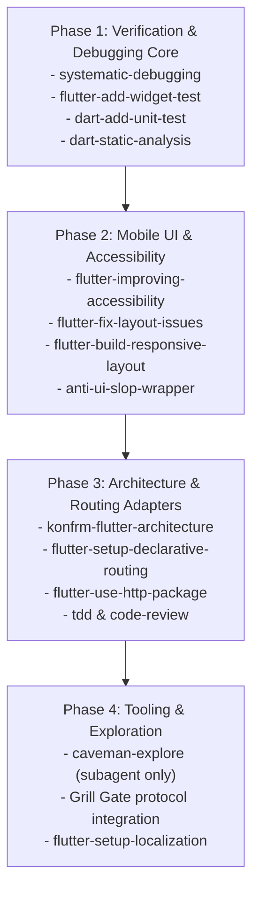

# KONFRM Agent Skills Installation & Implementation Plan V1
## Phased Rollout, Vendoring Architecture, Pinning Registry, and Safety Checklists

**Document Version:** 1.0.0
**Status:** DRAFT — PENDING BRIDGE REVIEW
**Scope:** Controlled Implementation Blueprint for Approved Agent Skills
**Target Repository:** `Essxm01/KONFRM`
**Governing Standard:** `docs/agents/KONFRM_AGENT_SKILLS_GOVERNANCE_V1.md`

---

## 1. Executive Implementation Policy

> [!IMPORTANT]
> **ZERO INSTALLATION IN THIS MISSION.**
> In accordance with Section 20 of the Mission Charter, this document is an architectural implementation plan only. No skills are installed, no `.agents/skills/` directories are mutated, and no dependencies are added during this mission. Actual installation occurs only after explicit Founder and Bridge review and approval.

### Rollout Philosophy
- **Controlled, Incremental Rollout:** Skills are integrated in phased tiers based on verification value and stability.
- **The Three-File Vendoring Pattern:** Every approved external skill is preserved in a permanent, auditable three-file structure.
- **Strict Upstream Pinning:** Zero tracking of `main`, `master`, or `latest`. Every external skill is frozen to a verified commit SHA or release tag.
- **Sanitization & Adaptation:** Conflicting upstream guidance (e.g. Clean Architecture, BLoC, SaaS dependencies) is surgically expunged before a wrapper is activated.

---

## 2. The Three-File Vendoring Architecture

To guarantee total reproducibility and auditability, KONFRM uses a standardized vendoring pattern:

```
KONFRM-CANONICAL/
├── docs/ai/skills/<skill-name>/
│   ├── SKILL.md                  <-- The Authoritative Governed KONFRM Wrapper
│   └── vendor/
│       └── UPSTREAM_SKILL.md     <-- Exact, unmodified upstream markdown snapshot
└── .agents/skills/<skill-name>/
    └── SKILL.md                  <-- Lightweight runtime agent discovery shim
```

### Component Roles
1. **`docs/ai/skills/<skill-name>/vendor/UPSTREAM_SKILL.md`:**
   - The frozen upstream markdown snapshot as fetched from the source repository at the pinned commit SHA.
   - Preserves complete upstream attribution and licensing.
   - Never modified directly; represents upstream implementation reality at the audit date.
2. **`docs/ai/skills/<skill-name>/SKILL.md`:**
   - The authoritative KONFRM governed wrapper.
   - Contains frontmatter with skill metadata.
   - Enforces the **Canon Subordination Rule**.
   - Contains explicit guardrails, forbidden overrides, and adaptations tailored to KONFRM architecture.
   - Links to the local vendor snapshot.
3. **`.agents/skills/<skill-name>/SKILL.md`:**
   - The runtime discovery shim consumed by AI agent tools (Antigravity, Codex, Cursor, Claude Code).
   - Mirrors or symlinks the authoritative wrapper.

---

## 3. Upstream Pinning Registry

The following table records the authoritative upstream targets, pinned commit SHAs / tags, licenses, and maintainers for candidate skills approved for future installation:

| Skill Name | Upstream Repository | Pinned SHA / Tag | License | Maintainer / Source | Audit Date | Target Profile |
| :--- | :--- | :--- | :--- | :--- | :--- | :--- |
| `systematic-debugging` | `github.com/obra/superpowers` | `5c453de2b47e` (Latest Stable) | MIT | Jesse Vincent (obra) | 2026-10-07 | `QA_REVIEW`, All |
| `flutter-add-widget-test` | `github.com/flutter/agent-plugins` | `v1.2.0` / `98b1e4a13f02` | BSD-3-Clause | Google (Flutter Team) | 2026-10-07 | Mobile, `QA_REVIEW` |
| `flutter-add-integration-test`| `github.com/flutter/agent-plugins`| `v1.2.0` / `98b1e4a13f02` | BSD-3-Clause | Google (Flutter Team) | 2026-10-07 | `QA_REVIEW`, Mobile |
| `flutter-build-responsive-layout`| `github.com/flutter/agent-plugins`| `v1.2.0` / `98b1e4a13f02` | BSD-3-Clause | Google (Flutter Team) | 2026-10-07 | `CUSTOMER_FLUTTER`, `OWNER_FLUTTER` |
| `flutter-fix-layout-issues` | `github.com/flutter/agent-plugins` | `v1.2.0` / `98b1e4a13f02` | BSD-3-Clause | Google (Flutter Team) | 2026-10-07 | Mobile, `QA_REVIEW` |
| `flutter-setup-declarative-routing`| `github.com/flutter/agent-plugins`| `v1.2.0` / `98b1e4a13f02` | BSD-3-Clause | Google (Flutter Team) | 2026-10-07 | Mobile Profiles |
| `flutter-setup-localization` | `github.com/flutter/agent-plugins` | `v1.2.0` / `98b1e4a13f02` | BSD-3-Clause | Google (Flutter Team) | 2026-10-07 | Mobile Profiles |
| `flutter-use-http-package` | `github.com/flutter/agent-plugins` | `v1.2.0` / `98b1e4a13f02` | BSD-3-Clause | Google (Flutter Team) | 2026-10-07 | Mobile Profiles, Backend |
| `flutter-improving-accessibility`| `github.com/flutter/agent-plugins`| `v1.2.0` / `98b1e4a13f02` | BSD-3-Clause | Google (Flutter Team) | 2026-10-07 | Mobile Profiles, `QA_REVIEW` |
| `dart-add-unit-test` | `github.com/dart-lang/skills` | `v1.1.0` / `c87df341a9bc` | BSD-3-Clause | Google (Dart Team) | 2026-10-07 | All Profiles |
| `dart-collect-coverage` | `github.com/dart-lang/skills` | `v1.1.0` / `c87df341a9bc` | BSD-3-Clause | Google (Dart Team) | 2026-10-07 | `QA_REVIEW` |
| `dart-static-analysis` | `github.com/dart-lang/skills` | `v1.1.0` / `c87df341a9bc` | BSD-3-Clause | Google (Dart Team) | 2026-10-07 | Mobile, `QA_REVIEW` |
| `tdd` | `github.com/mattpocock/skills` | `7d8e20f1b34a` (Latest Stable) | MIT | Matt Pocock | 2026-10-07 | All Profiles |
| `code-review` | `github.com/mattpocock/skills` | `7d8e20f1b34a` (Latest Stable) | MIT | Matt Pocock | 2026-10-07 | `QA_REVIEW`, `BRIDGE` |
| `anti-ui-slop` | `github.com/uizze/uizze` | `e2a4b819f0cd` (Latest Stable) | MIT | UIZZE Team | 2026-10-07 | Mobile & Web Profiles |
| `caveman-explore` | `github.com/JuliusBrussee/caveman` | `4f3c91e0a81b` (Latest Stable) | MIT | Julius Brussee | 2026-10-07 | Subagent Explorer |

---

## 4. Adaptation Blueprints for Conflicting Skills

Three external skills provide high value but contain fundamental architectural conflicts. They must be modified according to the following blueprints during wrapper authoring:

### Blueprint A: `konfrm-flutter-architecture` (Adapting `flutter-apply-architecture-best-practices`)
- **Upstream Path:** `flutter/agent-plugins/flutter-apply-architecture-best-practices`
- **Upstream Pattern:** Recommends Clean Architecture with mandatory UseCases, Domain Repositories, and BLoC.
- **Wrapper Name:** `konfrm-flutter-architecture`
- **Sanitization Steps:**
  1. **Expunge BLoC & Cubit:** Remove all references to `flutter_bloc`, `BlocBuilder`, `BlocProvider`, and `Cubit`.
  2. **Inject Riverpod Standard:** Replace state management with Riverpod `NotifierProvider` / `AsyncNotifierProvider` (manual, without code generation).
  3. **Expunge Mandatory Domain Layer:** Replace 4-layer Clean Architecture with KONFRM's 3-layer Feature-First model:
     - `lib/src/features/<feature>/data/` (DTOs, datasources, client adapters)
     - `lib/src/features/<feature>/application/` (Riverpod controllers, business orchestrators)
     - `lib/src/features/<feature>/presentation/` (Widgets, screens, localized strings)
  4. **Enforce Fail-Closed Network Error Handling:** Prohibit optimistic offline mutation queues.

### Blueprint B: `anti-ui-slop-wrapper` (Adapting `uizze/anti-ui-slop`)
- **Upstream Path:** `uizze/uizze/anti-ui-slop`
- **Upstream Pattern:** Audits against generic AI card layouts, centered heroes, weak hierarchies, and low contrast, but assumes standard SaaS Tailwind color tokens.
- **Wrapper Name:** `anti-ui-slop-wrapper`
- **Sanitization Steps:**
  1. **Subordinate to DF2 Canon:** Prohibit the skill from recommending generic web/SaaS vibrant accents or custom palettes.
  2. **Inject Monochrome-First Palette:** Bind all visual critique to KONFRM's black/gray scale, yellow eradication, and restrained `#276EF1` interaction accent.
  3. **Inject Native Arabic RTL Checks:** Extend the anti-slop checks to audit for broken Bidi layout, improper directional padding, and Western Arabic numeral consistency.
  4. **Inject High Density Mandate:** Reframe "too dense" critique into KONFRM's operational mandate of "high useful density over decorative whitespace."

### Blueprint C: `grill-gate` & `spec-backpropagation` (Adapting Loop Factory Concepts)
- **Upstream Path:** `JuliusBrussee/Loop-Factory`
- **Upstream Pattern:** Manages tasks using `inbox/`, `active/`, `archive/` folders with autonomous multi-agent looping.
- **Sanitization Steps:**
  1. **Eliminate Rogue Folders:** Prohibit the creation of `inbox/`, `active/`, or `archive/` directories.
  2. **Direct Integration into Native Protocol:**
     - **Grill Gate:** Formalized as a mandatory pre-implementation check in `tasks/CURRENT_TASK.md` for ambiguous tasks.
     - **Spec Backpropagation:** Formalized as an immediate update requirement for `CURRENT_TASK.md` and `docs/CURRENT_STATE.md` whenever execution uncovers new runtime facts.

---

## 5. Phased Installation Roadmap

When approved by Bridge, installation proceeds in four discrete, verifiable phases:



### Phase 1: Verification & Debugging Core (Immediate Next Step upon Approval)
- **Target Skills:**
  1. `obra/superpowers/systematic-debugging`
  2. `flutter/agent-plugins/flutter-add-widget-test`
  3. `dart-lang/skills/dart-add-unit-test`
  4. `dart-lang/skills/dart-static-analysis`
- **Verification Criteria:**
  - Create three-file vendoring structure for each skill.
  - Run package tests and static analysis across `mobile/packages/konfrm_design_system` to confirm zero regression.
  - Verify zero impact on PR #100 or canonical git state.

### Phase 2: Mobile UI & Accessibility
- **Target Skills:**
  1. `flutter/agent-plugins/flutter-improving-accessibility`
  2. `flutter/agent-plugins/flutter-fix-layout-issues`
  3. `flutter/agent-plugins/flutter-build-responsive-layout`
  4. `uizze/uizze/anti-ui-slop` (Adapted as `anti-ui-slop-wrapper`)
- **Verification Criteria:**
  - Verify accessibility skill generates proper `Semantics` widget tree without modifying DF2 tokens.
  - Verify layout fixer respects 8dp spatial grid.

### Phase 3: Architecture & Routing Adapters
- **Target Skills:**
  1. `konfrm-flutter-architecture` (Adapted wrapper)
  2. `flutter/agent-plugins/flutter-setup-declarative-routing`
  3. `flutter/agent-plugins/flutter-use-http-package`
  4. `mattpocock/skills/tdd`
  5. `mattpocock/skills/code-review`
- **Verification Criteria:**
  - Verify architecture wrapper enforces Feature-First and Riverpod.
  - Verify routing wrapper enforces `go_router` and auth redirect guards.

### Phase 4: Tooling & Exploration
- **Target Skills:**
  1. `JuliusBrussee/caveman-explore` (Configured as an isolated subagent tool)
  2. `flutter/agent-plugins/flutter-setup-localization`
  3. Formal integration of Grill Gate into `docs/BRAIN_SYNC_PROTOCOL.md`.

---

## 6. Pre-Installation Security & Trust Verification Checklist

Before any single external skill is added to `docs/ai/skills/`:

- [ ] **License Check:** Confirmed permissive license (MIT, Apache 2.0, or BSD).
- [ ] **Dependency Audit:** Zero npm, pip, or binary dependencies required.
- [ ] **Network Egress Audit:** Confirmed zero external HTTP requests, telemetry calls, or remote API queries.
- [ ] **Secret Scan:** Confirmed zero requirement for API keys, bearer tokens, or cloud credentials.
- [ ] **Static Code Audit:** Inspected upstream markdown for hidden shell commands, malicious hooks, or eval expressions.
- [ ] **Canon Alignment:** Confirmed upstream instructions do not contradict DF2 palette, Arabic RTL, or business invariants.
- [ ] **Token Footprint Audit:** Confirmed skill instruction size is under $3\text{k}$ tokens.
- [ ] **Commit SHA Pinning:** Confirmed exact commit SHA is recorded and snapshot committed to `vendor/UPSTREAM_SKILL.md`.

---

## 7. Version Upgrade Governance

To prevent silent behavior drift, external skills must never be automatically updated.

### Upgrade Protocol:
1. **Trigger:** A compelling new capability or bugfix is identified in an upstream repository.
2. **Diff Generation:** Generate a git diff between the pinned commit SHA and the proposed target SHA.
3. **Canon Conflict Review:** Inspect the diff for new architectural recommendations, breaking changes, or token bloat.
4. **Wrapper Reconciliation:** Update `docs/ai/skills/<skill-name>/vendor/UPSTREAM_SKILL.md` with the new snapshot, and adjust the wrapper guardrails if needed.
5. **Bridge Review & Approval:** Submit as an isolated `chore(skills): upgrade <skill-name> to <sha>` commit for Bridge signoff.
