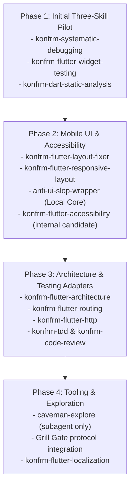

# KONFRM Agent Skills Installation & Implementation Plan V1
## Phased Rollout, Skill Bundle Vendoring Architecture, and Pinning Manifest

**Document Version:** 1.2.0
**Status:** DRAFT — PENDING FINAL BRIDGE APPROVAL
**Scope:** Controlled Implementation Blueprint for Approved Agent Skills
**Target Repository:** `Essxm01/KONFRM`
**Governing Standard:** `docs/agents/KONFRM_AGENT_SKILLS_GOVERNANCE_V1.md`

---

## 1. Executive Implementation Policy

> [!IMPORTANT]
> **ZERO INSTALLATION IN THIS MISSION.**
> In accordance with Section 20 of the Mission Charter, this document is an architectural implementation plan only. No skills are installed, no `.agents/skills/` directories are mutated, and no dependencies are added during this mission. Actual installation occurs only after explicit Founder and Bridge review and approval.

### Rollout Philosophy
- **Controlled, Incremental Rollout:** Skills are integrated in phased tiers based on verification value and stability.
- **The `KONFRM_SKILL_BUNDLE_V1` Pattern:** Every approved external skill is preserved as a self-contained runtime bundle in `.agents/skills/` paired with an audit and provenance record in `docs/ai/skills/`.
- **Strict Upstream Pinning:** Zero tracking of `main`, `master`, or `latest`. Every external skill is frozen to a verified 40-character commit SHA (`AUDITED_COMMIT`).
- **Sanitization & Frontmatter Normalization:** Conflicting upstream guidance (MVVM, ChangeNotifier, offline mutation queues, generic SaaS palettes) and platform-locked frontmatter (e.g. `model: haiku`) are adapted before bundle activation.

---

## 2. The `KONFRM_SKILL_BUNDLE_V1` Architecture

To guarantee total reproducibility and auditability, KONFRM uses a standardized bundle structure:

```text
KONFRM-CANONICAL/
├── .agents/skills/<governed-skill-name>/      <-- RUNTIME SOURCE OF TRUTH (Antigravity & Codex)
│   ├── SKILL.md                              <-- Authoritative, self-contained executable skill
│   ├── references/                           <-- Bundled local supporting guides (RUNTIME_REQUIRED only)
│   ├── scripts/                              <-- Optional local validation scripts (scanned & audited)
│   └── assets/                               <-- Optional local reference templates
│
└── docs/ai/skills/<governed-skill-name>/       <-- GOVERNANCE & PROVENANCE REPOSITORY (Never loaded in routine runs)
    ├── AUDIT.md                              <-- Audit record, adaptation rationale, security classification
    ├── UPSTREAM_MANIFEST.md                  <-- Dependency manifest, upstream blobs, license provenance
    └── vendor/                               <-- Exact upstream snapshot as fetched at AUDITED_COMMIT
        ├── SKILL.md                          <-- Unmodified upstream SKILL.md
        └── ...                               <-- Upstream companion files
```

### Component Roles
1. **`.agents/skills/<governed-skill-name>/SKILL.md`:**
   - The authoritative runtime executable skill discovered by both Antigravity and Codex.
   - Contains normalized frontmatter, triggers, Canon subordination, operational procedures, guardrails, and relative links to companion files in `references/`.
   - **NOT** a pointer shim; it is completely self-contained.
2. **`.agents/skills/<governed-skill-name>/references/`:**
   - Companion markdown files classified as `RUNTIME_REQUIRED` by the dependency manifest.
   - Preserves required deep-dive checklists and procedures locally so that runtime execution has zero broken links.
3. **`docs/ai/skills/<governed-skill-name>/`:**
   - Preserves the audited upstream snapshot (`vendor/`), full dependency classification (`UPSTREAM_MANIFEST.md`), and governance findings (`AUDIT.md`).
   - Kept out of routine agent execution contexts to protect token budgets.

---

## 3. Master Upstream Pinning & Bundle Manifest Table

The following table records the authoritative upstream targets, verified full 40-character commit SHAs (`AUDITED_COMMIT`), exact file paths, file/blob SHAs, network classifications, host-specific metadata normalization, cross-skill dependency handling, and runtime profiles for candidate skills approved for phased implementation:

| # | Upstream Skill Name | KONFRM Runtime Name | Upstream Repo & Path | Audited Commit SHA | Root Skill Blob SHA | Supporting Companion Files & Manifest Status | Network Class | Host-Specific Metadata Handled | Cross-Skill Dependencies Handled | Runtime Profile | Install Status |
| :--- | :--- | :--- | :--- | :--- | :--- | :--- | :---: | :--- | :--- | :--- | :---: |
| **01** | `systematic-debugging` | `konfrm-systematic-debugging` | `obra/superpowers`<br>`skills/systematic-debugging/SKILL.md` | `8ca22dba9a94f28898bbce59f2537ff4d87c747d` | `095d194ac041502905f15b01d22d294fb94db8b2` | `root-cause-tracing.md` (`RUNTIME_REQUIRED`)<br>`defense-in-depth.md` (`RUNTIME_REQUIRED`)<br>`condition-based-waiting.md` (`RUNTIME_REQUIRED`)<br>`find-polluter.sh` (`AUDIT_ONLY`) | `LOCAL_ONLY` | Standardized (universal) | Unresolved upstream links to `test-driven-development` and `verification-before-completion` are rewritten to map to KONFRM Quality Gates. | `QA_REVIEW`, All | **PHASE 1 PILOT** (Pending Bridge Approval) |
| **02** | `flutter-add-widget-test` | `konfrm-flutter-widget-testing` | `flutter/agent-plugins`<br>`skills/flutter-add-widget-test/SKILL.md` | `0ef3972f93e2baa4156ba1cbb1e515cd53079c68` | `01ac7ac645a7f6f66603cb1c78a2a28dba3a5d32` | None (Single file self-contained) | `LOCAL_ONLY` | Strips upstream `model: models/gemini-3.1-pro-preview` | None | Mobile, `QA_REVIEW` | **PHASE 1 PILOT** (Pending Bridge Approval) |
| **03** | `dart-run-static-analysis` | `konfrm-dart-static-analysis` | `dart-lang/skills`<br>`skills/dart-run-static-analysis/SKILL.md` | `0d9f1c4a0ae29d6f5180bf6143d7997ec3bacf49` | `27ca6546684accbc8f96091d0b992f6f43a16d15` | None (Single file self-contained) | `LOCAL_ONLY` | Strips upstream `model: models/gemini-3.1-pro-preview` | None | All Dart/Flutter | **PHASE 1 PILOT** (Pending Bridge Approval) |
| **04** | `flutter-add-integration-test`| `konfrm-flutter-integration-test`| `flutter/agent-plugins`<br>`skills/flutter-add-integration-test/SKILL.md`| `0ef3972f93e2baa4156ba1cbb1e515cd53079c68`| `60902f1aa3156fa0c8e28df5448864dd5cc6c014` | None | `LOCAL_ONLY` | Strips upstream model metadata | Requires dedicated entrypoint (`lib/main_test.dart`); forbids mutating `lib/main.dart`. | `QA_REVIEW` (`ON_DEMAND`) | Phase 2 Candidate |
| **05** | `flutter-build-responsive-layout`| `konfrm-flutter-responsive-layout`| `flutter/agent-plugins`<br>`skills/flutter-build-responsive-layout/SKILL.md`| `0ef3972f93e2baa4156ba1cbb1e515cd53079c68`| `b85bfd7e82e30ac676d2140ddb436bfebd0992cb` | None | `LOCAL_ONLY` | Strips upstream model metadata | Bound to phone/tablet density and DF2 4–32 spacing scale. | `CUSTOMER_FLUTTER`, `OWNER_FLUTTER` | Phase 2 Candidate |
| **06** | `flutter-fix-layout-issues` | `konfrm-flutter-layout-fixer` | `flutter/agent-plugins`<br>`skills/flutter-fix-layout-issues/SKILL.md` | `0ef3972f93e2baa4156ba1cbb1e515cd53079c68` | `3804a3c1d9fd2b88ee1ddc74716799cf2cd770c1` | None | `LOCAL_ONLY` | Strips upstream model metadata | None | Mobile, `QA_REVIEW` | Phase 2 Candidate |
| **07** | `flutter-apply-architecture-best-practices`| `konfrm-flutter-architecture` | `flutter/agent-plugins`<br>`skills/flutter-apply-architecture-best-practices/SKILL.md` | `0ef3972f93e2baa4156ba1cbb1e515cd53079c68` | `791994b12280e5734479079bd6255fa705e983c5` | None | `LOCAL_ONLY` | Strips upstream model metadata | Replaces MVVM/ChangeNotifier, hybrid structure, and offline sync with Feature-First, Riverpod without codegen, and fail-closed error handling. | Mobile Profiles | Phase 3 Candidate |
| **08** | `flutter-setup-declarative-routing`| `konfrm-flutter-routing` | `flutter/agent-plugins`<br>`skills/flutter-setup-declarative-routing/SKILL.md`| `0ef3972f93e2baa4156ba1cbb1e515cd53079c68`| `272031181bc8d8598c934a14b1d12cf08c7aa1bc` | None | `LOCAL_ONLY` | Strips upstream model metadata | Deep link architecture preserved; concrete URL schemes deferred. | Mobile Profiles | Phase 3 Candidate |
| **09** | `flutter-setup-localization` | `konfrm-flutter-localization` | `flutter/agent-plugins`<br>`skills/flutter-setup-localization/SKILL.md` | `0ef3972f93e2baa4156ba1cbb1e515cd53079c68` | `d3dd4596da225df783e1816c658125206566902b` | None | `LOCAL_ONLY` | Strips upstream model metadata | Enforces Western Arabic digits (`0-9`) default and Egyptian currency formatting. | Mobile Profiles | Phase 4 Candidate |
| **10** | `flutter-use-http-package` | `konfrm-flutter-http` | `flutter/agent-plugins`<br>`skills/flutter-use-http-package/SKILL.md` | `0ef3972f93e2baa4156ba1cbb1e515cd53079c68` | `bb60468d6448259b1708a2c34a01f43e77529437` | None | `LOCAL_ONLY` | Strips upstream model metadata | Enforces fail-closed handling; Dio deferred. | Mobile Profiles, Backend | Phase 3 Candidate |
| **11** | `dart-add-unit-test` | `konfrm-dart-unit-test` | `dart-lang/skills`<br>`skills/dart-add-unit-test/SKILL.md` | `0d9f1c4a0ae29d6f5180bf6143d7997ec3bacf49` | `a4921a529000ddbfa6c98360dbc0b68f11fc4d4a` | None | `LOCAL_ONLY` | Strips upstream model metadata | None | All Profiles | Phase 2 Candidate |
| **12** | `dart-collect-coverage` | `konfrm-dart-coverage` | `dart-lang/skills`<br>`skills/dart-collect-coverage/SKILL.md` | `0d9f1c4a0ae29d6f5180bf6143d7997ec3bacf49` | `60dad77533dc0a98b7f4a8363ac1b56d589d353a` | None | `LOCAL_ONLY` | Strips upstream model metadata | None | `QA_REVIEW` | Phase 2 Candidate |
| **13** | `tdd` | `konfrm-tdd` | `mattpocock/skills`<br>`skills/engineering/tdd/SKILL.md` | `f3fc5632f401156837ee3872f14fe33ccf1024ea` | `01eadaa34e7c9a63a67d6dc3cce1cc81b0e49985` | `tests.md` (`RUNTIME_REQUIRED`)<br>`mocking.md` (`RUNTIME_REQUIRED`)<br>`agents/openai.yaml` (`AUDIT_ONLY`) | `LOCAL_ONLY` | Standardized (universal) | Enforces Founder Interruption Policy: do NOT interrupt for established seams. | All Profiles | Phase 3 Candidate |
| **14** | `code-review` | `konfrm-code-review` | `mattpocock/skills`<br>`skills/engineering/code-review/SKILL.md` | `f3fc5632f401156837ee3872f14fe33ccf1024ea` | `373a4f26e6cfa3617778397945bb069d9cb184bc` | `agents/openai.yaml` (`AUDIT_ONLY`) | `LOCAL_ONLY` | Standardized (universal) | Derives fixed points directly from mission contracts. | `QA_REVIEW`, `BRIDGE` | Phase 3 Candidate |
| **15** | `anti-ui-slop` | `anti-ui-slop-wrapper` | `uizze/uizze`<br>`skills/anti-ui-slop/SKILL.md` | `4a0224f578f65a87f328e9c533b3d8bf1023c1f7` | `81761062c1e482ddc7ea30e4f4e250ef67b73c0e` | `reference/audit.md` (`RUNTIME_REQUIRED`)<br>`craft.md` (`RUNTIME_REQUIRED`)<br>`distill.md` (`RUNTIME_REQUIRED`)<br>`polish.md` (`RUNTIME_REQUIRED`)<br>`ios.md` (`AUDIT_ONLY`)<br>`references/uizze-reference-policy.md` (`AUDIT_ONLY`) | `NETWORK_OPTIONAL_EXPLICIT` | Standardized (universal) | Defaults to Local Core Mode (`LOCAL_ONLY`). Remote reference mode requires explicit Founder approval. Subordinated to DF2 Canon. | Mobile & Web Profiles | Phase 2 Candidate |
| **16** | `caveman-explore` | `caveman-explore` | `JuliusBrussee/caveman`<br>`skills/caveman-explore/SKILL.md` | `99aafe151a1be72be783e662858e8a0955add59f` | `5bc2aa79833d34c411b5680ed0e7c60496982426` | None | `LOCAL_ONLY` | Strips upstream `model: haiku` | Must remain strictly read-only and invoked only via isolated subagent. Full adoption deferred pending pilot evidence. | Subagent Explorer (`ON_DEMAND`) | Phase 4 Candidate |

---

## 4. Adaptation Blueprints for Governed Bundles

### Blueprint A: `konfrm-flutter-architecture` (Adapting `flutter-apply-architecture-best-practices`)
- **Upstream Path:** `skills/flutter-apply-architecture-best-practices/SKILL.md`
- **Actual Upstream Pattern:** Recommends MVVM with `ChangeNotifier` / `Listenable`, UI+Data layering, optional domain use cases, hybrid structure, `freezed`/`built_value`, and local caching/offline sync.
- **Runtime Bundle Name:** `konfrm-flutter-architecture`
- **Sanitization Steps:**
  1. **Expunge MVVM & ChangeNotifier:** Replace state management guidance with Riverpod `NotifierProvider` / `AsyncNotifierProvider` (manual, without code generation).
  2. **Expunge Hybrid Directory Structure:** Replace with KONFRM's 3-layer Feature-First model:
     - `lib/src/features/<feature>/data/` (DTOs, datasources, client adapters)
     - `lib/src/features/<feature>/application/` (Riverpod controllers, orchestrators)
     - `lib/src/features/<feature>/presentation/` (Widgets, screens, localized strings)
  3. **Expunge Offline Synchronization Queues:** Enforce strict **fail-closed** network error handling.
  4. **Enforce Zero Local Financial Authority:** Forbid client-side fee or split math.

### Blueprint B: `anti-ui-slop-wrapper` (Adapting `uizze/anti-ui-slop`)
- **Upstream Path:** `skills/anti-ui-slop/SKILL.md`
- **Actual Upstream Pattern:** Audits against generic AI card layouts, centered heroes, weak hierarchies, and low contrast; assumes standard SaaS Tailwind color tokens; declares optional remote fetch capabilities.
- **Runtime Bundle Name:** `anti-ui-slop-wrapper`
- **Bundle Contents:**
  - Root `SKILL.md` (Governed)
  - `references/audit.md` (Local audit playbook)
  - `references/craft.md` (Local craft playbook)
  - `references/distill.md` (Local distillation playbook)
  - `references/polish.md` (Local micro-polish playbook)
- **Sanitization Steps:**
  1. **Enforce Local Core Mode:** All external network fetches disabled by default. Remote reference search requires explicit Founder approval.
  2. **Subordinate to DF2 Canon:** Prohibit generic web/SaaS vibrant accents or custom palettes.
  3. **Inject Monochrome-First Palette:** Bind visual critique to Mobile Primary Black (`#000000` system-validated provisional), neutral gray scales, and candidate interaction blue (`#276EF1`).
  4. **Inject Native Arabic RTL Checks:** Audit for broken Bidi layout, improper directional padding, and Western Arabic numeral (`0-9`) consistency.
  5. **Inject Component-Scoped Geometry:** Enforce Field radius `8`, Primary button radius `6` provisional, Sheet top radius `16` provisional, Dialog radius `12` provisional. Prohibit generic "4–12dp" collapsing.

### Blueprint C: `konfrm-dart-static-analysis` Governed Bundle
- **Upstream Path:** `skills/dart-run-static-analysis/SKILL.md`
- **Actual Upstream Pattern:** Recommends running `dart analyze`, automated fixes via `dart fix --apply`, and `dart format .`.
- **Runtime Bundle Name:** `konfrm-dart-static-analysis`
- **Sanitization Steps:**
  1. **Read-Only by Default:** The analysis gate (`dart analyze`) is safe and read-only.
  2. **Dry-Run Enforcement:** Any automated fixing must execute `dart fix --dry-run` first; inspect proposed changes before applying.
  3. **No Blanket Repo-Wide Formatting/Fixing:** Forbid repo-wide `dart fix --apply` or repo-wide `dart format .`. Scope changes strictly to files modified in the active task.
  4. **No Suppression to Force Green CI:** Blanket `// ignore_for_file:` or inline suppression comments are strictly forbidden.

### Blueprint D: `konfrm-tdd` Governed Bundle (Founder Interruption Policy)
- **Upstream Path:** `skills/engineering/tdd/SKILL.md`
- **Actual Upstream Pattern:** Inquires with user regarding test seams and public boundaries. References companion files `tests.md` and `mocking.md`.
- **Runtime Bundle Name:** `konfrm-tdd`
- **Bundle Contents:** Root `SKILL.md`, `references/tests.md`, `references/mocking.md`.
- **Sanitization Steps:**
  1. **Enforce Bounded Autonomy:** Do NOT interrupt the Founder when acceptance criteria are established and architecture is governed.
  2. **Escalate Only on Structural Mutations:** Prompt user only if the seam selection alters architectural boundaries, business rules, or public API contracts.

### Blueprint E: `konfrm-flutter-integration-test` Governed Bundle
- **Upstream Path:** `skills/flutter-add-integration-test/SKILL.md`
- **Actual Upstream Pattern:** Recommends adding Flutter Driver extension directly into `lib/main.dart`.
- **Runtime Bundle Name:** `konfrm-flutter-integration-test`
- **Sanitization Steps:**
  1. **Classification:** Strictly `ON_DEMAND`.
  2. **Dedicated Test Entrypoint:** Prohibit mutating production `lib/main.dart`. Require a dedicated test entrypoint (e.g. `lib/main_test.dart`).

### Blueprint F: `konfrm-systematic-debugging` Governed Bundle
- **Upstream Path:** `skills/systematic-debugging/SKILL.md`
- **Actual Upstream Pattern:** 4-phase root-cause analysis referencing companion guides and sibling skills.
- **Runtime Bundle Name:** `konfrm-systematic-debugging`
- **Bundle Contents:**
  - Root `SKILL.md` (Governed)
  - `references/root-cause-tracing.md`
  - `references/defense-in-depth.md`
  - `references/condition-based-waiting.md`
- **Sanitization Steps:**
  1. **Sibling Dependency Rewrites:** Rewrite upstream references to `test-driven-development` and `verification-before-completion` to map directly to KONFRM Quality Gates.
  2. **Local Path Resolution:** Ensure relative links resolve strictly within `.agents/skills/konfrm-systematic-debugging/references/`.

---

## 5. Phased Installation Roadmap & Initial Pilot

When approved by Bridge, installation proceeds in discrete, verifiable phases:



### Phase 1: Representative Three-Skill Pilot
Before any wider rollout, exactly three representative governed skill bundles will be installed into `.agents/skills/`:
1. `konfrm-systematic-debugging`
2. `konfrm-flutter-widget-testing`
3. `konfrm-dart-static-analysis`

### Pilot Verification Gates
The pilot must verify:
- Antigravity discovers the bundles from repo-local `.agents/skills/`.
- Codex discovers the exact same repo-local versions.
- Descriptions trigger activation accurately without cross-talk.
- No global duplicate in user home directories takes precedence.
- Bundled references resolve locally without broken paths.
- Network activity is confirmed `LOCAL_ONLY`.
- Context footprint remains bounded.

---

## 6. Pre-Installation Security & Trust Verification Checklist

Before any single external skill bundle is approved for installation:

- [ ] **License Check:** Confirmed permissive license (MIT, Apache 2.0, or BSD).
- [ ] **Dependency Audit:** Zero npm, pip, or binary dependencies required.
- [ ] **Network Classification Required:** Explicitly classified into `LOCAL_ONLY`, `NETWORK_OPTIONAL_EXPLICIT`, `NETWORK_REQUIRED_ON_DEMAND`, or `REJECT_NETWORK_PROFILE`.
- [ ] **Secret Scan:** Confirmed zero requirement for API keys, bearer tokens, or cloud credentials.
- [ ] **Static Code Audit:** Inspected upstream markdown and scripts for hidden shell commands, malicious hooks, or eval expressions.
- [ ] **Canon Alignment:** Confirmed upstream instructions do not contradict DF2 palette, Arabic RTL, or business invariants.
- [ ] **Frontmatter Normalization:** Confirmed host-specific model metadata or unsupported tools are stripped.
- [ ] **Dependency Manifest Verified:** All `RUNTIME_REQUIRED` companion files exist and resolve locally; zero broken links.
- [ ] **Commit SHA Pinning:** Confirmed exact 40-character commit SHA is recorded and snapshot committed to `docs/ai/skills/<name>/vendor/`.

---

## 7. Version Upgrade Governance

To prevent silent behavior drift, external skills must never be automatically updated.

### Upgrade Protocol:
1. **Trigger:** A compelling new capability or bugfix is identified in an upstream repository.
2. **Diff Generation:** Generate a git diff between the pinned commit SHA and the proposed target SHA.
3. **Canon Conflict Review:** Inspect the diff for new architectural recommendations, breaking changes, or token bloat.
4. **Bundle Reconciliation:** Update `docs/ai/skills/<skill-name>/vendor/` snapshot, update `UPSTREAM_MANIFEST.md`, and adjust the runtime wrapper in `.agents/skills/<skill-name>/` with updated guardrails.
5. **Bridge Review & Approval:** Submit as an isolated `chore(skills): upgrade <skill-name> to <sha>` commit for Bridge signoff.
