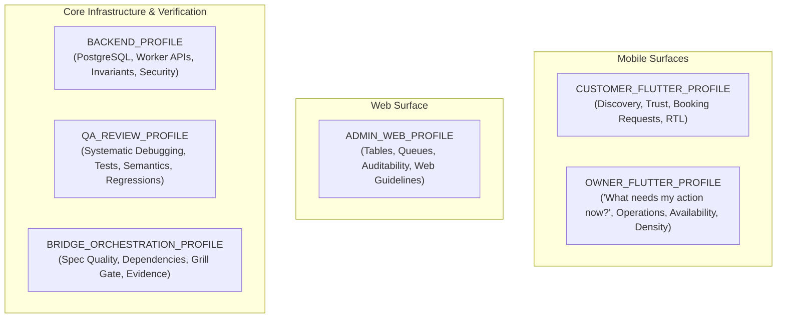

# KONFRM Agent Skill Profiles V1
## Role-Specific Context Profiles, Skill Allocations, and Operational Boundaries

**Document Version:** 1.2.0
**Status:** DRAFT — PENDING FINAL BRIDGE APPROVAL
**Scope:** Agent Skill Profile Definitions across Surfaces and Roles
**Target Repository:** `Essxm01/KONFRM`
**Governing Standard:** `docs/agents/KONFRM_AGENT_SKILLS_GOVERNANCE_V1.md`

---

## 1. Profile Architecture & Declaration Policy

In accordance with the **Smallest Relevant Skill Set Principle**, no agent may load the complete repository skills catalog simultaneously. Loading irrelevant skills wastes context tokens, increases latency, and introduces cross-surface contamination (e.g., loading web guidelines into Flutter, or UI skills into backend migrations).

This document establishes **six discrete operational profiles**:

### Profile Declaration & Discovery Policy
- **Repository-Local Execution:** Both Antigravity and Codex discover skills exclusively from `.agents/skills/`. Duplicate global installation in user directories is strictly prohibited.
- **Metadata Declaration:** The active profile is declared in execution prompt metadata or task mission contracts (e.g. `PROFILE: CUSTOMER_FLUTTER`).
- **No Document Churn:** Routine or bounded execution tasks do **NOT** require editing `tasks/CURRENT_TASK.md` merely to record a profile declaration. `CURRENT_TASK.md` is updated only when persistent repository task tracking warrants it.
- **Durable Business Authority:** Profiles enforce that external skills MUST NOT define, copy, reinterpret, or modify KONFRM financial formulas, booking state machines, wallet rules, availability semantics, payment policy, cancellation policy, or trust semantics. All business truth is read directly from `docs/BUSINESS_RULES.md` and `docs/codex/KONFRM_MASTER_RULES.md`.

---

## 2. Profile 1: `CUSTOMER_FLUTTER_PROFILE`

### 2.1 Role & Surface Scope
The Customer Flutter application is the primary consumer surface. It must establish instant trust, effortless search, transparent pricing, and smooth booking request submission while adhering strictly to Arabic-first native mobile conventions.

### 2.2 Core Responsibilities & Product Goals
- Property discovery, browsing, filtering, and media presentation.
- Transparent property details (pricing breakdown, amenities, house rules).
- Multi-step booking request submission flow.
- Authentication interruption and resume handling.
- Egyptian currency formatting (`1,600 ج.م`) and Western Arabic numerals (`0-9`).
- Strict Bidi sub-run isolation and native RTL layout semantics.
- Accessible TalkBack/VoiceOver labels on all interactive controls.

### 2.3 Design & Architecture Bounds
- **Mobile Foundation:** DF2 Mobile Foundation v1.7.
- **Palette Nuance:** Mobile Primary Black (`#000000`) is `SYSTEM-VALIDATED PROVISIONAL` for governed primary usage; Blue (`#276EF1`) is candidate interaction accent only (exact blue remains `OPEN`); neutral scales remain `OPEN`.
- **Spacing:** Authoritative scale `4 / 8 / 12 / 16 / 24 / 32`; Mobile Page Inset `16` provisional.
- **Geometry:** Component-scoped (Field radius `8` `FIELD_ONLY`, Primary button radius `6` provisional `PRIMARY_ONLY`, Sheet top radius `16` provisional, Dialog radius `12` provisional). Secondary button radius is `OPEN`.
- **Financial Authority:** Zero client-side fee computation; server is absolute authority.

### 2.4 Skill Allocation
| Tier | Skill Name | Source & Bundle | Network Class | Purpose |
| :--- | :--- | :--- | :---: | :--- |
| **Mandatory (P0)** | `konfrm-product-ux` | Native KONFRM (EXISTS) | `LOCAL_ONLY` | Enforces Customer booking request clarity and state grammar |
| **Mandatory (P0)** | `konfrm-mobile-design`| Native KONFRM (EXISTS) | `LOCAL_ONLY` | Implements DF2 v1.7, component-scoped geometry, 4–32 spacing |
| **Mandatory (P0)** | `konfrm-rtl-arabic` | Native KONFRM (EXISTS) | `LOCAL_ONLY` | Native Arabic RTL, Cairo typography, Bidi isolation, Western digits |
| **Mandatory (P0)** | `konfrm-accessibility`| Native KONFRM (EXISTS) | `LOCAL_ONLY` | Mobile accessibility standards, TalkBack semantics, text scaling |
| **Recommended (P1)**| `konfrm-flutter-widget-testing`| Governed Bundle (Pilot) | `LOCAL_ONLY` | Widget tests for property cards, filters, booking forms |
| **Recommended (P1)**| `konfrm-flutter-responsive-layout`| Governed Bundle | `LOCAL_ONLY` | Screen size adaptation across phones and tablets |
| **Recommended (P1)**| `konfrm-flutter-architecture`| Governed Adapter Bundle | `LOCAL_ONLY` | Feature-first structure, Riverpod state management |
| **Recommended (P2)**| `emil-wrapper` | Governed Wrapper (EXISTS)| `LOCAL_ONLY` | Purposeful micro-interactions, spring feel, interruptible sheets |
| **Recommended (P2)**| `anti-ui-slop-wrapper`| Governed Bundle (Local Core)| `NETWORK_OPTIONAL_EXPLICIT`| Guards against generic AI card layouts and weak visual hierarchy |
| **On-Demand (P3)** | `caveman-explore` | Subagent Tool (Read-Only) | `LOCAL_ONLY` | Fast symbol locator during exploration (`path:line`) |

### 2.5 Explicitly Forbidden Skills & Overrides
- **FORBIDDEN:** `vercel-web-guidelines-wrapper`, `vercel-composition-wrapper` (Zero web code patterns in Flutter).
- **FORBIDDEN:** Upstream skills recommending MVVM, `ChangeNotifier`, BLoC, or Clean Architecture domain layers.
- **FORBIDDEN:** Synthetic scarcity patterns ("Only 1 left!"), fake urgency timers, or fabricated social proof badges.
- **FORBIDDEN:** Client-side financial calculations or commission math.

### 2.6 Qualitative Token Footprint Class
- **Footprint Class:** `MEDIUM` (Focused mobile guidance, minimal overhead).

---

## 3. Profile 2: `OWNER_FLUTTER_PROFILE`

### 3.1 Role & Surface Scope
The Owner Flutter application is an operational tool. Hosts depend on it for daily business management, guest request triage, instant availability locking, and earnings monitoring. Operational certainty and high useful density take precedence over decorative consumer aesthetics.

### 3.2 Core Question & Responsibilities
- **Primary Host Mental Model:** `"What needs my action now?"`
- Operational dashboard with high useful density and actionable alerts.
- Calendar availability management (blocking/unblocking).
- Booking request accept / decline decision interface with guest context.
- Financial overview: earnings, pending transactions, payout states (formulas derived from authoritative Business Rules).
- Truthful state representation: immediate fail-closed feedback on network mutations.
- Fast, predictable navigation between operational workflows.

### 3.3 Design & Availability Bounds
- **Mobile Foundation:** DF2 Mobile Foundation v1.7; component-scoped geometry; 4–32 spacing scale.
- **Availability Invariants:**
  - `PENDING_OWNER_APPROVAL` does **NOT** block calendar availability.
  - `APPROVED_PENDING_PAYMENT` and `CONFIRMED` **DO** block calendar availability.
  - Fail-closed error handling on all calendar mutations.

### 3.4 Skill Allocation
| Tier | Skill Name | Source & Bundle | Network Class | Purpose |
| :--- | :--- | :--- | :---: | :--- |
| **Mandatory (P0)** | `konfrm-product-ux` | Native KONFRM (EXISTS) | `LOCAL_ONLY` | Enforces Owner operational certainty and unambiguous states |
| **Mandatory (P0)** | `konfrm-mobile-design`| Native KONFRM (EXISTS) | `LOCAL_ONLY` | Implements DF2 v1.7, high density layout, monochrome hierarchy |
| **Mandatory (P0)** | `konfrm-rtl-arabic` | Native KONFRM (EXISTS) | `LOCAL_ONLY` | Native Arabic RTL, Cairo typography, Western digits |
| **Mandatory (P0)** | `konfrm-accessibility`| Native KONFRM (EXISTS) | `LOCAL_ONLY` | Operational touch targets ($\ge 48\text{dp}$), high contrast text |
| **Recommended (P1)**| `konfrm-flutter-widget-testing`| Governed Bundle (Pilot) | `LOCAL_ONLY` | Testing dense data grids, calendar cells, decision modals |
| **Recommended (P1)**| `konfrm-flutter-layout-fixer`| Governed Bundle | `LOCAL_ONLY` | Resolves RenderFlex overflows on dense operational screens |
| **Recommended (P1)**| `konfrm-flutter-architecture`| Governed Adapter Bundle | `LOCAL_ONLY` | Feature-first Riverpod controllers for calendar/booking mutations |
| **Recommended (P1)**| `konfrm-flutter-http` | Governed Bundle | `LOCAL_ONLY` | Direct API communication with fail-closed error handling |
| **Recommended (P2)**| `anti-ui-slop-wrapper`| Governed Bundle (Local Core)| `NETWORK_OPTIONAL_EXPLICIT`| Prevents wasteful decorative spacing in operational views |
| **Recommended (P2)**| `konfrm-systematic-debugging`| Governed Bundle (Pilot) | `LOCAL_ONLY` | Root-cause analysis on complex calendar/state bugs |
| **On-Demand (P3)** | `caveman-explore` | Subagent Tool (Read-Only) | `LOCAL_ONLY` | Quick symbol hunting across owner codebase |

### 3.5 Explicitly Forbidden Skills & Overrides
- **FORBIDDEN:** Web guidelines or React composition wrappers.
- **FORBIDDEN:** Optimistic offline mutation queues (Fail-closed is mandatory; owner must know immediately if a date block failed).
- **FORBIDDEN:** Client-side 80/20 split calculations or payout rounding.
- **FORBIDDEN:** Decorative animations that delay critical operational decisions (e.g. accept/decline buttons).

### 3.6 Qualitative Token Footprint Class
- **Footprint Class:** `MEDIUM` (Dense operational clarity).

---

## 4. Profile 3: `ADMIN_WEB_PROFILE`

### 4.1 Role & Surface Scope
The Admin Web application is the governance, audit, and trust nexus for KONFRM staff. Built on React 19, TypeScript, and Vite, it requires high-density tabular displays, verification queues, moderation controls, and financial reconciliation tools.

### 4.2 Core Responsibilities & Role Goals
- User verification queues and account status oversight.
- Transaction audit views and operational log reconciliation.
- System-wide booking and availability status inspection.
- High-density responsive web tables with multi-column sorting and filtering.
- Comprehensive keyboard navigation and screen reader support (WCAG 2.2 AA).

### 4.3 Skill Allocation
| Tier | Skill Name | Source & Bundle | Network Class | Purpose |
| :--- | :--- | :--- | :---: | :--- |
| **Mandatory (P0)** | `konfrm-product-ux` | Native KONFRM (EXISTS) | `LOCAL_ONLY` | Enforces Admin audit governance and immutable state logs |
| **Mandatory (P0)** | `konfrm-rtl-arabic` | Native KONFRM (EXISTS) | `LOCAL_ONLY` | Web RTL support, bilingual layout switching |
| **Mandatory (P1)** | `vercel-web-guidelines-wrapper`| Governed Wrapper (EXISTS)| `LOCAL_ONLY` | Web performance, web accessibility, semantic HTML, responsive web |
| **Recommended (P1)**| `vercel-composition-wrapper`| Governed Wrapper (EXISTS)| `LOCAL_ONLY` | React 19 compound components, flexible prop contracts, clean hooks |
| **Recommended (P2)**| `frontend-design-wrapper`| Governed Wrapper (EXISTS)| `LOCAL_ONLY` | Desktop table ergonomics, clean typography hierarchy |
| **Recommended (P2)**| `konfrm-tdd` | Governed Bundle | `LOCAL_ONLY` | Red-green-refactor for complex web filtering/table hooks |
| **Recommended (P2)**| `konfrm-code-review` | Governed Bundle | `LOCAL_ONLY` | Pre-commit security and edge-case review for admin actions |
| **On-Demand (P3)** | `ui-ux-pro-max-wrapper` | Governed Wrapper (EXISTS)| `LOCAL_ONLY` | Complex web pattern lookups (e.g. bulk actions, audit trails) |

### 4.4 Explicitly Forbidden Skills & Overrides
- **FORBIDDEN:** ALL Flutter/Dart mobile skills (`flutter-*`, `dart-*`, `konfrm-mobile-design`). Zero Flutter concepts in Admin Web.
- **FORBIDDEN:** Mobile haptic or gesture libraries.
- **FORBIDDEN:** Direct browser-side execution of destructive database operations without backend authorization.

### 4.5 Qualitative Token Footprint Class
- **Footprint Class:** `MEDIUM` (Web-specific engineering).

---

## 5. Profile 4: `BACKEND_PROFILE`

### 5.1 Role & Surface Scope
The Backend surface consists of the Supabase PostgreSQL database (migrations, RLS policies, triggers, stored procedures) and the Cloudflare Worker API proxy. It is the absolute authority for persistence, financial arithmetic, and security invariants.

### 5.2 Core Responsibilities
- PostgreSQL migrations and schema integrity (`backend/database/migrations/`).
- Row Level Security (RLS) enforcement across Customer, Owner, and Admin roles.
- Cloudflare Worker TypeScript REST endpoints and Supabase REST query compatibility adapter.
- Server-authoritative execution of financial state and booking state transitions derived directly from authoritative Business Rules (`docs/BUSINESS_RULES.md`).
- Authorization boundary enforcement; server-derived identity (never client-provided authority).
- Fail-closed error reporting; zero synthetic fallback data.

### 5.3 Skill Allocation
| Tier | Skill Name | Source & Bundle | Network Class | Purpose |
| :--- | :--- | :--- | :---: | :--- |
| **Mandatory (P0)** | Master Rules & Database Canon | Core Documents | `LOCAL_ONLY` | Enforces schema rules, RLS policies, and financial invariants |
| **Mandatory (P1)** | Framework Native Test Tooling | Native | `LOCAL_ONLY` | Pure service testing, regression testing |
| **Mandatory (P1)** | `konfrm-systematic-debugging`| Governed Bundle (Pilot) | `LOCAL_ONLY` | 4-phase root cause analysis for migration failures or SQL bugs |
| **Recommended (P1)**| `konfrm-tdd` | Governed Bundle | `LOCAL_ONLY` | Red-green-refactor for backend business endpoints |
| **Recommended (P2)**| `konfrm-code-review` | Governed Bundle | `LOCAL_ONLY` | SQL injection, RLS bypass, and security invariant audits |
| **On-Demand (P3)** | `caveman-explore` | Subagent Tool (Read-Only) | `LOCAL_ONLY` | Rapid locating of SQL functions and API route handlers |

### 5.4 Explicitly Forbidden Skills & Overrides
- **FORBIDDEN:** ALL UI and Design skills (`konfrm-mobile-design`, `uizze`, `taste-skill`, `emil-wrapper`, `frontend-design`). UI skills have zero relevance to backend persistence.
- **FORBIDDEN:** Any skill attempting to soften RLS policies or bypass server-side validation.
- **FORBIDDEN:** Mocking production data or fabricating database success.

### 5.5 Qualitative Token Footprint Class
- **Footprint Class:** `LOW` (Lean context, maximum reasoning capacity).

---

## 6. Profile 5: `QA_REVIEW_PROFILE`

### 6.1 Role & Surface Scope
The QA Review profile is dedicated to verification, test coverage, regression defense, accessibility compliance, and code review. It operates as an adversarial auditor across all code changes.

### 6.2 Core Responsibilities
- Pre-merge static analysis gate enforcement (`dart analyze`, lint rules).
- Authoring and executing unit, widget, and integration tests.
- Visual QA and physical runtime verification (multi-scale viewports, Android TalkBack).
- Adversarial code review for regression traps, edge cases, and architectural drift.
- Root cause diagnosis of reported bugs without guess-and-check code churning.

### 6.3 Skill Allocation
| Tier | Skill Name | Source & Bundle | Network Class | Purpose |
| :--- | :--- | :--- | :---: | :--- |
| **Mandatory (P0)** | `konfrm-visual-qa` | Native KONFRM (EXISTS) | `LOCAL_ONLY` | Multi-viewport physical validation, state matrix verification |
| **Mandatory (P0)** | `konfrm-accessibility`| Native KONFRM (EXISTS) | `LOCAL_ONLY` | WCAG 2.2 AA audit, screen reader semantics verification |
| **Mandatory (P1)** | `konfrm-systematic-debugging`| Governed Bundle (Pilot) | `LOCAL_ONLY` | 4-phase RCA: Understand $\to$ Reproduce $\to$ Fix $\to$ Verify |
| **Mandatory (P1)** | `konfrm-dart-static-analysis`| Governed Bundle (Pilot) | `LOCAL_ONLY` | Safe, read-only analysis gate; strict dry-run before applying fixes |
| **Recommended (P1)**| `konfrm-flutter-widget-testing`| Governed Bundle (Pilot) | `LOCAL_ONLY` | Regression widget tests for fixed components |
| **On-Demand (P1)** | `konfrm-flutter-integration-test`| Governed Bundle | `LOCAL_ONLY` | E2E driver flows; requires dedicated test entrypoint |
| **Recommended (P1)**| `konfrm-dart-coverage` | Governed Bundle | `LOCAL_ONLY` | LCOV code coverage audit |
| **Recommended (P2)**| `konfrm-code-review` | Governed Bundle | `LOCAL_ONLY` | Systematic PR inspection checklist along Standards and Spec axes |
| **Recommended (P2)**| `anti-ui-slop-wrapper`| Governed Bundle (Local Core)| `NETWORK_OPTIONAL_EXPLICIT`| Audit UI code for inert controls and missing states |
| **On-Demand (P0)** | `konfrm-design-court` | Native KONFRM (EXISTS) | `LOCAL_ONLY` | Adjudicating disputed visual QA findings |

### 6.4 Safety Guardrails & Forbidden Actions
- **FORBIDDEN:** Modifying product requirements or business rules.
- **FORBIDDEN:** Bypassing failing tests or silencing linter warnings with inline ignore comments.
- **FORBIDDEN:** Approving code based solely on green CI without required physical device runtime evidence.
- **FORBIDDEN:** Running repo-wide `dart fix --apply` or repo-wide `dart format .` blindly.

### 6.5 Qualitative Token Footprint Class
- **Footprint Class:** `MEDIUM` (Rigorous verification and testing).

---

## 7. Profile 6: `BRIDGE_ORCHESTRATION_PROFILE`

### 7.1 Role & Surface Scope
The Bridge Orchestration profile is used by orchestrator agents and supervisors (Bridge, Codex lead, or Antigravity supervisor) to define tasks, enforce dependency graph ordering, challenge specifications, and oversee multi-step delivery.

### 7.2 Core Responsibilities
- Authoring and maintaining `tasks/CURRENT_TASK.md` contracts.
- Enforcing macro dependency order (`KONFRM_EXECUTION_DEPENDENCY_ORDER.md`).
- Executing the **Grill Gate**: interrogating task requirements before implementation begins.
- Exercising **Authoritative Spec Backpropagation**: reconciling repository memory (`CURRENT_TASK.md`, `CURRENT_STATE.md`) after verified evidence.
- Pre-flight branch reality checks and post-merge verification handshakes.
- Guarding against out-of-scope work, premature merges, and unvetted PR modifications.

### 7.3 Skill Allocation
| Tier | Skill Name | Source & Bundle | Network Class | Purpose |
| :--- | :--- | :--- | :---: | :--- |
| **Mandatory (P0)** | Master Rules & Operating Context | Core Documents | `LOCAL_ONLY` | Precedence model, branch pre-flight, handshake envelope |
| **Mandatory (P0)** | `konfrm-design-router` | Native KONFRM (EXISTS) | `LOCAL_ONLY` | Classifies incoming design and engineering tasks |
| **Mandatory (P0)** | Authoritative Spec Backpropagation| Native Protocol | `LOCAL_ONLY` | Sole authority to write backpropagation updates to memory docs |
| **Mandatory (P1)** | Grill Gate (Adapted Concept) | Native Protocol | `LOCAL_ONLY` | Interrogates ambiguous requirements before implementation |
| **Recommended (P2)**| `konfrm-code-review` | Governed Bundle | `LOCAL_ONLY` | PR review and verification completeness checklist |
| **On-Demand (P0)** | `konfrm-design-court` | Native KONFRM (EXISTS) | `LOCAL_ONLY` | Adjudication panel for high-friction design/architectural decisions |
| **On-Demand (P3)** | `caveman-explore` | Subagent Tool (Read-Only) | `LOCAL_ONLY` | Rapid repository scanning to establish file dependencies |

### 7.4 Explicitly Forbidden Skills & Overrides
- **FORBIDDEN:** Wholesale installation of Loop Factory (`inbox/active/archive` folders).
- **FORBIDDEN:** Direct code editing or bulk test running (Bridge coordinates; execution agents implement).
- **FORBIDDEN:** Merging PRs without satisfying complete closure quality gates.

### 7.5 Qualitative Token Footprint Class
- **Footprint Class:** `LOW` (Clean, high-level reasoning space).

---

## 8. Profile Activation Matrix Summary

| Skill / Bundle Name | Customer Flutter | Owner Flutter | Admin Web | Backend | QA Review | Bridge Orchestration | Network Class |
| :--- | :---: | :---: | :---: | :---: | :---: | :---: | :---: |
| `konfrm-product-ux` | **MANDATORY** | **MANDATORY** | **MANDATORY** | — | — | — | `LOCAL_ONLY` |
| `konfrm-mobile-design` | **MANDATORY** | **MANDATORY** | FORBIDDEN | FORBIDDEN | RECOMMENDED | — | `LOCAL_ONLY` |
| `konfrm-rtl-arabic` | **MANDATORY** | **MANDATORY** | **MANDATORY** | — | RECOMMENDED | — | `LOCAL_ONLY` |
| `konfrm-accessibility` | **MANDATORY** | **MANDATORY** | **MANDATORY** | — | **MANDATORY** | — | `LOCAL_ONLY` |
| `konfrm-visual-qa` | RECOMMENDED | RECOMMENDED | — | — | **MANDATORY** | — | `LOCAL_ONLY` |
| `konfrm-design-router` | AUTO | AUTO | AUTO | — | — | **MANDATORY** | `LOCAL_ONLY` |
| `konfrm-flutter-architecture` | RECOMMENDED | RECOMMENDED | FORBIDDEN | — | RECOMMENDED | — | `LOCAL_ONLY` |
| `konfrm-flutter-widget-testing` (Pilot)| RECOMMENDED | RECOMMENDED | FORBIDDEN | — | RECOMMENDED | — | `LOCAL_ONLY` |
| `konfrm-flutter-integration-test` | — | — | FORBIDDEN | — | **ON-DEMAND** | — | `LOCAL_ONLY` |
| `konfrm-flutter-layout-fixer` | RECOMMENDED | RECOMMENDED | FORBIDDEN | — | RECOMMENDED | — | `LOCAL_ONLY` |
| `konfrm-dart-unit-test` | RECOMMENDED | RECOMMENDED | — | RECOMMENDED | **MANDATORY** | — | `LOCAL_ONLY` |
| `konfrm-dart-static-analysis` (Pilot) | **MANDATORY** | **MANDATORY** | — | — | **MANDATORY** | — | `LOCAL_ONLY` |
| `konfrm-systematic-debugging` (Pilot) | RECOMMENDED | RECOMMENDED | RECOMMENDED | **MANDATORY** | **MANDATORY** | — | `LOCAL_ONLY` |
| `konfrm-tdd` | ON-DEMAND | ON-DEMAND | RECOMMENDED | RECOMMENDED | RECOMMENDED | — | `LOCAL_ONLY` |
| `konfrm-code-review` | — | — | RECOMMENDED | RECOMMENDED | RECOMMENDED | RECOMMENDED | `LOCAL_ONLY` |
| `vercel-web-guidelines-wrapper`| FORBIDDEN | FORBIDDEN | **MANDATORY** | — | — | — | `LOCAL_ONLY` |
| `vercel-composition-wrapper` | FORBIDDEN | FORBIDDEN | RECOMMENDED | — | — | — | `LOCAL_ONLY` |
| `emil-wrapper` | RECOMMENDED | ON-DEMAND | FORBIDDEN | FORBIDDEN | — | — | `LOCAL_ONLY` |
| `anti-ui-slop-wrapper` | RECOMMENDED | RECOMMENDED | RECOMMENDED | FORBIDDEN | RECOMMENDED | — | `NETWORK_OPTIONAL_EXPLICIT` |
| `ui-radar` | ON-DEMAND | ON-DEMAND | ON-DEMAND | FORBIDDEN | — | — | `NETWORK_REQUIRED_ON_DEMAND` |
| `Grill Gate` (Adapted Protocol) | — | — | — | — | — | **MANDATORY** | `LOCAL_ONLY` |
| `Spec Backpropagation` | **PROPOSE** | **PROPOSE** | **PROPOSE** | **PROPOSE** | **PROPOSE** | **AUTHORITATIVE WRITE** | `LOCAL_ONLY` |
| `caveman-explore` (Read-Only) | ON-DEMAND | ON-DEMAND | ON-DEMAND | ON-DEMAND | ON-DEMAND | ON-DEMAND | `LOCAL_ONLY` |
| `caveman` (Prose compressor) | FORBIDDEN | FORBIDDEN | FORBIDDEN | FORBIDDEN | FORBIDDEN | FORBIDDEN | `LOCAL_ONLY` |
| `design-mobile-apps` (Sleek) | FORBIDDEN | FORBIDDEN | FORBIDDEN | FORBIDDEN | FORBIDDEN | FORBIDDEN | `REJECT_NETWORK_PROFILE` |
| `find-skills` | FORBIDDEN | FORBIDDEN | FORBIDDEN | FORBIDDEN | FORBIDDEN | FORBIDDEN | `REJECT_NETWORK_PROFILE` |
