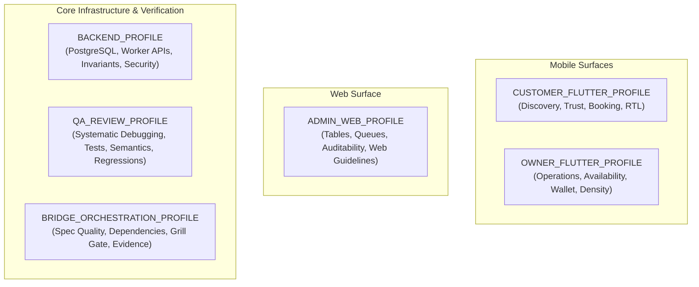

# KONFRM Agent Skill Profiles V1
## Role-Specific Context Profiles, Skill Allocations, and Operational Boundaries

**Document Version:** 1.0.0
**Status:** DRAFT — PENDING BRIDGE REVIEW
**Scope:** Agent Skill Profile Definitions across Surfaces and Roles
**Target Repository:** `Essxm01/KONFRM`
**Governing Standard:** `docs/agents/KONFRM_AGENT_SKILLS_GOVERNANCE_V1.md`

---

## 1. Profile Architecture Overview

In accordance with the **Smallest Relevant Skill Set Principle**, no agent may load the complete repository skills catalog simultaneously. Loading irrelevant skills wastes context tokens, increases latency, and introduces cross-surface contamination (e.g., loading web guidelines into Flutter, or UI skills into backend migrations).

This document establishes **six discrete operational profiles**:

Every execution task assigned via `tasks/CURRENT_TASK.md` must declare its active profile.

---

## 2. Profile 1: `CUSTOMER_FLUTTER_PROFILE`

### 2.1 Role & Surface Scope
The Customer Flutter application is the primary consumer surface. It must establish instant trust, effortless search, transparent pricing, and smooth booking request submission while adhering strictly to Arabic-first native mobile conventions.

### 2.2 Core Responsibilities
- Property discovery, browsing, filtering, and media presentation.
- Truthful property detail hierarchy (pricing breakdown, amenities, house rules).
- Multi-step booking request submission flow.
- Authentication interruption and resume handling.
- Egyptian currency formatting (`1,600 ج.م`) and Western Arabic numerals (0-9).
- Strict Bidi isolation and native RTL layout semantics.
- Accessible TalkBack/VoiceOver labels on all interactive controls.

### 2.3 Skill Allocation
| Tier | Skill Name | Source | Purpose |
| :--- | :--- | :--- | :--- |
| **Mandatory (P0)** | `konfrm-product-ux` | Native KONFRM | Enforces Customer booking request clarity and state grammar |
| **Mandatory (P0)** | `konfrm-mobile-design`| Native KONFRM | Implements DF2 v1.4, monochrome-first palette, 8dp spatial grid |
| **Mandatory (P0)** | `konfrm-rtl-arabic` | Native KONFRM | Native Arabic RTL, Cairo typography, Bidi isolation |
| **Mandatory (P0)** | `konfrm-accessibility`| Native KONFRM | Mobile accessibility standards, TalkBack semantics, text scaling |
| **Recommended (P1)**| `flutter-add-widget-test`| Vendor Wrapper | Widget tests for property cards, filters, booking forms |
| **Recommended (P1)**| `flutter-build-responsive-layout`| Vendor Wrapper | Screen size adaptation across phones and tablets |
| **Recommended (P1)**| `flutter-improving-accessibility`| Vendor Wrapper | `Semantics` widget wrapping, label clarity, contrast verification |
| **Recommended (P1)**| `konfrm-flutter-architecture`| Governed Adapter | Feature-first structure, Riverpod state management |
| **Recommended (P2)**| `emil-wrapper` | Governed Wrapper | Purposeful micro-interactions, spring feel, interruptible sheets |
| **Recommended (P2)**| `anti-ui-slop` (Adapted)| Governed Wrapper | Guards against generic AI card layouts and weak visual hierarchy |
| **On-Demand (P3)** | `caveman-explore` | Subagent Tool | Fast read-only symbol hunting during navigation |

### 2.4 Explicitly Forbidden Skills & Overrides
- **FORBIDDEN:** `vercel-web-guidelines-wrapper`, `vercel-composition-wrapper` (Zero web code patterns in Flutter).
- **FORBIDDEN:** Any external skill recommending BLoC, Cubit, or Clean Architecture domain layers.
- **FORBIDDEN:** Synthetic scarcity patterns (e.g. "Only 1 unit left!"), fake urgency timers, or fabricated social proof badges.
- **FORBIDDEN:** Client-side financial calculations or commission math.

### 2.5 Context Budget & Activation Trigger
- **Budget Ceiling:** Max $8\text{k}$ skill tokens active simultaneously.
- **Activation Trigger:** Flutter customer feature implementation, UI refinement, or customer widget testing.

---

## 3. Profile 2: `OWNER_FLUTTER_PROFILE`

### 2.1 Role & Surface Scope
The Owner Flutter application is an operational tool. Hosts depend on it for daily business management, guest request triage, instant availability locking, and earnings monitoring. Operational certainty and high useful density take precedence over decorative consumer aesthetics.

### 2.2 Core Responsibilities
- Operational dashboard with high useful density and actionable alerts.
- Calendar availability management (single-tap blocking/unblocking).
- Booking request accept / decline decision interface with full guest profile context.
- Financial overview: pending payouts, completed payouts, deposit holds.
- Truthful state representation: immediate feedback on network mutations.
- Fast, predictable navigation between operational workflows.

### 2.3 Skill Allocation
| Tier | Skill Name | Source | Purpose |
| :--- | :--- | :--- | :--- |
| **Mandatory (P0)** | `konfrm-product-ux` | Native KONFRM | Enforces Owner operational certainty and unambiguous states |
| **Mandatory (P0)** | `konfrm-mobile-design`| Native KONFRM | Implements DF2 v1.4, high density layout, monochrome hierarchy |
| **Mandatory (P0)** | `konfrm-rtl-arabic` | Native KONFRM | Native Arabic RTL, Cairo typography, Western digits |
| **Mandatory (P0)** | `konfrm-accessibility`| Native KONFRM | Operational touch targets ($\ge 48\text{dp}$), high contrast text |
| **Recommended (P1)**| `flutter-add-widget-test`| Vendor Wrapper | Testing dense data grids, calendar cells, decision modals |
| **Recommended (P1)**| `flutter-fix-layout-issues`| Vendor Wrapper | Resolves RenderFlex overflows on dense operational screens |
| **Recommended (P1)**| `konfrm-flutter-architecture`| Governed Adapter | Feature-first Riverpod controllers for calendar/booking mutations |
| **Recommended (P1)**| `flutter-use-http-package`| Vendor Wrapper | Direct API communication with fail-closed error handling |
| **Recommended (P2)**| `anti-ui-slop` (Adapted)| Governed Wrapper | Prevents wasteful decorative spacing in operational views |
| **Recommended (P2)**| `systematic-debugging` | Vendor Wrapper | Root-cause analysis on complex calendar/state bugs |
| **On-Demand (P3)** | `caveman-explore` | Subagent Tool | Quick symbol hunting across owner codebase |

### 2.4 Explicitly Forbidden Skills & Overrides
- **FORBIDDEN:** Web guidelines or React composition wrappers.
- **FORBIDDEN:** Optimistic offline mutation queues (Fail-closed is mandatory; owner must know if a date block failed).
- **FORBIDDEN:** Client-side 80/20 split calculations or payout rounding.
- **FORBIDDEN:** Decorative animations that delay critical operational decisions (e.g. accept/decline buttons).

### 2.5 Context Budget & Activation Trigger
- **Budget Ceiling:** Max $8\text{k}$ skill tokens active simultaneously.
- **Activation Trigger:** Owner mobile application feature implementation, calendar logic, or owner widget testing.

---

## 4. Profile 3: `ADMIN_WEB_PROFILE`

### 3.1 Role & Surface Scope
The Admin Web application is the governance, audit, and trust nexus for KONFRM staff. Built on React 19, TypeScript, and Vite, it requires high-density tabular displays, verification queues, moderation controls, and financial reconciliation tools.

### 3.2 Core Responsibilities
- User verification queues (identity document review, property ownership validation).
- Dispute triage and transaction audit logs.
- System-wide booking and availability intervention.
- High-density responsive web tables with multi-column sorting and filtering.
- Comprehensive keyboard navigation and screen reader support (WCAG 2.2 AA).

### 3.3 Skill Allocation
| Tier | Skill Name | Source | Purpose |
| :--- | :--- | :--- | :--- |
| **Mandatory (P0)** | `konfrm-product-ux` | Native KONFRM | Enforces Admin audit governance and immutable state logs |
| **Mandatory (P0)** | `konfrm-rtl-arabic` | Native KONFRM | Web RTL support, bilingual layout switching |
| **Mandatory (P1)** | `vercel-web-guidelines-wrapper`| Governed Wrapper | Web performance, web accessibility, semantic HTML, responsive web |
| **Recommended (P1)**| `vercel-composition-wrapper`| Governed Wrapper | React 19 compound components, flexible prop contracts, clean hooks |
| **Recommended (P2)**| `frontend-design-wrapper`| Governed Wrapper | Desktop table ergonomics, clean typography hierarchy |
| **Recommended (P2)**| `tdd` (Matt Pocock) | Vendor Wrapper | Red-green-refactor for complex web filtering/table hooks |
| **Recommended (P2)**| `code-review` (Matt Pocock)| Vendor Wrapper | Pre-commit security and edge-case review for admin actions |
| **On-Demand (P3)** | `ui-ux-pro-max-wrapper` | Governed Wrapper | Complex web pattern lookups (e.g. bulk actions, audit trails) |

### 3.4 Explicitly Forbidden Skills & Overrides
- **FORBIDDEN:** ALL Flutter/Dart mobile skills (`flutter-*`, `dart-*`, `konfrm-mobile-design`). Zero Flutter concepts in Admin Web.
- **FORBIDDEN:** Mobile haptic or gesture libraries.
- **FORBIDDEN:** Direct browser-side execution of destructive database operations without backend authorization.

### 3.5 Context Budget & Activation Trigger
- **Budget Ceiling:** Max $9\text{k}$ skill tokens active simultaneously.
- **Activation Trigger:** Admin web application development, React component refactoring, or admin table engineering.

---

## 5. Profile 4: `BACKEND_PROFILE`

### 4.1 Role & Surface Scope
The Backend surface consists of the Supabase PostgreSQL database (migrations, RLS policies, triggers, stored procedures) and the Cloudflare Worker API proxy. It is the absolute authority for persistence, financial arithmetic, and security invariants.

### 4.2 Core Responsibilities
- PostgreSQL migrations and schema integrity (`backend/database/migrations/`).
- Row Level Security (RLS) enforcement across Customer, Owner, and Admin roles.
- Cloudflare Worker TypeScript REST endpoints and Supabase REST query compatibility adapter.
- Canonical implementation of booking state machines, deposit escrow, and 20/80 commission math.
- Authorization boundary enforcement; server-derived identity (never client-provided authority).
- Fail-closed error reporting; zero synthetic fallback data.

### 4.3 Skill Allocation
| Tier | Skill Name | Source | Purpose |
| :--- | :--- | :--- | :--- |
| **Mandatory (P0)** | Master Rules & Database Canon | Core Documents | Enforces schema rules, RLS policies, and financial invariants |
| **Mandatory (P1)** | `dart-add-unit-test` (where applicable) / Node Test | Framework Native | Pure service testing, regression testing |
| **Mandatory (P1)** | `systematic-debugging` | Vendor Wrapper | 4-phase root cause analysis for migration failures or SQL bugs |
| **Recommended (P1)**| `tdd` (Matt Pocock) | Vendor Wrapper | Red-green-refactor for backend business endpoints |
| **Recommended (P2)**| `code-review` (Matt Pocock)| Vendor Wrapper | SQL injection, RLS bypass, and security invariant audits |
| **On-Demand (P3)** | `caveman-explore` | Subagent Tool | Rapid locating of SQL functions and API route handlers |

### 4.4 Explicitly Forbidden Skills & Overrides
- **FORBIDDEN:** ALL UI and Design skills (`konfrm-mobile-design`, `uizze`, `taste-skill`, `emil-wrapper`, `frontend-design`). UI skills have zero relevance to backend persistence.
- **FORBIDDEN:** Any skill attempting to soften RLS policies or bypass server-side validation.
- **FORBIDDEN:** Mocking production data or fabricating database success.

### 4.5 Context Budget & Activation Trigger
- **Budget Ceiling:** Max $5\text{k}$ skill tokens active simultaneously (minimal overhead, maximum reasoning capacity).
- **Activation Trigger:** SQL migrations, Cloudflare Worker route handling, RLS policies, backend API services.

---

## 6. Profile 5: `QA_REVIEW_PROFILE`

### 5.1 Role & Surface Scope
The QA Review profile is dedicated to verification, test coverage, regression defense, accessibility compliance, and code review. It operates as an adversarial auditor across all code changes.

### 5.2 Core Responsibilities
- Pre-merge static analysis gate enforcement (`dart analyze`, lint rules).
- Authoring and executing unit, widget, and integration tests.
- Visual QA and physical runtime verification (multi-scale viewports, Android TalkBack).
- Adversarial code review for regression traps, edge cases, and architectural drift.
- Root cause diagnosis of reported bugs without guess-and-check code churning.

### 5.3 Skill Allocation
| Tier | Skill Name | Source | Purpose |
| :--- | :--- | :--- | :--- |
| **Mandatory (P0)** | `konfrm-visual-qa` | Native KONFRM | Multi-viewport physical validation, state matrix verification |
| **Mandatory (P0)** | `konfrm-accessibility`| Native KONFRM | WCAG 2.2 AA audit, screen reader semantics verification |
| **Mandatory (P1)** | `systematic-debugging` | Vendor Wrapper | 4-phase RCA: Understand -> Reproduce -> Fix -> Verify |
| **Mandatory (P1)** | `dart-static-analysis` | Vendor Wrapper | Zero-warning `dart analyze` enforcement |
| **Recommended (P1)**| `flutter-add-widget-test`| Vendor Wrapper | Regression widget tests for fixed components |
| **Recommended (P1)**| `flutter-add-integration-test`| Vendor Wrapper | E2E flow automated validation |
| **Recommended (P1)**| `dart-collect-coverage`| Vendor Wrapper | LCOV code coverage audit |
| **Recommended (P2)**| `code-review` (Matt Pocock)| Vendor Wrapper | Systematic PR inspection checklist |
| **Recommended (P2)**| `anti-ui-slop` (Adapted)| Governed Wrapper | Audit UI code for inert controls and missing states |
| **On-Demand (P0)** | `konfrm-design-court` | Native KONFRM | Adjudicating disputed visual QA findings |

### 5.4 Explicitly Forbidden Skills & Overrides
- **FORBIDDEN:** Modifying product requirements or business rules.
- **FORBIDDEN:** Bypassing failing tests or silencing linter warnings with inline ignore comments.
- **FORBIDDEN:** Approving code based solely on green CI without required physical device runtime evidence.

### 5.5 Context Budget & Activation Trigger
- **Budget Ceiling:** Max $8\text{k}$ skill tokens active simultaneously.
- **Activation Trigger:** Test authoring, bug diagnosis, PR review, or pre-merge validation missions.

---

## 7. Profile 6: `BRIDGE_ORCHESTRATION_PROFILE`

### 6.1 Role & Surface Scope
The Bridge Orchestration profile is used by orchestrator agents and supervisors (Bridge, Codex lead, or Antigravity supervisor) to define tasks, enforce dependency graph ordering, challenge specifications, and oversee multi-step delivery.

### 6.2 Core Responsibilities
- Authoring and maintaining `tasks/CURRENT_TASK.md` contracts.
- Enforcing macro dependency order (`KONFRM_EXECUTION_DEPENDENCY_ORDER.md`).
- Executing the **Grill Gate**: interrogating task requirements before implementation begins.
- Executing **Spec Backpropagation**: updating repository memory immediately upon discovering runtime facts.
- Pre-flight branch reality checks and post-merge verification handshakes.
- Guarding against out-of-scope work, premature merges, and unvetted PR modifications.

### 6.3 Skill Allocation
| Tier | Skill Name | Source | Purpose |
| :--- | :--- | :--- | :--- |
| **Mandatory (P0)** | Master Rules & Operating Context | Core Documents | Precedence model, branch pre-flight, handshake envelope |
| **Mandatory (P0)** | `konfrm-design-router` | Native KONFRM | Classifies incoming design and engineering tasks |
| **Mandatory (P0)** | Spec Backpropagation (Concept)| Native Protocol | Synchronizes discoveries directly into `CURRENT_TASK.md` |
| **Mandatory (P1)** | Grill Gate (Concept) | Native Protocol | Interrogates ambiguous requirements before implementation |
| **Recommended (P2)**| `code-review` (Matt Pocock)| Vendor Wrapper | PR review and verification completeness checklist |
| **On-Demand (P0)** | `konfrm-design-court` | Native KONFRM | Adjudication panel for high-friction design/architectural decisions |
| **On-Demand (P3)** | `caveman-explore` | Subagent Tool | Rapid repository scanning to establish file dependencies |

### 6.4 Explicitly Forbidden Skills & Overrides
- **FORBIDDEN:** Wholesale installation of Loop Factory (`inbox/active/archive` folders).
- **FORBIDDEN:** Direct code editing or bulk test running (Bridge coordinates; execution agents implement).
- **FORBIDDEN:** Merging PRs without satisfying complete closure quality gates.

### 6.5 Context Budget & Activation Trigger
- **Budget Ceiling:** Max $6\text{k}$ skill tokens active simultaneously (clean, high-level reasoning space).
- **Activation Trigger:** Task contract creation, branch transition, PR review orchestration, or final closure verification.

---

## 8. Profile Activation Matrix Summary

| Skill Name | Customer Flutter | Owner Flutter | Admin Web | Backend | QA Review | Bridge Orchestration |
| :--- | :---: | :---: | :---: | :---: | :---: | :---: |
| `konfrm-product-ux` | **MANDATORY** | **MANDATORY** | **MANDATORY** | — | — | — |
| `konfrm-mobile-design` | **MANDATORY** | **MANDATORY** | FORBIDDEN | FORBIDDEN | RECOMMENDED | — |
| `konfrm-rtl-arabic` | **MANDATORY** | **MANDATORY** | **MANDATORY** | — | RECOMMENDED | — |
| `konfrm-accessibility` | **MANDATORY** | **MANDATORY** | **MANDATORY** | — | **MANDATORY** | — |
| `konfrm-visual-qa` | RECOMMENDED | RECOMMENDED | — | — | **MANDATORY** | — |
| `konfrm-design-router` | AUTO | AUTO | AUTO | — | — | **MANDATORY** |
| `konfrm-flutter-architecture` (Adapted) | RECOMMENDED | RECOMMENDED | FORBIDDEN | — | RECOMMENDED | — |
| `flutter-add-widget-test` | RECOMMENDED | RECOMMENDED | FORBIDDEN | — | RECOMMENDED | — |
| `flutter-fix-layout-issues` | RECOMMENDED | RECOMMENDED | FORBIDDEN | — | RECOMMENDED | — |
| `flutter-improving-accessibility` | RECOMMENDED | RECOMMENDED | FORBIDDEN | — | **MANDATORY** | — |
| `dart-add-unit-test` | RECOMMENDED | RECOMMENDED | — | RECOMMENDED | **MANDATORY** | — |
| `dart-static-analysis` | **MANDATORY** | **MANDATORY** | — | — | **MANDATORY** | — |
| `systematic-debugging` | RECOMMENDED | RECOMMENDED | RECOMMENDED | **MANDATORY** | **MANDATORY** | — |
| `tdd` (Matt Pocock) | ON-DEMAND | ON-DEMAND | RECOMMENDED | RECOMMENDED | RECOMMENDED | — |
| `code-review` (Matt Pocock) | — | — | RECOMMENDED | RECOMMENDED | RECOMMENDED | RECOMMENDED |
| `vercel-web-guidelines-wrapper`| FORBIDDEN | FORBIDDEN | **MANDATORY** | — | — | — |
| `vercel-composition-wrapper` | FORBIDDEN | FORBIDDEN | RECOMMENDED | — | — | — |
| `emil-wrapper` | RECOMMENDED | ON-DEMAND | FORBIDDEN | FORBIDDEN | — | — |
| `anti-ui-slop` (Adapted Wrapper) | RECOMMENDED | RECOMMENDED | RECOMMENDED | FORBIDDEN | RECOMMENDED | — |
| `ui-radar` | ON-DEMAND | ON-DEMAND | ON-DEMAND | FORBIDDEN | — | — |
| `Grill Gate` (Adapted Concept) | — | — | — | — | — | **MANDATORY** |
| `Spec Backpropagation` | **MANDATORY** | **MANDATORY** | **MANDATORY** | **MANDATORY** | **MANDATORY** | **MANDATORY** |
| `caveman-explore` | ON-DEMAND | ON-DEMAND | ON-DEMAND | ON-DEMAND | ON-DEMAND | ON-DEMAND |
| `caveman` (Prose compressor) | FORBIDDEN | FORBIDDEN | FORBIDDEN | FORBIDDEN | FORBIDDEN | FORBIDDEN |
| `design-mobile-apps` (Sleek) | FORBIDDEN | FORBIDDEN | FORBIDDEN | FORBIDDEN | FORBIDDEN | FORBIDDEN |
| `find-skills` | FORBIDDEN | FORBIDDEN | FORBIDDEN | FORBIDDEN | FORBIDDEN | FORBIDDEN |
