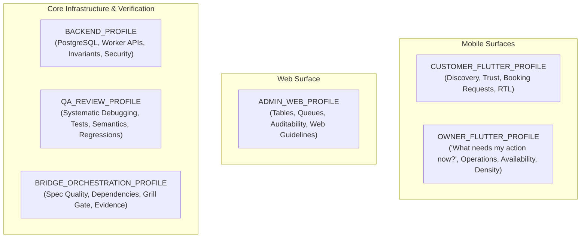

# KONFRM Agent Skill Profiles V1
## Role-Specific Context Profiles, Skill Allocations, and Operational Boundaries

**Document Version:** 1.3.0
**Status:** DRAFT — PENDING FINAL BRIDGE APPROVAL
**Scope:** Agent Skill Profile Definitions across Surfaces and Roles
**Target Repository:** `Essxm01/KONFRM`
**Governing Standard:** `docs/agents/KONFRM_AGENT_SKILLS_GOVERNANCE_V1.md`

---

## 1. Profile Architecture & Context Discipline Policy

### 1.1 The Smallest Sufficient Skill Set Principle
In accordance with the **Smallest Sufficient Skill Set Principle**, no agent may load the complete repository skills catalog simultaneously. Loading irrelevant skills wastes context tokens, increases latency, and introduces cross-surface contamination (e.g., loading web guidelines into Flutter, or UI skills into backend migrations).

- **Recommended Ordinary Target:** **`1–3 active skills`** per task.
- This is a context-discipline engineering principle, not a rigid mechanical ceiling.
- **FORBIDDEN:** Preloading multi-skill suites "just in case" without specific task triggers.

### 1.2 Deterministic Routing Order
To discover and activate skills without recursive filesystem scanning, agents follow a strict 5-step routing procedure:
1. **Step A — Host-Native Skill Metadata Matching:** Evaluate native host skill metadata (name, trigger intent, concise description) against the active task requirements.
2. **Step B — Compact Skill Router Fallback:** If ambiguity remains, or if the task is a high-risk governed operation, consult `.agents/SKILL_ROUTER.md` ($\le 50$ lines fallback mapping).
3. **Step C — Load Authoritative `SKILL.md`:** Open the exact resolved path `.agents/skills/<name>/SKILL.md`.
4. **Step D — Load Specific Reference on Demand:** If and only if a subtask requires detailed guidance, open the specific Level 2 reference file from `references/`.
5. **Step E — Base Agent Fallback (No Blind Scanning):** If no skill clearly matches, proceed using KONFRM Canon, Master Rules, and core agent capabilities. **Do NOT** scan the skill directory hunting for tools.

### 1.3 Bridge Explicit Overrides (Mission Contracts)
For high-risk, multi-step, or mission-critical tasks, Bridge Orchestration may explicitly mandate required skills directly within the task contract:
```text
Required skills:
- konfrm-systematic-debugging
- konfrm-dart-static-analysis
```
**Rule:** Explicit Bridge skill declarations take absolute precedence over auto-discovery ambiguity. This is a deliberate safety mechanism that guarantees execution discipline on complex workflows.

### 1.4 Profile Structure
This document establishes **six discrete operational profiles**:



### 1.5 Governance & Boundary Rules
- **Repository-Local Execution:** Both Antigravity and Codex discover governed skills exclusively from `.agents/skills/`. Duplicate global installation in user directories is strictly prohibited. Global Antigravity scope is `~/.gemini/config/skills/`.
- **Metadata Declaration:** The active profile is declared in execution prompt metadata or task mission contracts (e.g. `PROFILE: CUSTOMER_FLUTTER`).
- **No Document Churn:** Routine or bounded execution tasks do **NOT** require editing `tasks/CURRENT_TASK.md` merely to record a profile declaration. `CURRENT_TASK.md` is updated only when persistent repository task tracking warrants it.
- **Durable Business Authority:** Profiles enforce that external skills MUST NOT define, copy, reinterpret, or modify KONFRM financial formulas, booking state machines, wallet rules, availability semantics, payment policy, cancellation policy, or trust semantics. All business truth is read directly from `docs/BUSINESS_RULES.md` and `docs/codex/KONFRM_MASTER_RULES.md`.
- **Execution vs. Audit Context:** Routine task execution operates strictly in `.agents/skills/`; agents must **NEVER** read `docs/ai/skills/<name>/vendor/`.

---

## 2. Profile 1: `CUSTOMER_FLUTTER_PROFILE`

### 2.1 Role & Surface Scope
The Customer Flutter application is the primary consumer surface. It must establish instant trust, effortless search, transparent pricing, and smooth booking request submission while adhering strictly to Arabic-first native mobile conventions.

### 2.2 Core Responsibilities & Product Goals
- Property discovery, browsing, filtering, and media presentation.
- Transparent property details (pricing breakdown, amenities, house rules).
- Multi-step booking request submission flow.
- Authentication interruption and resume handling.
- Egyptian currency formatting (`1,600 ج.م`) and Western Arabic numerals (`0-9`).
- Strict Bidi sub-run isolation and native RTL layout semantics.
- Accessible TalkBack/VoiceOver labels on all interactive controls.

### 2.3 Design & Architecture Bounds
- **Mobile Foundation:** DF2 Mobile Foundation v1.7.
- **Palette Nuance:** Mobile Primary Black (`#000000`) is `SYSTEM-VALIDATED PROVISIONAL` for governed primary usage; Blue (`#276EF1`) is candidate interaction accent only (exact blue remains `OPEN`); neutral scales remain `OPEN`.
- **Spacing:** Authoritative scale `4 / 8 / 12 / 16 / 24 / 32`; Mobile Page Inset `16` provisional.
- **Geometry:** Component-scoped (Field radius `8` `FIELD_ONLY`, Primary button radius `6` provisional `PRIMARY_ONLY`, Sheet top radius `16` provisional, Dialog radius `12` provisional). Secondary button radius is `OPEN`.
- **Financial Authority:** Zero client-side fee computation; server is absolute authority.

### 2.4 Skill Allocation
| Activation Tier | Skill Name | Taxonomy Category | Direct Runtime Path | Trigger Intent | Network Class | Purpose & Level 2 References |
| :--- | :--- | :--- | :--- | :--- | :---: | :--- |
| **Always-On Rules** | Master Rules & DF2 Canon | Universal Core | `docs/codex/` | Every turn | `LOCAL_ONLY` | Precedence, Git safety, no business rule invention |
| **Mandatory on Trigger** | `konfrm-product-ux` | `konfrm-design-*` | `.agents/skills/konfrm-product-ux/` | Customer booking UI | `LOCAL_ONLY` | Enforces Customer booking request clarity and state grammar |
| **Mandatory on Trigger** | `konfrm-mobile-design` | `konfrm-design-*` | `.agents/skills/konfrm-mobile-design/` | Customer widget layout | `LOCAL_ONLY` | Implements DF2 v1.7, component-scoped geometry, 4–32 spacing |
| **Mandatory on Trigger** | `konfrm-rtl-arabic` | `konfrm-core-*` | `.agents/skills/konfrm-rtl-arabic/` | Arabic strings / RTL UI | `LOCAL_ONLY` | Native Arabic RTL, Cairo typography, Bidi isolation, Western digits |
| **Mandatory on Trigger** | `konfrm-accessibility` | `konfrm-qa-*` | `.agents/skills/konfrm-accessibility/` | Accessibility / Semantics | `LOCAL_ONLY` | Mobile accessibility standards, TalkBack semantics, text scaling |
| **Mandatory on Trigger** | `konfrm-dart-static-analysis`| `konfrm-flutter-*` | `.agents/skills/konfrm-dart-static-analysis/` | Dart/Flutter source edit | `LOCAL_ONLY` | Mandatory pre-completion gate; safe read-only analysis |
| **Recommended on Trigger**| `konfrm-flutter-widget-testing`| `konfrm-flutter-*`| `.agents/skills/konfrm-flutter-widget-testing/`| Customer widget tests | `LOCAL_ONLY` | Widget tests for property cards, filters, booking forms |
| **Recommended on Trigger**| `konfrm-flutter-responsive-layout`| `konfrm-flutter-*`| `.agents/skills/konfrm-flutter-responsive-layout/`| Responsive breakpoints | `LOCAL_ONLY` | Screen size adaptation across phones and tablets |
| **Recommended on Trigger**| `konfrm-flutter-architecture`| `konfrm-flutter-*`| `.agents/skills/konfrm-flutter-architecture/`| Feature directory / provider | `LOCAL_ONLY` | Feature-first structure, Riverpod state management |
| **Recommended on Trigger**| `emil-wrapper` | `konfrm-design-*` | `.agents/skills/emil-wrapper/` | Micro-interactions / sheets | `LOCAL_ONLY` | Purposeful micro-interactions, spring feel, interruptible sheets |
| **Recommended on Trigger**| `anti-ui-slop-wrapper`| `konfrm-design-*` | `.agents/skills/anti-ui-slop-wrapper/` | UI layout review | `NETWORK_OPTIONAL_EXPLICIT`| Guards against generic AI card layouts and weak visual hierarchy (`references/audit.md` on demand) |
| **On-Demand** | `caveman-explore` | `konfrm-core-*` | `.agents/skills/caveman-explore/` | Symbol hunting | `LOCAL_ONLY` | Fast symbol locator during exploration (`path:line`) via subagent |

### 2.5 Explicitly Forbidden Skills & Overrides
- **FORBIDDEN:** `vercel-web-guidelines-wrapper`, `vercel-composition-wrapper` (Zero web code patterns in Flutter).
- **FORBIDDEN:** Upstream skills recommending MVVM, `ChangeNotifier`, BLoC, or Clean Architecture domain layers.
- **FORBIDDEN:** Synthetic scarcity patterns ("Only 1 left!"), fake urgency timers, or fabricated social proof badges.
- **FORBIDDEN:** Client-side financial calculations or commission math.

### 2.6 Qualitative Token Footprint Class
- **Footprint Class:** `MEDIUM` (Focused mobile guidance, minimal overhead).

---

## 3. Profile 2: `OWNER_FLUTTER_PROFILE`

### 3.1 Role & Surface Scope
The Owner Flutter application is an operational tool. Hosts depend on it for daily business management, guest request triage, instant availability locking, and earnings monitoring. Operational certainty and high useful density take precedence over decorative consumer aesthetics.

### 3.2 Core Question & Responsibilities
- **Primary Host Mental Model:** `"What needs my action now?"`
- Operational dashboard with high useful density and actionable alerts.
- Calendar availability management (blocking/unblocking).
- Booking request accept / decline decision interface with guest context.
- Financial overview: earnings, pending transactions, payout states (formulas derived from authoritative Business Rules).
- Truthful state representation: immediate fail-closed feedback on network mutations.
- Fast, predictable navigation between operational workflows.

### 3.3 Design & Availability Bounds
- **Mobile Foundation:** DF2 Mobile Foundation v1.7; component-scoped geometry; 4–32 spacing scale.
- **Availability Invariants:**
  - `PENDING_OWNER_APPROVAL` does **NOT** block calendar availability.
  - `APPROVED_PENDING_PAYMENT` and `CONFIRMED` **DO** block calendar availability.
  - Fail-closed error handling on all calendar mutations.

### 3.4 Skill Allocation
| Activation Tier | Skill Name | Taxonomy Category | Direct Runtime Path | Trigger Intent | Network Class | Purpose & Level 2 References |
| :--- | :--- | :--- | :--- | :--- | :---: | :--- |
| **Always-On Rules** | Master Rules & DF2 Canon | Universal Core | `docs/codex/` | Every turn | `LOCAL_ONLY` | Precedence, Git safety, no business rule invention |
| **Mandatory on Trigger** | `konfrm-product-ux` | `konfrm-design-*` | `.agents/skills/konfrm-product-ux/` | Owner operational flows | `LOCAL_ONLY` | Enforces Owner operational certainty and unambiguous states |
| **Mandatory on Trigger** | `konfrm-mobile-design` | `konfrm-design-*` | `.agents/skills/konfrm-mobile-design/` | Owner UI layout/density | `LOCAL_ONLY` | Implements DF2 v1.7, high density layout, monochrome hierarchy |
| **Mandatory on Trigger** | `konfrm-rtl-arabic` | `konfrm-core-*` | `.agents/skills/konfrm-rtl-arabic/` | Arabic strings / RTL UI | `LOCAL_ONLY` | Native Arabic RTL, Cairo typography, Western digits |
| **Mandatory on Trigger** | `konfrm-accessibility` | `konfrm-qa-*` | `.agents/skills/konfrm-accessibility/` | Accessibility / Semantics | `LOCAL_ONLY` | Operational touch targets ($\ge 48\text{dp}$), high contrast text |
| **Mandatory on Trigger** | `konfrm-dart-static-analysis`| `konfrm-flutter-*` | `.agents/skills/konfrm-dart-static-analysis/` | Dart/Flutter source edit | `LOCAL_ONLY` | Mandatory pre-completion gate; safe read-only analysis |
| **Mandatory on Trigger** | `konfrm-systematic-debugging`| `konfrm-qa-*` | `.agents/skills/konfrm-systematic-debugging/`| Calendar/state bugs | `LOCAL_ONLY` | 4-phase RCA on state defects (`references/root-cause-tracing.md` on demand) |
| **Recommended on Trigger**| `konfrm-flutter-widget-testing`| `konfrm-flutter-*`| `.agents/skills/konfrm-flutter-widget-testing/`| Owner widget tests | `LOCAL_ONLY` | Testing dense data grids, calendar cells, decision modals |
| **Recommended on Trigger**| `konfrm-flutter-layout-fixer`| `konfrm-flutter-*`| `.agents/skills/konfrm-flutter-layout-fixer/`| RenderFlex overflows | `LOCAL_ONLY` | Resolves RenderFlex overflows on dense operational screens |
| **Recommended on Trigger**| `konfrm-flutter-architecture`| `konfrm-flutter-*`| `.agents/skills/konfrm-flutter-architecture/`| Provider / controller edit | `LOCAL_ONLY` | Feature-first Riverpod controllers for calendar/booking mutations |
| **Recommended on Trigger**| `konfrm-flutter-http` | `konfrm-flutter-*` | `.agents/skills/konfrm-flutter-http/` | HTTP client mutations | `LOCAL_ONLY` | Direct API communication with fail-closed error handling |
| **Recommended on Trigger**| `anti-ui-slop-wrapper`| `konfrm-design-*` | `.agents/skills/anti-ui-slop-wrapper/` | Operational view density | `NETWORK_OPTIONAL_EXPLICIT`| Prevents wasteful decorative spacing in operational views |
| **On-Demand** | `caveman-explore` | `konfrm-core-*` | `.agents/skills/caveman-explore/` | Symbol hunting | `LOCAL_ONLY` | Quick symbol hunting across owner codebase via subagent |

### 3.5 Explicitly Forbidden Skills & Overrides
- **FORBIDDEN:** Web guidelines or React composition wrappers.
- **FORBIDDEN:** Optimistic offline mutation queues (Fail-closed is mandatory; owner must know immediately if a date block failed).
- **FORBIDDEN:** Client-side 80/20 split calculations or payout rounding.
- **FORBIDDEN:** Decorative animations that delay critical operational decisions (e.g. accept/decline buttons).

### 3.6 Qualitative Token Footprint Class
- **Footprint Class:** `MEDIUM` (Dense operational clarity).

---

## 4. Profile 3: `ADMIN_WEB_PROFILE`

### 4.1 Role & Surface Scope
The Admin Web application is the governance, audit, and trust nexus for KONFRM staff. Built on React 19, TypeScript, and Vite, it requires high-density tabular displays, verification queues, moderation controls, and financial reconciliation tools.

### 4.2 Core Responsibilities & Role Goals
- User verification queues and account status oversight.
- Transaction audit views and operational log reconciliation.
- System-wide booking and availability status inspection.
- High-density responsive web tables with multi-column sorting and filtering.
- Comprehensive keyboard navigation and screen reader support (WCAG 2.2 AA).

### 4.3 Skill Allocation
| Activation Tier | Skill Name | Taxonomy Category | Direct Runtime Path | Trigger Intent | Network Class | Purpose & Level 2 References |
| :--- | :--- | :--- | :--- | :--- | :---: | :--- |
| **Always-On Rules** | Master Rules & Web Canon | Universal Core | `docs/codex/` | Every turn | `LOCAL_ONLY` | Precedence, Git safety, no business rule invention |
| **Mandatory on Trigger** | `konfrm-product-ux` | `konfrm-design-*` | `.agents/skills/konfrm-product-ux/` | Admin audit UI flows | `LOCAL_ONLY` | Enforces Admin audit governance and immutable state logs |
| **Mandatory on Trigger** | `konfrm-rtl-arabic` | `konfrm-core-*` | `.agents/skills/konfrm-rtl-arabic/` | Web RTL / Cairo fonts | `LOCAL_ONLY` | Web RTL support, bilingual layout switching |
| **Mandatory on Trigger** | `vercel-web-guidelines-wrapper`| `konfrm-web-*` | `.agents/skills/vercel-web-guidelines-wrapper/`| React 19 web UI edit | `LOCAL_ONLY` | Web performance, accessibility, semantic HTML, responsive web |
| **Recommended on Trigger**| `vercel-composition-wrapper`| `konfrm-web-*` | `.agents/skills/vercel-composition-wrapper/`| Compound web components | `LOCAL_ONLY` | React 19 compound components, flexible prop contracts, clean hooks |
| **Recommended on Trigger**| `frontend-design-wrapper`| `konfrm-design-*` | `.agents/skills/frontend-design-wrapper/`| Web table layout | `LOCAL_ONLY` | Desktop table ergonomics, clean typography hierarchy |
| **Recommended on Trigger**| `konfrm-tdd` | `konfrm-qa-*` | `.agents/skills/konfrm-tdd/` | Complex web hooks/filters | `LOCAL_ONLY` | Red-green-refactor for complex web filtering/table hooks (`references/tests.md` on demand) |
| **Recommended on Trigger**| `konfrm-code-review` | `konfrm-qa-*` | `.agents/skills/konfrm-code-review/` | Admin PR review | `LOCAL_ONLY` | Pre-commit security and edge-case review for admin actions |
| **On-Demand** | `ui-ux-pro-max-wrapper` | `konfrm-design-*` | `.agents/skills/ui-ux-pro-max-wrapper/`| Complex web pattern research| `LOCAL_ONLY` | Complex web pattern lookups (e.g. bulk actions, audit trails) |

### 4.4 Explicitly Forbidden Skills & Overrides
- **FORBIDDEN:** ALL Flutter/Dart mobile skills (`flutter-*`, `dart-*`, `konfrm-mobile-design`). Zero Flutter concepts in Admin Web.
- **FORBIDDEN:** Mobile haptic or gesture libraries.
- **FORBIDDEN:** Direct browser-side execution of destructive database operations without backend authorization.

### 4.5 Qualitative Token Footprint Class
- **Footprint Class:** `MEDIUM` (Web-specific engineering).

---

## 5. Profile 4: `BACKEND_PROFILE`

### 5.1 Role & Surface Scope
The Backend surface consists of the Supabase PostgreSQL database (migrations, RLS policies, triggers, stored procedures) and the Cloudflare Worker API proxy. It is the absolute authority for persistence, financial arithmetic, and security invariants.

### 5.2 Core Responsibilities
- PostgreSQL migrations and schema integrity (`backend/database/migrations/`).
- Row Level Security (RLS) enforcement across Customer, Owner, and Admin roles.
- Cloudflare Worker TypeScript REST endpoints and Supabase REST query compatibility adapter.
- Server-authoritative execution of financial state and booking state transitions derived directly from authoritative Business Rules (`docs/BUSINESS_RULES.md`).
- Authorization boundary enforcement; server-derived identity (never client-provided authority).
- Fail-closed error reporting; zero synthetic fallback data.

### 5.3 Skill Allocation
| Activation Tier | Skill Name | Taxonomy Category | Direct Runtime Path | Trigger Intent | Network Class | Purpose & Level 2 References |
| :--- | :--- | :--- | :--- | :--- | :---: | :--- |
| **Always-On Rules** | Master Rules & DB Canon | Universal Core | `docs/codex/`, `docs/DATABASE.md` | Every turn | `LOCAL_ONLY` | Schema integrity, RLS enforcement, financial invariants |
| **Mandatory on Trigger** | `konfrm-systematic-debugging`| `konfrm-qa-*` | `.agents/skills/konfrm-systematic-debugging/`| Migration failure, SQL bug | `LOCAL_ONLY` | 4-phase root cause analysis for database/API errors (`references/root-cause-tracing.md` on demand) |
| **Recommended on Trigger**| `konfrm-tdd` | `konfrm-qa-*` | `.agents/skills/konfrm-tdd/` | API route / business endpoint | `LOCAL_ONLY` | Red-green-refactor for backend business endpoints (`references/tests.md` on demand) |
| **Recommended on Trigger**| `konfrm-code-review` | `konfrm-qa-*` | `.agents/skills/konfrm-code-review/` | Migration / RLS PR review | `LOCAL_ONLY` | SQL injection, RLS bypass, and security invariant audits |
| **On-Demand** | `caveman-explore` | `konfrm-core-*` | `.agents/skills/caveman-explore/` | Fast route/SQL lookup | `LOCAL_ONLY` | Rapid locating of SQL functions and API route handlers via subagent |

### 5.4 Explicitly Forbidden Skills & Overrides
- **FORBIDDEN:** ALL UI and Design skills (`konfrm-mobile-design`, `uizze`, `taste-skill`, `emil-wrapper`, `frontend-design`). UI skills have zero relevance to backend persistence.
- **FORBIDDEN:** Any skill attempting to soften RLS policies or bypass server-side validation.
- **FORBIDDEN:** Mocking production data or fabricating database success.

### 5.5 Qualitative Token Footprint Class
- **Footprint Class:** `LOW` (Lean context, maximum reasoning capacity).

---

## 6. Profile 5: `QA_REVIEW_PROFILE`

### 6.1 Role & Surface Scope
The QA Review profile is dedicated to verification, test coverage, regression defense, accessibility compliance, and code review. It operates as an adversarial auditor across all code changes.

### 6.2 Core Responsibilities
- Pre-merge static analysis gate enforcement (`dart analyze`, lint rules).
- Authoring and executing unit, widget, and integration tests.
- Visual QA and physical runtime verification (multi-scale viewports, Android TalkBack).
- Adversarial code review for regression traps, edge cases, and architectural drift.
- Root cause diagnosis of reported bugs without guess-and-check code churning.

### 6.3 Skill Allocation
| Activation Tier | Skill Name | Taxonomy Category | Direct Runtime Path | Trigger Intent | Network Class | Purpose & Level 2 References |
| :--- | :--- | :--- | :--- | :--- | :---: | :--- |
| **Always-On Rules** | Master Rules & Quality Gates | Universal Core | `docs/codex/` | Every turn | `LOCAL_ONLY` | Strict pass/fail gates, runtime evidence requirements |
| **Mandatory on Trigger** | `konfrm-visual-qa` | `konfrm-qa-*` | `.agents/skills/konfrm-visual-qa/` | Visual regression verification | `LOCAL_ONLY` | Multi-viewport physical validation, state matrix verification |
| **Mandatory on Trigger** | `konfrm-accessibility` | `konfrm-qa-*` | `.agents/skills/konfrm-accessibility/` | Accessibility / TalkBack audit | `LOCAL_ONLY` | WCAG 2.2 AA audit, screen reader semantics verification |
| **Mandatory on Trigger** | `konfrm-systematic-debugging`| `konfrm-qa-*` | `.agents/skills/konfrm-systematic-debugging/`| Bug, failing test, defect | `LOCAL_ONLY` | 4-phase RCA: Understand $\to$ Reproduce $\to$ Fix $\to$ Verify (`references/root-cause-tracing.md` on demand) |
| **Mandatory on Trigger** | `konfrm-dart-static-analysis`| `konfrm-flutter-*` / `konfrm-qa-*` | `.agents/skills/konfrm-dart-static-analysis/`| Pre-completion Dart gate | `LOCAL_ONLY` | Safe, read-only analysis gate; strict dry-run before applying fixes |
| **Recommended on Trigger**| `konfrm-flutter-widget-testing`| `konfrm-flutter-*`| `.agents/skills/konfrm-flutter-widget-testing/`| Widget regression tests | `LOCAL_ONLY` | Regression widget tests for fixed components |
| **Recommended on Trigger**| `konfrm-dart-coverage` | `konfrm-qa-*` | `.agents/skills/konfrm-dart-coverage/` | Test coverage gap audit | `LOCAL_ONLY` | LCOV code coverage audit; rigor over percentage chasing |
| **Recommended on Trigger**| `konfrm-code-review` | `konfrm-qa-*` | `.agents/skills/konfrm-code-review/` | PR review / closure gate | `LOCAL_ONLY` | Systematic PR inspection checklist along Standards and Spec axes |
| **Recommended on Trigger**| `anti-ui-slop-wrapper`| `konfrm-design-*` | `.agents/skills/anti-ui-slop-wrapper/` | Visual hierarchy / inert UI | `NETWORK_OPTIONAL_EXPLICIT`| Audit UI code for inert controls and missing states (`references/audit.md` on demand) |
| **On-Demand** | `konfrm-flutter-integration-test`| `konfrm-flutter-*` / `konfrm-qa-*`| `.agents/skills/konfrm-flutter-integration-test/`| Device/driver integration run | `LOCAL_ONLY` | E2E driver flows; requires dedicated test entrypoint |
| **On-Demand** | `konfrm-design-court` | `konfrm-core-*` | `.agents/skills/konfrm-design-court/` | Disputed visual QA findings | `LOCAL_ONLY` | Adjudicating disputed visual QA findings |

### 6.4 Safety Guardrails & Forbidden Actions
- **FORBIDDEN:** Modifying product requirements or business rules.
- **FORBIDDEN:** Bypassing failing tests or silencing linter warnings with inline ignore comments.
- **FORBIDDEN:** Approving code based solely on green CI without required physical device runtime evidence.
- **FORBIDDEN:** Running repo-wide `dart fix --apply` or repo-wide `dart format .` blindly.

### 6.5 Qualitative Token Footprint Class
- **Footprint Class:** `MEDIUM` (Rigorous verification and testing).

---

## 7. Profile 6: `BRIDGE_ORCHESTRATION_PROFILE`

### 7.1 Role & Surface Scope
The Bridge Orchestration profile is used by orchestrator agents and supervisors (Bridge, Codex lead, or Antigravity supervisor) to define tasks, enforce dependency graph ordering, challenge specifications, and oversee multi-step delivery.

### 7.2 Core Responsibilities
- Authoring and maintaining `tasks/CURRENT_TASK.md` contracts.
- Enforcing macro dependency order (`KONFRM_EXECUTION_DEPENDENCY_ORDER.md`).
- Executing the **Grill Gate**: interrogating task requirements before implementation begins.
- Exercising **Authoritative Spec Backpropagation**: reconciling repository memory (`CURRENT_TASK.md`, `CURRENT_STATE.md`) after verified evidence.
- Pre-flight branch reality checks and post-merge verification handshakes.
- Guarding against out-of-scope work, premature merges, and unvetted PR modifications.

### 7.3 Skill Allocation
| Activation Tier | Skill Name | Taxonomy Category | Direct Runtime Path | Trigger Intent | Network Class | Purpose & Level 2 References |
| :--- | :--- | :--- | :--- | :--- | :---: | :--- |
| **Always-On Rules** | Master Rules & Operating Context | Universal Core | `docs/codex/` | Every turn | `LOCAL_ONLY` | Precedence model, branch pre-flight, handshake envelope |
| **Mandatory on Trigger** | `konfrm-design-router` | `konfrm-core-*` | `.agents/skills/konfrm-design-router/` | Task classification | `LOCAL_ONLY` | Classifies incoming design and engineering tasks |
| **Mandatory on Trigger** | Authoritative Spec Backpropagation| Native Protocol | Memory Docs | Verified evidence ready | `LOCAL_ONLY` | Sole authority to write backpropagation updates to memory docs |
| **Mandatory on Trigger** | Grill Gate (Adapted Concept) | Native Protocol | Task Contract | Ambiguous task intent | `LOCAL_ONLY` | Interrogates ambiguous requirements before implementation |
| **Recommended on Trigger**| `konfrm-code-review` | `konfrm-qa-*` | `.agents/skills/konfrm-code-review/` | PR review / merge audit | `LOCAL_ONLY` | PR review and verification completeness checklist |
| **On-Demand** | `konfrm-design-court` | `konfrm-core-*` | `.agents/skills/konfrm-design-court/` | Severe architectural dispute| `LOCAL_ONLY` | Adjudication panel for high-friction design/architectural decisions |
| **On-Demand** | `caveman-explore` | `konfrm-core-*` | `.agents/skills/caveman-explore/` | Cross-system file mapping | `LOCAL_ONLY` | Rapid repository scanning to establish file dependencies via subagent |

### 7.4 Explicitly Forbidden Skills & Overrides
- **FORBIDDEN:** Wholesale installation of Loop Factory (`inbox/active/archive` folders).
- **FORBIDDEN:** Direct code editing or bulk test running (Bridge coordinates; execution agents implement).
- **FORBIDDEN:** Merging PRs without satisfying complete closure quality gates.

### 7.5 Qualitative Token Footprint Class
- **Footprint Class:** `LOW` (Clean, high-level reasoning space).

---

## 8. Profile Activation Matrix Summary

| Skill / Bundle Name | Customer Flutter | Owner Flutter | Admin Web | Backend | QA Review | Bridge Orchestration | Trigger Intent | Activation Mode | Network Class |
| :--- | :---: | :---: | :---: | :---: | :---: | :---: | :--- | :---: | :---: |
| `konfrm-product-ux` | **MANDATORY** | **MANDATORY** | **MANDATORY** | — | — | — | 3-Role UX Implementation | `MANDATORY_ON_TRIGGER` | `LOCAL_ONLY` |
| `konfrm-mobile-design` | **MANDATORY** | **MANDATORY** | FORBIDDEN | FORBIDDEN | RECOMMENDED | — | Mobile UI / Styling | `MANDATORY_ON_TRIGGER` | `LOCAL_ONLY` |
| `konfrm-rtl-arabic` | **MANDATORY** | **MANDATORY** | **MANDATORY** | — | RECOMMENDED | — | Arabic / RTL / Currency | `MANDATORY_ON_TRIGGER` | `LOCAL_ONLY` |
| `konfrm-accessibility` | **MANDATORY** | **MANDATORY** | **MANDATORY** | — | **MANDATORY** | — | Accessibility / Semantics | `MANDATORY_ON_TRIGGER` | `LOCAL_ONLY` |
| `konfrm-visual-qa` | RECOMMENDED | RECOMMENDED | — | — | **MANDATORY** | — | Visual Multi-Viewport Check | `MANDATORY_ON_TRIGGER` | `LOCAL_ONLY` |
| `konfrm-design-router` | AUTO | AUTO | AUTO | — | — | **MANDATORY** | Design / Engineering Triage | `MANDATORY_ON_TRIGGER` | `LOCAL_ONLY` |
| `konfrm-flutter-architecture` | RECOMMENDED | RECOMMENDED | FORBIDDEN | — | RECOMMENDED | — | Feature Architecture / Providers | `RECOMMENDED_ON_TRIGGER` | `LOCAL_ONLY` |
| `konfrm-flutter-widget-testing` (Pilot)| RECOMMENDED | RECOMMENDED | FORBIDDEN | — | RECOMMENDED | — | Widget Testing / Pumping | `MANDATORY_ON_TRIGGER` | `LOCAL_ONLY` |
| `konfrm-flutter-integration-test` | — | — | FORBIDDEN | — | **ON-DEMAND** | — | E2E Driver Testing | `ON_DEMAND` | `LOCAL_ONLY` |
| `konfrm-flutter-layout-fixer` | RECOMMENDED | RECOMMENDED | FORBIDDEN | — | RECOMMENDED | — | RenderFlex Overflows | `RECOMMENDED_ON_TRIGGER` | `LOCAL_ONLY` |
| `konfrm-dart-unit-test` | RECOMMENDED | RECOMMENDED | — | RECOMMENDED | **MANDATORY** | — | Pure Dart Logic / DTO Tests | `MANDATORY_ON_TRIGGER` | `LOCAL_ONLY` |
| `konfrm-dart-static-analysis` (Pilot) | **MANDATORY** | **MANDATORY** | — | — | **MANDATORY** | — | Dart Source Gate / Analyze | `MANDATORY_ON_TRIGGER` | `LOCAL_ONLY` |
| `konfrm-systematic-debugging` (Pilot) | RECOMMENDED | RECOMMENDED | RECOMMENDED | **MANDATORY** | **MANDATORY** | — | Bug / Failing Test / Crash | `MANDATORY_ON_TRIGGER` | `LOCAL_ONLY` |
| `konfrm-tdd` | ON-DEMAND | ON-DEMAND | RECOMMENDED | RECOMMENDED | RECOMMENDED | — | Red-Green-Refactor Cycle | `RECOMMENDED_ON_TRIGGER` | `LOCAL_ONLY` |
| `konfrm-code-review` | — | — | RECOMMENDED | RECOMMENDED | RECOMMENDED | RECOMMENDED | PR Review / Closure Audit | `RECOMMENDED_ON_TRIGGER` | `LOCAL_ONLY` |
| `vercel-web-guidelines-wrapper`| FORBIDDEN | FORBIDDEN | **MANDATORY** | — | — | — | Admin Web React 19 UI | `MANDATORY_ON_TRIGGER` | `LOCAL_ONLY` |
| `vercel-composition-wrapper` | FORBIDDEN | FORBIDDEN | RECOMMENDED | — | — | — | React 19 Compound Hooks | `RECOMMENDED_ON_TRIGGER` | `LOCAL_ONLY` |
| `emil-wrapper` | RECOMMENDED | ON-DEMAND | FORBIDDEN | FORBIDDEN | — | — | Micro-Interactions / Motion | `RECOMMENDED_ON_TRIGGER` | `LOCAL_ONLY` |
| `anti-ui-slop-wrapper` | RECOMMENDED | RECOMMENDED | RECOMMENDED | FORBIDDEN | RECOMMENDED | — | AI Layout / Contrast Review | `RECOMMENDED_ON_TRIGGER` | `NETWORK_OPTIONAL_EXPLICIT` |
| `ui-radar` | ON-DEMAND | ON-DEMAND | ON-DEMAND | FORBIDDEN | — | — | Remote Screen Research | `ON_DEMAND` | `NETWORK_REQUIRED_ON_DEMAND` |
| `Grill Gate` (Adapted Protocol) | — | — | — | — | — | **MANDATORY** | Ambiguous Task Contract | `MANDATORY_ON_TRIGGER` | `LOCAL_ONLY` |
| `Spec Backpropagation` | **PROPOSE** | **PROPOSE** | **PROPOSE** | **PROPOSE** | **PROPOSE** | **AUTHORITATIVE WRITE** | Evidence Reconciled | `MANDATORY_ON_TRIGGER` | `LOCAL_ONLY` |
| `caveman-explore` (Read-Only) | ON-DEMAND | ON-DEMAND | ON-DEMAND | ON-DEMAND | ON-DEMAND | ON-DEMAND | Read-Only Symbol Hunting | `ON_DEMAND` | `LOCAL_ONLY` |
| `caveman` (Prose compressor) | FORBIDDEN | FORBIDDEN | FORBIDDEN | FORBIDDEN | FORBIDDEN | FORBIDDEN | — | `REJECT` | `LOCAL_ONLY` |
| `design-mobile-apps` (Sleek) | FORBIDDEN | FORBIDDEN | FORBIDDEN | FORBIDDEN | FORBIDDEN | FORBIDDEN | — | `REJECT` | `REJECT_NETWORK_PROFILE` |
| `find-skills` | FORBIDDEN | FORBIDDEN | FORBIDDEN | FORBIDDEN | FORBIDDEN | FORBIDDEN | — | `DISCOVERY_ONLY_OUTSIDE_EXECUTION` | `REJECT_NETWORK_PROFILE` |
