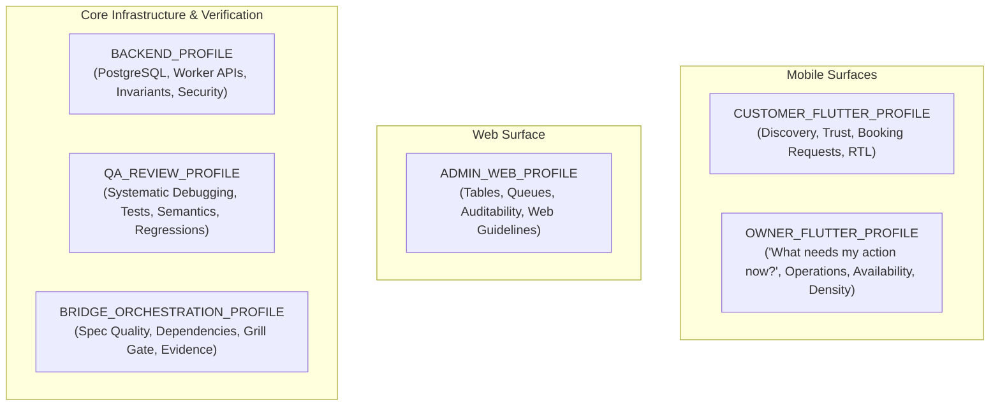

# KONFRM Agent Skill Profiles V1
## Role-Specific Context Profiles, Capability Allocations, and Harmonization Boundaries

**Document Version:** 1.4.0
**Status:** DRAFT — PENDING FINAL BRIDGE APPROVAL
**Scope:** Agent Skill Profile Definitions across Surfaces and Roles
**Target Repository:** `Essxm01/KONFRM`
**Governing Standard:** `docs/agents/KONFRM_AGENT_SKILLS_GOVERNANCE_V1.md`
**Harmonization Authority:** `docs/agents/KONFRM_SKILL_HARMONIZATION_V1.md`

---

## 1. Profile Architecture & Context Discipline Policy

### 1.1 Context Efficiency via `MINIMAL_SUFFICIENT_CONTEXT`
In accordance with the **Smallest Sufficient Skill Set Principle**, no agent may load the complete repository skills catalog simultaneously. Loading irrelevant skills wastes context tokens, increases latency, and introduces cross-surface contamination (e.g., loading web guidelines into Flutter, or UI skills into backend migrations).

- **Recommended Ordinary Target:** **`1–3 active skills`** per task.
- This is a context-discipline engineering guideline, not a rigid mechanical ceiling. Correctness outranks arbitrary limits: when risk and verification demand additional capabilities, the DAG activates them sequentially.
- **FORBIDDEN:** Preloading multi-skill suites "just in case" without specific task triggers.

### 1.2 Deterministic Routing Order
To discover and activate skills without recursive filesystem scanning, agents follow a strict 5-step routing procedure:
1. **Step A — Host-Native Skill Metadata Matching:** Evaluate native host skill metadata (name, trigger intent, concise description) against active task requirements.
2. **Step B — Compact Skill Router Fallback:** If ambiguity remains, or if the task is a high-risk governed operation, consult `.agents/SKILL_ROUTER.md`.
3. **Step C — Load Authoritative `SKILL.md`:** Open the exact resolved path `.agents/skills/<name>/SKILL.md`.
4. **Step D — Load Specific Reference on Demand:** If and only if a subtask requires detailed guidance, open the specific Level 2 reference file from `references/`.
5. **Step E — Base Agent Fallback (No Blind Scanning):** If no skill clearly matches, proceed using KONFRM Canon, Master Rules, and core agent capabilities. **Do NOT** scan the skill directory hunting for tools.

### 1.3 Capability Transitions & Structured Handoffs (`KONFRM_SKILL_HANDOFF_V1`)
Capabilities within and across profiles transition using the structured handoff envelope defined in `docs/agents/KONFRM_SKILL_HARMONIZATION_V1.md`:
```text
=== KONFRM_SKILL_HANDOFF_V1 ===
CAPABILITY_COMPLETED: <Family Name, e.g. DEBUGGING>
SURFACE:             <CUSTOMER_FLUTTER | OWNER_FLUTTER | ADMIN_WEB | BACKEND | CORE>
ROLE:                <Customer | Owner | Admin | System>
ROOT_FACT_OR_RESULT: <Single concise sentence describing verified fact or diagnostic outcome>
AFFECTED_SCOPE:      <Exact file paths or components modified/diagnosed>
EVIDENCE:            <Command output, test line, or artifact reference proving fact>
RISK_CLASS:          <ACCESSIBILITY | VISUAL | STATE_MACHINE | etc.>
NEXT_CAPABILITY:     <Next Family Name, e.g. FLUTTER_TESTING>
NEXT_CAPABILITY_REASON: <Why the DAG requires this transition>
BLOCKER:             <NONE | Description of material blocker requiring escalation>
===============================
```

### 1.4 Role-Aware UI Mental Models
Design and UI capabilities must ground their reasoning in the specific role's mental model:
- **Customer (Renter):** *"Can I trust this property, understand what I am paying, and complete this booking safely?"*
- **Owner (Host):** *"What needs my attention or action now, and what is the exact operational state of my property?"*
- **Admin (Staff):** *"What happened, what evidence exists, and what action can I safely take?"*

### 1.5 Bridge Explicit Overrides (Mission Contracts)
For high-risk, multi-step, or mission-critical tasks, Bridge Orchestration may explicitly mandate required skills directly within the task contract:
```text
Required skills:
- konfrm-systematic-debugging
- konfrm-dart-static-analysis
```
**Rule:** Explicit Bridge skill declarations take absolute precedence over auto-discovery ambiguity.

### 1.6 Profile Structure
This document establishes **six discrete operational profiles**:



### 1.7 Governance & Boundary Rules
- **Repository-Local Execution:** Both Antigravity and Codex discover governed skills exclusively from `.agents/skills/`. Duplicate global installation in user directories is strictly prohibited. Global Antigravity scope is `~/.gemini/config/skills/`.
- **Metadata Declaration:** The active profile is declared in execution prompt metadata or task mission contracts (e.g. `PROFILE: CUSTOMER_FLUTTER`).
- **No Document Churn:** Routine or bounded execution tasks do **NOT** require editing `tasks/CURRENT_TASK.md` merely to record a profile declaration.
- **Durable Business Authority:** Profiles enforce that external skills MUST NOT define, copy, reinterpret, or modify KONFRM financial formulas, booking state machines, wallet rules, availability semantics, payment policy, cancellation policy, or trust semantics. All business truth is read directly from `docs/BUSINESS_RULES.md` and `docs/codex/KONFRM_MASTER_RULES.md`.
- **Execution vs. Audit Context:** Routine task execution operates strictly in `.agents/skills/`; agents must **NEVER** read `docs/ai/skills/<name>/vendor/`.

---

## 2. Profile 1: `CUSTOMER_FLUTTER_PROFILE`

### 2.1 Role & Surface Scope
The Customer Flutter application is the primary consumer surface. It must establish instant trust, effortless search, transparent pricing, and smooth booking request submission while adhering strictly to Arabic-first native mobile conventions.

- **Primary User Mental Model:** *"Can I trust this property, understand what I am paying, and complete this booking safely?"*

### 2.2 Core Responsibilities & Product Goals
- Property discovery, browsing, filtering, and media presentation.
- Transparent property details (pricing breakdown, amenities, house rules).
- Multi-step booking request submission flow.
- Authentication interruption and resume handling.
- Egyptian currency formatting (`1,600 ج.م`) and Western Arabic numerals (`0-9`).
- Strict Bidi sub-run isolation and native RTL layout semantics.
- Accessible TalkBack/VoiceOver labels on all interactive controls.
- Anti-deception enforcement: zero fake scarcity, fake timers, or simulated urgency.

### 2.3 Design & Architecture Bounds
- **Mobile Foundation:** DF2 Mobile Foundation v1.7.
- **Palette Nuance:** Mobile Primary Black (`#000000`) is `SYSTEM-VALIDATED PROVISIONAL` for governed primary usage; Blue (`#276EF1`) is candidate interaction accent only (exact blue remains `OPEN`); neutral scales remain `OPEN`.
- **Spacing:** Authoritative scale `4 / 8 / 12 / 16 / 24 / 32`; Mobile Page Inset `16` provisional.
- **Geometry:** Component-scoped (Field radius `8` `FIELD_ONLY`, Primary button radius `6` provisional `PRIMARY_ONLY`, Sheet top radius `16` provisional, Dialog radius `12` provisional). Secondary button radius is `OPEN`.
- **Financial Authority:** Zero client-side fee computation; server is absolute authority.

### 2.4 Capability Allocation
| Activation Tier | Skill Name | Capability Family | Direct Runtime Path | Trigger Intent | Declared Contracts | Net Class |
| :--- | :--- | :--- | :--- | :--- | :--- | :---: |
| **Always-On Rules** | Master Rules & DF2 Canon | Universal Core | `docs/codex/` | Every turn | Authority, Precedence | `LOCAL_ONLY` |
| **Mandatory on Trigger** | `konfrm-product-ux` | `DESIGN_REVIEW` | `.agents/skills/konfrm-product-ux/` | Customer booking UI | Authority, Role UI, Anti-Deception | `LOCAL_ONLY` |
| **Mandatory on Trigger** | `konfrm-mobile-design` | `FLUTTER_IMPLEMENTATION` | `.agents/skills/konfrm-mobile-design/` | Customer widget layout | Authority, UI Decision, UI State | `LOCAL_ONLY` |
| **Mandatory on Trigger** | `konfrm-rtl-arabic` | `RTL` | `.agents/skills/konfrm-rtl-arabic/` | Arabic strings / RTL UI | Authority, Evidence, Completion | `LOCAL_ONLY` |
| **Mandatory on Trigger** | `konfrm-accessibility` | `ACCESSIBILITY` | `.agents/skills/konfrm-accessibility/` | Accessibility / Semantics | Authority, Evidence, Completion | `LOCAL_ONLY` |
| **Mandatory on Trigger** | `konfrm-dart-static-analysis`| `STATIC_ANALYSIS` | `.agents/skills/konfrm-dart-static-analysis/` | Dart source edit completion | Authority, Completion, Git Anti-Patterns | `LOCAL_ONLY` |
| **Recommended on Trigger**| `konfrm-flutter-widget-testing`| `FLUTTER_TESTING` | `.agents/skills/konfrm-flutter-widget-testing/`| Customer widget tests | Authority, Evidence, Completion, Handoff | `LOCAL_ONLY` |
| **Recommended on Trigger**| `konfrm-flutter-responsive-layout`| `FLUTTER_IMPLEMENTATION` | `.agents/skills/konfrm-flutter-responsive-layout/`| Responsive breakpoints | Authority, UI Decision | `LOCAL_ONLY` |
| **Recommended on Trigger**| `konfrm-flutter-architecture`| `FLUTTER_IMPLEMENTATION` | `.agents/skills/konfrm-flutter-architecture/`| Feature directory / provider | Authority, Completion, Flutter Anti-Patterns | `LOCAL_ONLY` |
| **Recommended on Trigger**| `emil-wrapper` | `FLUTTER_IMPLEMENTATION` | `.agents/skills/emil-wrapper/` | Micro-interactions / sheets | Authority, UI Decision | `LOCAL_ONLY` |
| **Recommended on Trigger**| `anti-ui-slop-wrapper`| `DESIGN_REVIEW` | `.agents/skills/anti-ui-slop-wrapper/` | UI layout review | Authority, Anti-Deception, DF2 Conflict | `NETWORK_OPTIONAL_EXPLICIT`|
| **On-Demand** | `caveman-explore` | `DOCUMENT_RECONCILIATION` | `.agents/skills/caveman-explore/` | Symbol hunting | Authority | `LOCAL_ONLY` |

### 2.5 Explicitly Forbidden Skills & Overrides
- **FORBIDDEN:** `vercel-web-guidelines-wrapper`, `vercel-composition-wrapper` (Zero web code patterns in Flutter).
- **FORBIDDEN:** Upstream skills recommending MVVM, `ChangeNotifier`, BLoC, or Clean Architecture domain layers.
- **FORBIDDEN:** Synthetic scarcity patterns ("Only 1 left!"), fake urgency timers, or fabricated social proof badges.
- **FORBIDDEN:** Client-side financial calculations or commission math.

### 2.6 Qualitative Token Footprint Class
- **Footprint Class:** `MEDIUM` (Focused mobile guidance, minimal overhead).

---

## 3. Profile 2: `OWNER_FLUTTER_PROFILE`

### 3.1 Role & Surface Scope
The Owner Flutter application is an operational tool. Hosts depend on it for daily business management, guest request triage, instant availability locking, and earnings monitoring. Operational certainty and high useful density take precedence over decorative consumer aesthetics.

- **Primary User Mental Model:** *"What needs my attention or action now, and what is the exact operational state of my property?"*

### 3.2 Core Responsibilities
- Operational dashboard with high useful density and actionable alerts.
- Calendar availability management (blocking/unblocking).
- Booking request accept / decline decision interface with guest context.
- Financial overview: earnings, pending transactions, payout states (formulas derived from authoritative Business Rules).
- Truthful state representation: immediate fail-closed feedback on network mutations.
- Fast, predictable navigation between operational workflows.

### 3.3 Design & Availability Bounds
- **Mobile Foundation:** DF2 Mobile Foundation v1.7; component-scoped geometry; 4–32 spacing scale.
- **Availability Invariants:**
  - `PENDING_OWNER_APPROVAL` does **NOT** block calendar availability.
  - `APPROVED_PENDING_PAYMENT` and `CONFIRMED` **DO** block calendar availability.
  - Fail-closed error handling on all calendar mutations.

### 3.4 Capability Allocation
| Activation Tier | Skill Name | Capability Family | Direct Runtime Path | Trigger Intent | Declared Contracts | Net Class |
| :--- | :--- | :--- | :--- | :--- | :--- | :---: |
| **Always-On Rules** | Master Rules & DF2 Canon | Universal Core | `docs/codex/` | Every turn | Authority, Precedence | `LOCAL_ONLY` |
| **Mandatory on Trigger** | `konfrm-product-ux` | `DESIGN_REVIEW` | `.agents/skills/konfrm-product-ux/` | Owner operational flows | Authority, Role UI | `LOCAL_ONLY` |
| **Mandatory on Trigger** | `konfrm-mobile-design` | `FLUTTER_IMPLEMENTATION` | `.agents/skills/konfrm-mobile-design/` | Owner UI layout/density | Authority, UI Decision, UI State | `LOCAL_ONLY` |
| **Mandatory on Trigger** | `konfrm-rtl-arabic` | `RTL` | `.agents/skills/konfrm-rtl-arabic/` | Arabic strings / RTL UI | Authority, Evidence, Completion | `LOCAL_ONLY` |
| **Mandatory on Trigger** | `konfrm-accessibility` | `ACCESSIBILITY` | `.agents/skills/konfrm-accessibility/` | Accessibility / Semantics | Authority, Evidence, Completion | `LOCAL_ONLY` |
| **Mandatory on Trigger** | `konfrm-dart-static-analysis`| `STATIC_ANALYSIS` | `.agents/skills/konfrm-dart-static-analysis/` | Dart source edit completion | Authority, Completion, Git Anti-Patterns | `LOCAL_ONLY` |
| **Mandatory on Trigger** | `konfrm-systematic-debugging`| `DEBUGGING` | `.agents/skills/konfrm-systematic-debugging/`| Calendar/state bugs | Authority, Evidence, Completion, Handoff | `LOCAL_ONLY` |
| **Recommended on Trigger**| `konfrm-flutter-widget-testing`| `FLUTTER_TESTING` | `.agents/skills/konfrm-flutter-widget-testing/`| Owner widget tests | Authority, Evidence, Completion, Handoff | `LOCAL_ONLY` |
| **Recommended on Trigger**| `konfrm-flutter-layout-fixer`| `FLUTTER_IMPLEMENTATION` | `.agents/skills/konfrm-flutter-layout-fixer/`| RenderFlex overflows | Authority, Evidence, Completion | `LOCAL_ONLY` |
| **Recommended on Trigger**| `konfrm-flutter-architecture`| `FLUTTER_IMPLEMENTATION` | `.agents/skills/konfrm-flutter-architecture/`| Provider / controller edit | Authority, Completion, Flutter Anti-Patterns | `LOCAL_ONLY` |
| **Recommended on Trigger**| `konfrm-flutter-http` | `FLUTTER_IMPLEMENTATION` | `.agents/skills/konfrm-flutter-http/` | HTTP client mutations | Authority, Evidence, Completion | `LOCAL_ONLY` |
| **Recommended on Trigger**| `anti-ui-slop-wrapper`| `DESIGN_REVIEW` | `.agents/skills/anti-ui-slop-wrapper/` | Operational view density | Authority, Anti-Deception, DF2 Conflict | `NETWORK_OPTIONAL_EXPLICIT`|
| **On-Demand** | `caveman-explore` | `DOCUMENT_RECONCILIATION` | `.agents/skills/caveman-explore/` | Symbol hunting | Authority | `LOCAL_ONLY` |

### 3.5 Explicitly Forbidden Skills & Overrides
- **FORBIDDEN:** Web guidelines or React composition wrappers.
- **FORBIDDEN:** Optimistic offline mutation queues (Fail-closed is mandatory; owner must know immediately if a date block failed).
- **FORBIDDEN:** Client-side 80/20 split calculations or payout rounding.
- **FORBIDDEN:** Decorative animations that delay critical operational decisions (e.g. accept/decline buttons).

### 3.6 Qualitative Token Footprint Class
- **Footprint Class:** `MEDIUM` (Dense operational clarity).

---

## 4. Profile 3: `ADMIN_WEB_PROFILE`

### 4.1 Role & Surface Scope
The Admin Web application is the governance, audit, and trust nexus for KONFRM staff. Built on React 19, TypeScript, and Vite, it requires high-density tabular displays, verification queues, moderation controls, and financial reconciliation tools.

- **Primary User Mental Model:** *"What happened, what evidence exists, and what action can I safely take?"*

### 4.2 Core Responsibilities
- User verification queues and account status oversight.
- Transaction audit views and operational log reconciliation.
- System-wide booking and availability status inspection.
- High-density responsive web tables with multi-column sorting and filtering.
- Comprehensive keyboard navigation and screen reader support (WCAG 2.2 AA).

### 4.3 Capability Allocation
| Activation Tier | Skill Name | Capability Family | Direct Runtime Path | Trigger Intent | Declared Contracts | Net Class |
| :--- | :--- | :--- | :--- | :--- | :--- | :---: |
| **Always-On Rules** | Master Rules & Web Canon | Universal Core | `docs/codex/` | Every turn | Authority, Precedence | `LOCAL_ONLY` |
| **Mandatory on Trigger** | `konfrm-product-ux` | `DESIGN_REVIEW` | `.agents/skills/konfrm-product-ux/` | Admin audit UI flows | Authority, Role UI | `LOCAL_ONLY` |
| **Mandatory on Trigger** | `konfrm-rtl-arabic` | `RTL` | `.agents/skills/konfrm-rtl-arabic/` | Web RTL / Cairo fonts | Authority, Evidence, Completion | `LOCAL_ONLY` |
| **Mandatory on Trigger** | `vercel-web-guidelines-wrapper`| `DESIGN_REVIEW` | `.agents/skills/vercel-web-guidelines-wrapper/`| React 19 web UI edit | Authority, Evidence, Completion | `LOCAL_ONLY` |
| **Recommended on Trigger**| `vercel-composition-wrapper`| `FLUTTER_IMPLEMENTATION` (Web) | `.agents/skills/vercel-composition-wrapper/`| Compound web components | Authority, Completion | `LOCAL_ONLY` |
| **Recommended on Trigger**| `frontend-design-wrapper`| `DESIGN_REVIEW` | `.agents/skills/frontend-design-wrapper/`| Web table layout | Authority, Anti-Deception | `LOCAL_ONLY` |
| **Recommended on Trigger**| `konfrm-tdd` | `TDD` | `.agents/skills/konfrm-tdd/` | Complex web hooks/filters | Authority, Evidence, Completion | `LOCAL_ONLY` |
| **Recommended on Trigger**| `konfrm-code-review` | `CODE_REVIEW` | `.agents/skills/konfrm-code-review/` | Admin PR review | Authority, Evidence, Completion, Handoff | `LOCAL_ONLY` |
| **On-Demand** | `ui-ux-pro-max-wrapper` | `DESIGN_REVIEW` | `.agents/skills/ui-ux-pro-max-wrapper/`| Complex web pattern research| Authority | `LOCAL_ONLY` |

### 4.4 Explicitly Forbidden Skills & Overrides
- **FORBIDDEN:** ALL Flutter/Dart mobile skills (`flutter-*`, `dart-*`, `konfrm-mobile-design`). Zero Flutter concepts in Admin Web.
- **FORBIDDEN:** Mobile haptic or gesture libraries.
- **FORBIDDEN:** Direct browser-side execution of destructive database operations without backend authorization.

### 4.5 Qualitative Token Footprint Class
- **Footprint Class:** `MEDIUM` (Web-specific engineering).

---

## 5. Profile 4: `BACKEND_PROFILE`

### 5.1 Role & Surface Scope
The Backend surface consists of the Supabase PostgreSQL database (migrations, RLS policies, triggers, stored procedures) and the Cloudflare Worker API proxy. It is the absolute authority for persistence, financial arithmetic, and security invariants.

### 5.2 Core Responsibilities
- PostgreSQL migrations and schema integrity (`backend/database/migrations/`).
- Row Level Security (RLS) enforcement across Customer, Owner, and Admin roles.
- Cloudflare Worker TypeScript REST endpoints and Supabase REST query compatibility adapter.
- Server-authoritative execution of financial state and booking state transitions.
- Authorization boundary enforcement; server-derived identity.
- Fail-closed error reporting; zero synthetic fallback data.

### 5.3 Capability Allocation
| Activation Tier | Skill Name | Capability Family | Direct Runtime Path | Trigger Intent | Declared Contracts | Net Class |
| :--- | :--- | :--- | :--- | :--- | :--- | :---: |
| **Always-On Rules** | Master Rules & DB Canon | Universal Core | `docs/codex/`, `docs/DATABASE.md` | Every turn | Authority, Precedence | `LOCAL_ONLY` |
| **Mandatory on Trigger** | `konfrm-systematic-debugging`| `DEBUGGING` | `.agents/skills/konfrm-systematic-debugging/`| Migration failure, SQL bug | Authority, Evidence, Completion, Handoff | `LOCAL_ONLY` |
| **Recommended on Trigger**| `konfrm-tdd` | `TDD` | `.agents/skills/konfrm-tdd/` | API route / business endpoint | Authority, Evidence, Completion | `LOCAL_ONLY` |
| **Recommended on Trigger**| `konfrm-code-review` | `CODE_REVIEW` | `.agents/skills/konfrm-code-review/` | Migration / RLS PR review | Authority, Evidence, Completion, Handoff | `LOCAL_ONLY` |
| **On-Demand** | `caveman-explore` | `DOCUMENT_RECONCILIATION` | `.agents/skills/caveman-explore/` | Fast route/SQL lookup | Authority | `LOCAL_ONLY` |

### 5.4 Explicitly Forbidden Skills & Overrides
- **FORBIDDEN:** ALL UI and Design skills (`konfrm-mobile-design`, `uizze`, `taste-skill`, `emil-wrapper`, `frontend-design`). UI skills have zero relevance to backend persistence.
- **FORBIDDEN:** Any skill attempting to soften RLS policies or bypass server-side validation.
- **FORBIDDEN:** Mocking production data or fabricating database success.

### 5.5 Qualitative Token Footprint Class
- **Footprint Class:** `LOW` (Lean context, maximum reasoning capacity).

---

## 6. Profile 5: `QA_REVIEW_PROFILE`

### 6.1 Role & Surface Scope
The QA Review profile is dedicated to verification, test coverage, regression defense, accessibility compliance, and code review. It operates as an adversarial auditor across all code changes.

### 6.2 Core Responsibilities
- Pre-merge static analysis gate enforcement (`dart analyze`, lint rules).
- Authoring and executing unit, widget, and integration tests.
- Visual QA and physical runtime verification (multi-scale viewports, Android TalkBack).
- Adversarial code review for regression traps, edge cases, and architectural drift.
- Root cause diagnosis of reported bugs without guess-and-check code churning.

### 6.3 Capability Allocation
| Activation Tier | Skill Name | Capability Family | Direct Runtime Path | Trigger Intent | Declared Contracts | Net Class |
| :--- | :--- | :--- | :--- | :--- | :--- | :---: |
| **Always-On Rules** | Master Rules & Quality Gates | Universal Core | `docs/codex/` | Every turn | Authority, Evidence, Completion | `LOCAL_ONLY` |
| **Mandatory on Trigger** | `konfrm-visual-qa` | `VISUAL_QA` | `.agents/skills/konfrm-visual-qa/` | Visual regression verification | Authority, Evidence, Completion | `LOCAL_ONLY` |
| **Mandatory on Trigger** | `konfrm-accessibility` | `ACCESSIBILITY` | `.agents/skills/konfrm-accessibility/` | Accessibility / TalkBack audit | Authority, Evidence, Completion | `LOCAL_ONLY` |
| **Mandatory on Trigger** | `konfrm-systematic-debugging`| `DEBUGGING` | `.agents/skills/konfrm-systematic-debugging/`| Bug, failing test, defect | Authority, Evidence, Completion, Handoff | `LOCAL_ONLY` |
| **Mandatory on Trigger** | `konfrm-dart-static-analysis`| `STATIC_ANALYSIS` | `.agents/skills/konfrm-dart-static-analysis/`| Pre-completion Dart gate | Authority, Completion, Git Anti-Patterns | `LOCAL_ONLY` |
| **Recommended on Trigger**| `konfrm-flutter-widget-testing`| `FLUTTER_TESTING` | `.agents/skills/konfrm-flutter-widget-testing/`| Widget regression tests | Authority, Evidence, Completion, Handoff | `LOCAL_ONLY` |
| **Recommended on Trigger**| `konfrm-dart-coverage` | `CODE_REVIEW` | `.agents/skills/konfrm-dart-coverage/` | Test coverage gap audit | Authority, Evidence | `LOCAL_ONLY` |
| **Recommended on Trigger**| `konfrm-code-review` | `CODE_REVIEW` | `.agents/skills/konfrm-code-review/` | PR review / closure gate | Authority, Evidence, Completion, Handoff | `LOCAL_ONLY` |
| **Recommended on Trigger**| `anti-ui-slop-wrapper`| `DESIGN_REVIEW` | `.agents/skills/anti-ui-slop-wrapper/` | Visual hierarchy / inert UI | Authority, Anti-Deception, DF2 Conflict | `NETWORK_OPTIONAL_EXPLICIT`|
| **On-Demand** | `konfrm-flutter-integration-test`| `FLUTTER_TESTING` | `.agents/skills/konfrm-flutter-integration-test/`| Device/driver integration run | Authority, Evidence, Completion | `LOCAL_ONLY` |
| **On-Demand** | `konfrm-design-court` | `DESIGN_REVIEW` | `.agents/skills/konfrm-design-court/` | Disputed visual QA findings | Authority, Escalation | `LOCAL_ONLY` |

### 6.4 Safety Guardrails & Forbidden Actions
- **FORBIDDEN:** Modifying product requirements or business rules.
- **FORBIDDEN:** Bypassing failing tests or silencing linter warnings with inline ignore comments.
- **FORBIDDEN:** Approving code based solely on green CI without required physical device runtime evidence.
- **FORBIDDEN:** Running repo-wide `dart fix --apply` or repo-wide `dart format .` blindly.

### 6.5 Qualitative Token Footprint Class
- **Footprint Class:** `MEDIUM` (Rigorous verification and testing).

---

## 7. Profile 6: `BRIDGE_ORCHESTRATION_PROFILE`

### 7.1 Role & Surface Scope
The Bridge Orchestration profile is used by orchestrator agents and supervisors (Bridge, Codex lead, or Antigravity supervisor) to define tasks, enforce dependency graph ordering, challenge specifications, and oversee multi-step delivery.

### 7.2 Core Responsibilities
- Authoring and maintaining `tasks/CURRENT_TASK.md` contracts.
- Enforcing macro dependency order (`KONFRM_EXECUTION_DEPENDENCY_ORDER.md`).
- Executing the **Grill Gate**: interrogating task requirements before implementation begins.
- Exercising **Authoritative Spec Backpropagation**: reconciling repository memory (`CURRENT_TASK.md`, `CURRENT_STATE.md`) after verified evidence.
- Pre-flight branch reality checks and post-merge verification handshakes.
- Guarding against out-of-scope work, premature merges, and unvetted PR modifications.

### 7.3 Capability Allocation
| Activation Tier | Skill Name | Capability Family | Direct Runtime Path | Trigger Intent | Declared Contracts | Net Class |
| :--- | :--- | :--- | :--- | :--- | :--- | :---: |
| **Always-On Rules** | Master Rules & Operating Context | Universal Core | `docs/codex/` | Every turn | Authority, Precedence | `LOCAL_ONLY` |
| **Mandatory on Trigger** | `konfrm-design-router` | `DESIGN_REVIEW` | `.agents/skills/konfrm-design-router/` | Task classification | Authority, Role UI | `LOCAL_ONLY` |
| **Mandatory on Trigger** | Authoritative Spec Backpropagation| `DOCUMENT_RECONCILIATION` | Memory Docs | Verified evidence ready | Authority, Evidence, Completion | `LOCAL_ONLY` |
| **Mandatory on Trigger** | Grill Gate (Adapted Concept) | `DESIGN_REVIEW` | Task Contract | Ambiguous task intent | Authority, Escalation | `LOCAL_ONLY` |
| **Recommended on Trigger**| `konfrm-code-review` | `CODE_REVIEW` | `.agents/skills/konfrm-code-review/` | PR review / merge audit | Authority, Evidence, Completion, Handoff | `LOCAL_ONLY` |
| **On-Demand** | `konfrm-design-court` | `DESIGN_REVIEW` | `.agents/skills/konfrm-design-court/` | Severe architectural dispute| Authority, Escalation | `LOCAL_ONLY` |
| **On-Demand** | `caveman-explore` | `DOCUMENT_RECONCILIATION` | `.agents/skills/caveman-explore/` | Cross-system file mapping | Authority | `LOCAL_ONLY` |

### 7.4 Explicitly Forbidden Skills & Overrides
- **FORBIDDEN:** Wholesale installation of Loop Factory (`inbox/active/archive` folders).
- **FORBIDDEN:** Direct code editing or bulk test running (Bridge coordinates; execution agents implement).
- **FORBIDDEN:** Merging PRs without satisfying complete closure quality gates.

### 7.5 Qualitative Token Footprint Class
- **Footprint Class:** `LOW` (Clean, high-level reasoning space).

---

## 8. Profile Activation Matrix Summary

| Skill / Bundle Name | Capability Family | Customer Flutter | Owner Flutter | Admin Web | Backend | QA Review | Bridge Orchestration | Trigger Intent | Activation Mode | Net Class |
| :--- | :--- | :---: | :---: | :---: | :---: | :---: | :---: | :--- | :---: | :---: |
| `konfrm-product-ux` | `DESIGN_REVIEW` | **MANDATORY** | **MANDATORY** | **MANDATORY** | — | — | — | 3-Role UX Implementation | `MANDATORY_ON_TRIGGER` | `LOCAL_ONLY` |
| `konfrm-mobile-design` | `FLUTTER_IMPLEMENTATION` | **MANDATORY** | **MANDATORY** | FORBIDDEN | FORBIDDEN | RECOMMENDED | — | Mobile UI / Styling | `MANDATORY_ON_TRIGGER` | `LOCAL_ONLY` |
| `konfrm-rtl-arabic` | `RTL` | **MANDATORY** | **MANDATORY** | **MANDATORY** | — | RECOMMENDED | — | Arabic / RTL / Currency | `MANDATORY_ON_TRIGGER` | `LOCAL_ONLY` |
| `konfrm-accessibility` | `ACCESSIBILITY` | **MANDATORY** | **MANDATORY** | **MANDATORY** | — | **MANDATORY** | — | Accessibility / Semantics | `MANDATORY_ON_TRIGGER` | `LOCAL_ONLY` |
| `konfrm-visual-qa` | `VISUAL_QA` | RECOMMENDED | RECOMMENDED | — | — | **MANDATORY** | — | Visual Multi-Viewport Check | `MANDATORY_ON_TRIGGER` | `LOCAL_ONLY` |
| `konfrm-design-router` | `DESIGN_REVIEW` | AUTO | AUTO | AUTO | — | — | **MANDATORY** | Design / Engineering Triage | `MANDATORY_ON_TRIGGER` | `LOCAL_ONLY` |
| `konfrm-flutter-architecture` | `FLUTTER_IMPLEMENTATION` | RECOMMENDED | RECOMMENDED | FORBIDDEN | — | RECOMMENDED | — | Feature Architecture / Providers | `RECOMMENDED_ON_TRIGGER` | `LOCAL_ONLY` |
| `konfrm-flutter-widget-testing` (Pilot)| `FLUTTER_TESTING` | RECOMMENDED | RECOMMENDED | FORBIDDEN | — | RECOMMENDED | — | Widget Testing / Pumping | `MANDATORY_ON_TRIGGER` | `LOCAL_ONLY` |
| `konfrm-flutter-integration-test` | `FLUTTER_TESTING` | — | — | FORBIDDEN | — | **ON-DEMAND** | — | E2E Driver Testing | `ON_DEMAND` | `LOCAL_ONLY` |
| `konfrm-flutter-layout-fixer` | `FLUTTER_IMPLEMENTATION` | RECOMMENDED | RECOMMENDED | FORBIDDEN | — | RECOMMENDED | — | RenderFlex Overflows | `RECOMMENDED_ON_TRIGGER` | `LOCAL_ONLY` |
| `konfrm-dart-unit-test` | `TDD` | RECOMMENDED | RECOMMENDED | — | RECOMMENDED | **MANDATORY** | — | Pure Dart Logic / DTO Tests | `MANDATORY_ON_TRIGGER` | `LOCAL_ONLY` |
| `konfrm-dart-static-analysis` (Pilot) | `STATIC_ANALYSIS` | **MANDATORY** | **MANDATORY** | — | — | **MANDATORY** | — | Dart Source Gate / Analyze | `MANDATORY_ON_TRIGGER` | `LOCAL_ONLY` |
| `konfrm-systematic-debugging` (Pilot) | `DEBUGGING` | RECOMMENDED | RECOMMENDED | RECOMMENDED | **MANDATORY** | **MANDATORY** | — | Bug / Failing Test / Crash | `MANDATORY_ON_TRIGGER` | `LOCAL_ONLY` |
| `konfrm-tdd` | `TDD` | ON-DEMAND | ON-DEMAND | RECOMMENDED | RECOMMENDED | RECOMMENDED | — | Red-Green-Refactor Cycle | `RECOMMENDED_ON_TRIGGER` | `LOCAL_ONLY` |
| `konfrm-code-review` | `CODE_REVIEW` | — | — | RECOMMENDED | RECOMMENDED | RECOMMENDED | RECOMMENDED | PR Review / Closure Audit | `RECOMMENDED_ON_TRIGGER` | `LOCAL_ONLY` |
| `vercel-web-guidelines-wrapper`| `DESIGN_REVIEW` | FORBIDDEN | FORBIDDEN | **MANDATORY** | — | — | — | Admin Web React 19 UI | `MANDATORY_ON_TRIGGER` | `LOCAL_ONLY` |
| `vercel-composition-wrapper` | `FLUTTER_IMPLEMENTATION` | FORBIDDEN | FORBIDDEN | RECOMMENDED | — | — | — | React 19 Compound Hooks | `RECOMMENDED_ON_TRIGGER` | `LOCAL_ONLY` |
| `emil-wrapper` | `FLUTTER_IMPLEMENTATION` | RECOMMENDED | ON-DEMAND | FORBIDDEN | FORBIDDEN | — | — | Micro-Interactions / Motion | `RECOMMENDED_ON_TRIGGER` | `LOCAL_ONLY` |
| `anti-ui-slop-wrapper` | `DESIGN_REVIEW` | RECOMMENDED | RECOMMENDED | RECOMMENDED | FORBIDDEN | RECOMMENDED | — | AI Layout / Contrast Review | `RECOMMENDED_ON_TRIGGER` | `NETWORK_OPTIONAL_EXPLICIT` |
| `ui-radar` | `DESIGN_REVIEW` | ON-DEMAND | ON-DEMAND | ON-DEMAND | FORBIDDEN | — | — | Remote Screen Research | `ON_DEMAND` | `NETWORK_REQUIRED_ON_DEMAND` |
| `Grill Gate` (Adapted Protocol) | `DESIGN_REVIEW` | — | — | — | — | — | **MANDATORY** | Ambiguous Task Contract | `MANDATORY_ON_TRIGGER` | `LOCAL_ONLY` |
| `Spec Backpropagation` | `DOCUMENT_RECONCILIATION` | **PROPOSE** | **PROPOSE** | **PROPOSE** | **PROPOSE** | **PROPOSE** | **AUTHORITATIVE WRITE** | Evidence Reconciled | `MANDATORY_ON_TRIGGER` | `LOCAL_ONLY` |
| `caveman-explore` (Read-Only) | `DOCUMENT_RECONCILIATION` | ON-DEMAND | ON-DEMAND | ON-DEMAND | ON-DEMAND | ON-DEMAND | ON-DEMAND | Read-Only Symbol Hunting | `ON_DEMAND` | `LOCAL_ONLY` |
| `caveman` (Prose compressor) | — | FORBIDDEN | FORBIDDEN | FORBIDDEN | FORBIDDEN | FORBIDDEN | FORBIDDEN | — | `REJECT` | `LOCAL_ONLY` |
| `design-mobile-apps` (Sleek) | — | FORBIDDEN | FORBIDDEN | FORBIDDEN | FORBIDDEN | FORBIDDEN | FORBIDDEN | — | `REJECT` | `REJECT_NETWORK_PROFILE` |
| `find-skills` | — | FORBIDDEN | FORBIDDEN | FORBIDDEN | FORBIDDEN | FORBIDDEN | FORBIDDEN | — | `DISCOVERY_ONLY_OUTSIDE_EXECUTION` | `REJECT_NETWORK_PROFILE` |
