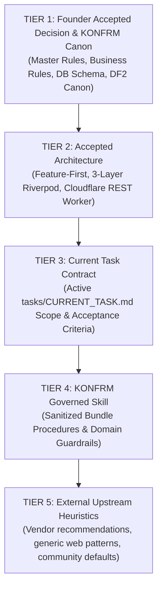
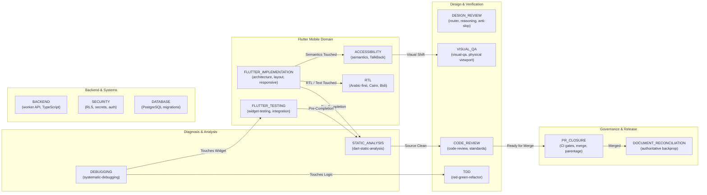
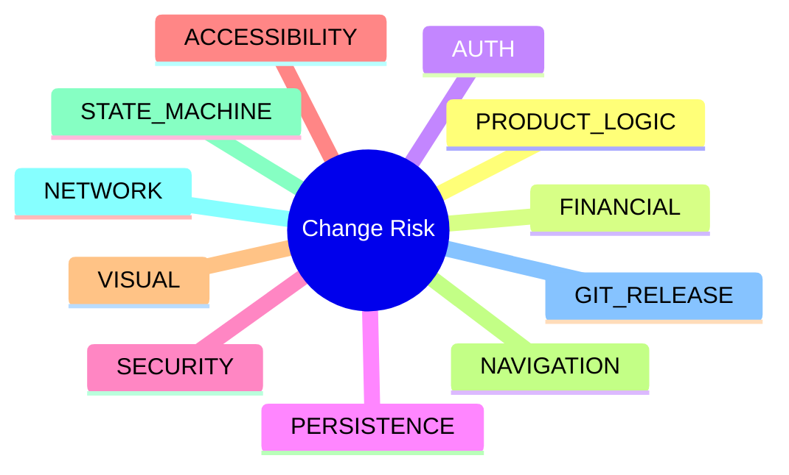
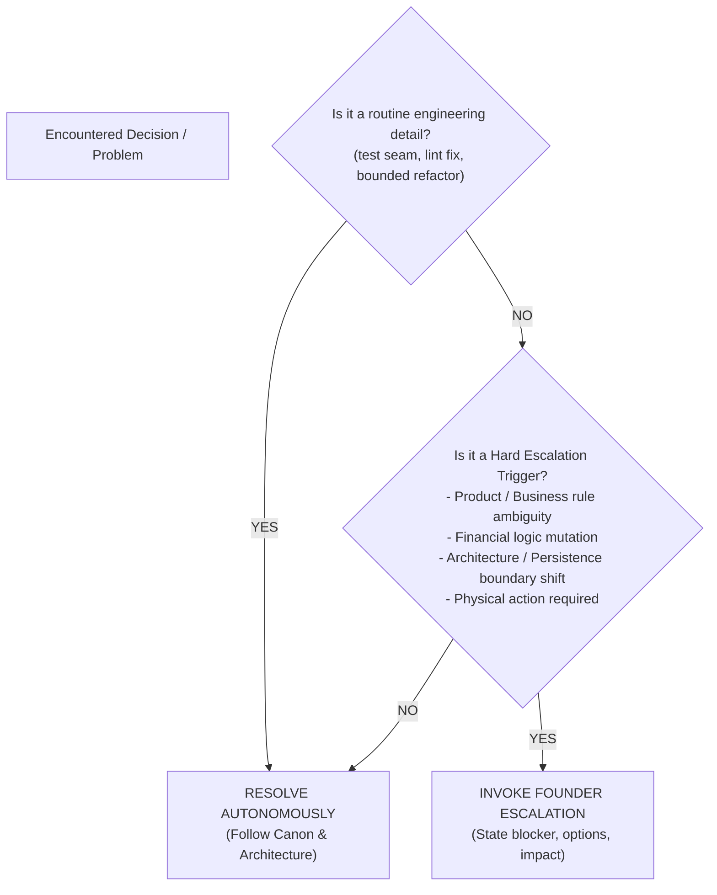

# KONFRM Skill Harmonization & Intelligence Layer V1
## Capability Graph, Conditional Composition, Shared Contracts, and Operational Intelligence

**Document Version:** 1.0.0
**Status:** DRAFT — PENDING FINAL BRIDGE APPROVAL
**Scope:** Coordinated Multi-Skill Intelligence & Composition Architecture
**Target Repository:** `Essxm01/KONFRM`
**Governing Standard:** `docs/agents/KONFRM_AGENT_SKILLS_GOVERNANCE_V1.md`
**Foundational Authority:** KONFRM Canon, Master Rules (`docs/codex/KONFRM_MASTER_RULES.md`), Founder Operating Context (`docs/codex/KONFRM_FOUNDER_OPERATING_CONTEXT.md`)

---

## 1. Executive Vision: From Collection to System

The foundational discovery architecture establishes where skills live (`.agents/skills/`) and how they are located without recursive filesystem scans. However, treating skills as an uncoordinated collection of isolated instructions invites conflicting recommendations, premature completion claims, redundant re-reading, and uncontrolled execution loops.

The **KONFRM Skill Harmonization & Intelligence Layer (V1)** elevates individual skills into a **Coordinated Capability System**:

$$\text{External Upstream Tools} \xrightarrow{\text{Sanitize \& Subordinate}} \text{Governed Skills (Ingredients)} \xrightarrow{\text{Harmonization Layer}} \text{Unified KONFRM Capability System}$$

### Core Objectives
1. **System Coherence:** External skills provide raw heuristics; KONFRM governed skills embody constitutional Canon. No external skill operates with unmediated authority.
2. **Deterministic Composition:** Skills compose conditionally along a Directed Acyclic Graph (DAG) based on verified runtime facts. Cyclic loops ($\text{Debug} \leftrightarrow \text{Test} \leftrightarrow \text{Review}$) are strictly prohibited.
3. **Structured Handoffs:** Handoffs between capabilities carry compact, verified findings so downstream agents do not re-read or re-reason over the entire task history.
4. **Risk-Based Verification:** Completion is never claimed based on a green build alone; verification gates activate proportionally to detected change risk.
5. **Context Efficiency via `MINIMAL_SUFFICIENT_CONTEXT`:** Eliminate rigid, arbitrary metrics in favor of loading the minimum sufficient context required for total correctness.
6. **Minimal Founder Interruption:** Autonomous resolution of routine engineering seams; escalation is reserved strictly for genuine product, financial, architectural, or physical blockers.

---

## 2. Inviolable Authority & Precedence (`KONFRM_AUTHORITY_CONTRACT`)

Every governed skill bundle and execution subagent operates under a common constitutional contract.

### 2.1 The Five-Tier Precedence Order
When instructions, heuristics, or tool recommendations conflict, precedence is resolved deterministically:



$$\text{Founder Decision / Canon} > \text{Accepted Architecture} > \text{Current Task Contract} > \text{KONFRM Governed Skill} > \text{Upstream Heuristic}$$

### 2.2 Conflict Resolution Invariants
1. **Automatic Discard:** If a lower-tier instruction (e.g. upstream advice recommending MVVM, ChangeNotifier, or generic SaaS colors) conflicts with a higher tier (KONFRM Riverpod or DF2 Canon), the lower instruction is **immediately discarded**.
2. **Preserve Higher Authority:** The higher authority governs without debate.
3. **No Unnecessary Escalation:** Do **NOT** interrupt the Founder for routine precedence applications where Canon is clear.
4. **Log Material Conflicts:** If an unexpected ambiguity exists between two Tier 1 or Tier 2 authorities, record the unresolved fact in task memory and escalate via the Founder Escalation Contract.
5. **Zero Business Rule Duplication:** This authority contract references `docs/BUSINESS_RULES.md` and `docs/DATABASE.md` dynamically; it does not clone mutable business truth.

---

## 3. The KONFRM Capability Graph

The system organizes all engineering operations into fifteen discrete **Capability Families**. Transitions between families are governed by strict conditions to prevent runaway sprawl.



### 3.1 Capability Family Specifications

| Capability Family | Primary Trigger | May Require | Must Require | Must NOT Auto-Require | Completion Gate | Escalation Target |
| :--- | :--- | :--- | :--- | :--- | :--- | :--- |
| **`DEBUGGING`** | Failing test, runtime crash, unexpected behavior, build failure | `FLUTTER_TESTING`, `TDD`, `STATIC_ANALYSIS` | Root-cause verification | `DESIGN_REVIEW`, `PR_CLOSURE` | 4-phase RCA complete; root cause proven with minimal reproduction | Unreproducible environment bug, external infrastructure outage |
| **`FLUTTER_IMPLEMENTATION`** | Task contract targeting Flutter screens, widgets, or controllers | `RTL`, `DESIGN_REVIEW`, `TDD` | `STATIC_ANALYSIS`, `FLUTTER_TESTING` (if logic changed) | `BACKEND`, `DATABASE` | Clean `dart analyze`; component compiles; states implemented | Missing business invariant, unapproved design token change |
| **`FLUTTER_TESTING`** | Widget verification, pump testing, regression guard authoring | `DEBUGGING` (if test fails) | `STATIC_ANALYSIS` | `VISUAL_QA`, `DESIGN_REVIEW` | All new/modified tests pass green; zero regression in existing suite | Non-deterministic test framework failure |
| **`STATIC_ANALYSIS`** | Pre-completion gate on any Dart/Flutter source edit | `DEBUGGING` (if analyze flags error) | Safe dry-run before automated fixes | `FLUTTER_TESTING`, `PR_CLOSURE` | Zero errors/warnings across active task scope; zero inline suppression | Breaking SDK / dependency analyzer incompatibility |
| **`ACCESSIBILITY`** | Modification to interactive widgets, icons, semantics, or TalkBack | `VISUAL_QA` | Semantics tree verification, touch target audit ($\ge 48\text{dp}$) | `TDD`, `DATABASE` | Accessible labels on all controls; decorative elements hidden; TalkBack passes | Conflicting platform accessibility guidelines |
| **`RTL`** | Modification of Arabic strings, directional padding, currency, Bidi | `ACCESSIBILITY` | Cairo font check, Western digits (`0-9`), Egyptian currency (`1,600 ج.م`) | `BACKEND` | Proper start/end alignment; no mirrored physical icons; Bidi isolation verified | Ambiguous grammatical or localization rule |
| **`DESIGN_REVIEW`** | Layout ambiguity, visual hierarchy refinement, anti-slop audit | `RTL`, `VISUAL_QA` | Subordination to DF2 Canon, monochrome palette check | `DEBUGGING`, `DATABASE` | Adheres to DF2 geometry; zero generic AI pills/cards; useful density confirmed | Fundamental product design dispute (escort to Design Court) |
| **`VISUAL_QA`** | Physical rendering verification on mobile viewports | `ACCESSIBILITY`, `DESIGN_REVIEW` | Multi-viewport check (100%, 125%, 150%, 200%), state matrix check | `TDD`, `BACKEND` | Verified rendered evidence on physical hardware / emulator; zero clipped text | Device unavailable or hardware failure |
| **`CODE_REVIEW`** | Pre-merge verification, PR audit, branch closure gate | `DEBUGGING` (if finding blocking) | Two-axis check (Standards & Spec), exact commit SHA review | `FLUTTER_IMPLEMENTATION` | Zero blocking findings; all quality gates verified; advisory notes logged | Architecture boundary breach or unapproved API mutation |
| **`TDD`** | Algorithm implementation, state machine logic, pure business rules | `DEBUGGING` (on red phase) | Failing test first, minimal green implementation, clean refactor | `VISUAL_QA`, `DESIGN_REVIEW` | Unit test suite passing; zero implementation before test failure | Unclear public API contract or state transition |
| **`BACKEND`** | API endpoint, Cloudflare Worker route, Supabase REST proxy | `DATABASE`, `SECURITY` | Server-authoritative logic, fail-closed handling, TypeScript compile | `FLUTTER_IMPLEMENTATION`, `VISUAL_QA` | Clean endpoint contract; fail-closed network response tested | Unapproved financial formula or fee split change |
| **`SECURITY`** | Auth flow, RLS policy, credential storage, secret handling | `DATABASE`, `BACKEND` | Server-derived identity, RLS leak test, zero secret leaks | `DESIGN_REVIEW`, `RTL` | RLS policy verified; zero client-side privilege escalation; zero secrets in code | Required permission elevation or infrastructure key rotation |
| **`DATABASE`** | PostgreSQL migration, table schema, RLS rule, trigger | `SECURITY`, `BACKEND` | Forward migration script, RLS enabled, Supabase REST match | `FLUTTER_TESTING`, `DESIGN_REVIEW` | Migration applies cleanly; rollback planned; RLS policies tested | Destructive schema mutation or data migration loss risk |
| **`PR_CLOSURE`** | Task completion, git release, branch merge to target | `CODE_REVIEW`, `DOCUMENT_RECONCILIATION` | Clean git status, exact reviewed SHA, green CI, main drift check, merge commit | `FLUTTER_IMPLEMENTATION`, `DEBUGGING` | Merge commit on base branch; ancestry verified; remote pushed | Divergent base branch requiring complex rebase/conflict resolution |
| **`DOCUMENT_RECONCILIATION`**| Post-merge memory update, backpropagation of verified facts | None | Authoritative Bridge write permission; verified evidence attached | `FLUTTER_TESTING`, `DEBUGGING` | `CURRENT_TASK.md` closed; `CURRENT_STATE.md` reconciled; zero drift | Discrepancy between committed code and documented Canon |

---

## 4. Conditional Composition & DAG Enforcement

### 4.1 Conditional Composition Principles
1. **Evidence-Driven Activation:** Capabilities do not preload. A capability activates **only** when evidence in the active task reveals an explicit need.
2. **Directed Acyclic Progress (DAG):** Every transition must move strictly forward toward a defined completion gate.
3. **No Cyclic Loops:** Under no circumstances may skills loop indefinitely.
   - *Prohibited Pattern:* $\text{DEBUGGING} \to \text{FLUTTER\_TESTING} \to \text{CODE\_REVIEW} \to \text{DEBUGGING} \to \text{FLUTTER\_TESTING} \dots$
   - *Remediation:* If a capability reveals a new defect during review, the task transitions to a single bounded `DEBUGGING` pass. If that pass fails to resolve the root cause within one iteration, the agent must halt and invoke `KONFRM_FOUNDER_ESCALATION_V1` rather than continuing to churn code.

### 4.2 Transition Rules
- If `DEBUGGING` isolates root cause to a Flutter widget $\implies$ activate `FLUTTER_TESTING` for reproduction.
- If `FLUTTER_IMPLEMENTATION` modifies widget semantics or labels $\implies$ activate `ACCESSIBILITY`.
- If `FLUTTER_IMPLEMENTATION` touches Arabic text or directionality $\implies$ activate `RTL`.
- Before ANY Flutter task completes $\implies$ activate `STATIC_ANALYSIS` as a non-negotiable gate.
- Before PR merge $\implies$ activate `CODE_REVIEW` $\to$ `PR_CLOSURE` $\to$ `DOCUMENT_RECONCILIATION`.

---

## 5. Structured Handoff Contract (`KONFRM_SKILL_HANDOFF_V1`)

To prevent downstream agents from re-reading and re-analyzing entire conversation transcripts, capabilities transition using a standardized, compact handoff envelope.

### 5.1 Handoff Schema
```text
=== KONFRM_SKILL_HANDOFF_V1 ===
CAPABILITY_COMPLETED: <Family Name, e.g. DEBUGGING>
SURFACE:             <CUSTOMER_FLUTTER | OWNER_FLUTTER | ADMIN_WEB | BACKEND | CORE>
ROLE:                <Customer | Owner | Admin | System>
ROOT_FACT_OR_RESULT: <Single concise sentence describing verified fact or diagnostic outcome>
AFFECTED_SCOPE:      <Exact file paths or components modified/diagnosed>
EVIDENCE:            <Command output, test line, or artifact reference proving fact>
RISK_CLASS:          <ACCESSIBILITY | VISUAL | STATE_MACHINE | etc.>
NEXT_CAPABILITY:     <Next Family Name, e.g. FLUTTER_TESTING>
NEXT_CAPABILITY_REASON: <Why the DAG requires this transition>
BLOCKER:             <NONE | Description of material blocker requiring escalation>
===============================
```

### 5.2 Concrete Example: Debugging to Widget Testing
```text
=== KONFRM_SKILL_HANDOFF_V1 ===
CAPABILITY_COMPLETED: DEBUGGING
SURFACE:             CUSTOMER_FLUTTER
ROLE:                Customer
ROOT_FACT_OR_RESULT: SearchField prefix icon lacked Semantics exclusion, causing TalkBack to read decorative icon as active button.
AFFECTED_SCOPE:      mobile/packages/konfrm_design_system/lib/src/components/inputs/input_field.dart
EVIDENCE:            TalkBack tree dump node #14 identified non-null label on decorative asset.
RISK_CLASS:          ACCESSIBILITY
NEXT_CAPABILITY:     FLUTTER_TESTING
NEXT_CAPABILITY_REASON: Verify regression test reproduces semantics exclusion failure and passes post-fix.
BLOCKER:             NONE
===============================
```

---

## 6. Common Evidence Contract (`KONFRM_EVIDENCE_CONTRACT`)

In KONFRM, a green CI build alone never universally proves completion. Different claims require explicit, domain-appropriate evidence classes:

| Claim Domain | Required Evidence Standard | Insufficient / Rejected Evidence |
| :--- | :--- | :--- |
| **Code Correctness** | Automated unit/widget test passes green AND `dart analyze` reports 0 issues. | "Code compiles", "looks correct", or green CI build on different branch head. |
| **UI Correctness** | Exact component rendered on target viewport (100%–200%) with all applicable states (default, focused, error). | Static inspection, web preview of Flutter code, or unrendered widget code. |
| **Accessibility** | Semantics test tree verification (`tester.getSemantics()`) AND physical TalkBack verification when quality gate mandates it. | Visual screenshot alone, assuming Flutter semantics defaults are correct. |
| **Arabic / RTL** | Rendered evidence of correct start/end layout, Cairo font rendering, Western digits (`0-9`), and Egyptian currency (`1,600 ج.م`). | LTR screenshot, mirrored media icons, or Eastern Arabic numeral fallbacks. |
| **Backend & Persistence** | Server-authoritative response verified, failure path tested (fail-closed), RLS policy verified against unauthorized role. | Client-side mock data, assuming database trigger succeeded without query proof. |
| **PR Closure** | Exact reviewed commit SHA matches remote HEAD; CI green on exact SHA; zero main drift; verified merge commit parentage. | PR marked merged in UI without checking base branch git ancestry and commit SHA. |

---

## 7. Risk-Based Gate Activation & Completion Contract

### 7.1 Risk Dimensions
Change risk is evaluated across eleven distinct dimensions:



1. **`PRODUCT_LOGIC`:** Core booking rules, availability locking, commission formulas $\implies$ Requires strict Canon review.
2. **`FINANCIAL`:** Payout math, wallet balances, refund calculations $\implies$ Requires absolute server authority verification; zero client arithmetic.
3. **`AUTH`:** Token storage, role permissions, login interruption $\implies$ Requires security review and fail-closed audit.
4. **`PERSISTENCE`:** SQL migrations, RLS policies, table indexes $\implies$ Requires database schema migration verification.
5. **`SECURITY`:** API secrets, user private data, credential boundaries $\implies$ Requires zero-leak scan and authorization check.
6. **`ACCESSIBILITY`:** Interactive labels, TalkBack focus, touch targets $\implies$ Requires semantics test and physical accessibility review.
7. **`VISUAL`:** Layouts, spacing, typography, component radii $\implies$ Requires multi-viewport visual QA.
8. **`NAVIGATION`:** Declarative routing, deep links, back stack $\implies$ Requires route transition and parameter verification.
9. **`STATE_MACHINE`:** Booking status, property availability status $\implies$ Requires truthful UI state evaluation across all valid transitions.
10. **`NETWORK`:** HTTP client, retry policy, error formatting $\implies$ Requires fail-closed verification under network disruption.
11. **`GIT_RELEASE`:** Commits, branches, PR merges $\implies$ Requires exact SHA verification and ancestry checks.

### 7.2 Completion Contract (`KONFRM_COMPLETION_CONTRACT`)
Every capability declares unambiguous `DONE_WHEN` and `NOT_DONE_IF` rules:

```text
=== KONFRM_COMPLETION_CONTRACT ===
CAPABILITY: <Capability Name>
DONE_WHEN:
  - <Specific verified condition 1>
  - <Specific verified condition 2>
NOT_DONE_IF:
  - <Disqualifying condition 1>
  - <Disqualifying condition 2>
==================================
```

#### Standard Completion Rules by Family:
- **`FLUTTER_IMPLEMENTATION`:**
  - *DONE_WHEN:* Feature code adheres to Feature-First structure; Riverpod controllers handle state; `dart analyze` reports zero warnings; component states implemented.
  - *NOT_DONE_IF:* RenderFlex overflow exists; BLoC/ChangeNotifier used; inline lint suppressions introduced; client performs fee math.
- **`DEBUGGING`:**
  - *DONE_WHEN:* Root cause isolated with reproducible evidence; targeted fix verified; regression test created and passing.
  - *NOT_DONE_IF:* Fix applied by trial-and-error without proven root cause; existing tests broken; unrelated files edited.
- **`PR_CLOSURE`:**
  - *DONE_WHEN:* Reviewed SHA equals merged HEAD; merge commit has exact parents; CI checks passed on exact revision; remote tracking updated.
  - *NOT_DONE_IF:* Merged with unreviewed commits; fast-forward merge used when merge commit required; base branch diverged.

---

## 8. Role-Aware UI Context & State Completeness

### 8.1 Role-Specific Mental Models
Design and UI capabilities must never flatten user experiences into a generic SaaS pattern. Every UI evaluation must ground itself in the primary role's mental model:

| Role / Surface | Primary User Mental Model & Question | Operational Objective in KONFRM |
| :--- | :--- | :--- |
| **Customer (Renter)** | *"Can I trust this property, understand what I am paying, and complete this booking safely?"* | Instant trust, transparent fee breakdowns, effortless date selection, smooth Arabic-first UX, zero deceptive urgency badges. |
| **Owner (Host)** | *"What needs my attention or action now, and what is the exact operational state of my property?"* | Operational certainty, high useful density, immediate accept/decline triage, transparent calendar availability blocks, zero decorative fluff. |
| **Admin (Staff)** | *"What happened, what evidence exists, and what action can I safely take?"* | Governance auditability, complete log verification, high-density tables, multi-column sorting, safe moderation workflows. |

### 8.2 UI Decision Context Envelope
Before any design skill issues recommendations, it must receive a structured UI context envelope:
```text
SURFACE:               <CUSTOMER_FLUTTER | OWNER_FLUTTER | ADMIN_WEB>
ROLE:                  <Customer | Owner | Admin>
SCREEN_JOB:            <Specific workflow job to be done>
PRIMARY_USER_DECISION: <The central decision user makes on this screen>
CURRENT_STATE:         <Active UI state, e.g. PENDING_PAYMENT>
IMPORTANT_EDGE_STATES: <Network error, expired session, empty property list>
CANON_CONSTRAINTS:     <DF2 v1.7, monochrome black, Cairo typography, 4-32 spacing>
```

### 8.3 State Completeness Contract (`KONFRM_UI_STATE_CONTRACT`)
Every UI component or screen must evaluate all applicable states from the standard state matrix:

$$\text{Default} \quad \text{Loading} \quad \text{Empty} \quad \text{Error} \quad \text{Disabled} \quad \text{Pending} \quad \text{Success} \quad \text{Partial} \quad \text{Retry} \quad \text{Auth Interruption} \quad \text{Network Failure}$$

- **Truthful State Representation:** If a calendar block fails over the network, show an explicit error state immediately. Never show an optimistic success state that might be reverted.
- **Relevance Rule:** Only states relevant to the component must be implemented. Do not invent artificial states for simple static badges.

### 8.4 Anti-Deception Contract
Design and product skills are strictly forbidden from introducing manipulative patterns:
- **FORBIDDEN:** Fake scarcity badges ("Only 1 room left at this price!").
- **FORBIDDEN:** Fake urgency timers ("Booking expires in 03:00!").
- **FORBIDDEN:** Fabricated popularity ("14 people looking at this now!").
- **FORBIDDEN:** Synthetic reviews, unverified host badges, or simulated social proof.
- *Exception:* Explicitly tagged `LAB_SCENARIO_DATA` used strictly in offline test fixtures.

---

## 9. Domain-Specific Anti-Patterns (`DO_NOT` Directives)

Each governed skill must enforce a concise, high-value `DO_NOT` boundary:

### 9.1 Mobile / Flutter Anti-Patterns
- **DO NOT** introduce BLoC, Cubit, `ChangeNotifier`, or MobX. Riverpod is the sole accepted state manager.
- **DO NOT** introduce code-generation packages (`freezed`, `json_serializable`) casually without an explicit architecture decision.
- **DO NOT** introduce `dio` when `package:http` is the accepted standard.
- **DO NOT** compute commissions, fee splits, or wallet payouts on the mobile client.
- **DO NOT** create client-side offline mutation sync queues. KONFRM enforces **fail-closed** network handling.
- **DO NOT** wrap entire views in `SingleChildScrollView` to lazily suppress RenderFlex overflows.

### 9.2 Git & Repository Anti-Patterns
- **DO NOT** execute `git add .` or `git add -A`. Always stage explicit, verified file paths.
- **DO NOT** execute destructive commands (`git reset --hard`, `git clean -fd`) without explicit Founder authorization.
- **DO NOT** merge unreviewed commit SHAs or bypass quality gates to achieve green status.
- **DO NOT** commit, log, or document private API keys, service role secrets, or environment secrets.

### 9.3 Design & Craft Anti-Patterns
- **DO NOT** override DF2 Mobile Foundation tokens with generic web/SaaS heuristics.
- **DO NOT** treat OPEN design candidates (e.g. `#276EF1` interaction blue, secondary button radius) as immutable Canon.
- **DO NOT** introduce generic AI card/pill styling with heavy dropshadows and vibrant gradients.
- **DO NOT** sacrifice operational information density for decorative whitespace in Owner or Admin apps.

### 9.4 Backend & Persistence Anti-Patterns
- **DO NOT** soften or disable Row Level Security (RLS) policies to make a failing test pass.
- **DO NOT** execute destructive SQL (`DROP TABLE`, `TRUNCATE`) without explicit confirmation.
- **DO NOT** fabricate mock production data or simulate database success on persistence errors.

---

## 10. Founder Escalation Contract (`KONFRM_FOUNDER_ESCALATION_V1`)

To maximize agent autonomous throughput, routine engineering challenges must be resolved independently. Founder escalation is reserved strictly for genuine constitutional boundaries.



### 10.1 Do NOT Interrupt the Founder For:
- Selecting standard test seams or test fixtures.
- Fixing mechanical compiler, linter, or static analysis warnings.
- Bounded internal refactoring within accepted feature directories.
- Discarding conflicting external upstream heuristics that contradict Canon.
- Routine Git staging, committing, and pushing on authorized candidate branches.

### 10.2 Mandatory Founder Escalation Triggers:
1. **Product Rule Ambiguity:** Any undefined marketplace policy, cancellation penalty, or guest/host dispute scenario.
2. **Financial Logic Mutation:** Any change to price breakdown calculation, platform service fee, or host payout formula.
3. **Architectural / Persistence Shift:** Any proposal to replace Riverpod, alter Supabase RLS boundaries, or change database table schemas.
4. **Physical Action Required:** Physical device connection/disconnection, manual USB authorization, or third-party portal credential entry.
5. **Irreconcilable Canon Conflicts:** Genuine contradictions between two authoritative Tier 1 Founder directives.

---

## 11. Cross-Skill Conflict Matrix

When external skills provide conflicting methodologies, the conflict matrix resolves precedence deterministically:

| Conflict Scenario | Upstream / Skill A Guidance | Upstream / Skill B Guidance | Authoritative KONFRM Resolution | Rationale |
| :--- | :--- | :--- | :--- | :--- |
| **TDD vs. Exploratory UI Design** | Strict red-green unit test required before writing any UI code (`tdd`). | Rapid visual layout prototyping and visual exploration (`taste-skill`, `anti-ui-slop`). | **Exploratory UI Permitted; TDD for Logic.** Visual exploration is allowed during UI drafting. Once visual direction is locked, regression tests and semantics tests become mandatory before merge. | TDD must never paralyze visual exploration, but code is never merged without tests. |
| **Generic Mobile Architecture vs. KONFRM** | MVVM with `ChangeNotifier`, layer-grouped folders, domain use cases (`flutter-apply-architecture-best-practices`). | Feature-First, 3-layer Riverpod (`lib/src/features/`), manual DTOs. | **KONFRM Architecture Wins Absolutely.** MVVM and ChangeNotifier are expunged from the bundle. | Tier 2 Accepted Architecture outranks Tier 5 upstream advice. |
| **UIZZE / Taste vs. DF2 Canon** | Recommends generic SaaS Tailwind palettes, vibrant blues, and generic 4–12dp card radiuses (`uizze`). | Monochrome-first identity, Primary Black (`#000000` provisional), component-scoped radii (Field 8, Primary Button 6 provisional). | **DF2 Canon Wins Absolutely.** External critique is filtered through DF2 monochrome tokens. | Tier 1 Canon outranks external design advice. |
| **Automated Fixers vs. Git Safety** | Blind execution of `dart fix --apply` and repo-wide `dart format .` (`dart-run-static-analysis`). | Explicit scoped staging, no unreviewed file modifications, clean diffs. | **Git Safety Wins Absolutely.** Automated fixes require `--dry-run` inspection and must be scoped strictly to modified task files. | Prevents silent repo-wide file churn and merge conflicts. |
| **Offline Sync vs. Fail-Closed** | Recommends local caching, optimistic offline UI, and background mutation queues (`flutter-apply-architecture-best-practices`). | Immediate transparent error reporting; zero optimistic mutations on calendar blocks. | **Fail-Closed Policy Wins Absolutely.** Offline mutation queues are stripped from all bundles. | Hosts must know with absolute certainty if an operational block succeeded or failed. |
| **Generic UX Heuristic vs. Role Product Rule** | "Minimize clicks on every screen; combine approval and payment into one step." | Three-role operational boundary: Owner approves request $\to$ Customer completes payment $\to$ Booking confirmed. | **Product Rule Wins Absolutely.** Booking request approval must remain distinct from payment execution. | Marketplace safety outranks generic consumer UX compression. |

---

## 12. Skill Activation Priority & Context Efficiency

### 12.1 Skill Activation Priority Hierarchy
When a task contract or prompt matches multiple skills, activation follows a strict priority cascade:
1. **Safety & Authority-Critical Capabilities:** (e.g. `SECURITY`, `DATABASE` invariants, branch reality pre-flight).
2. **Task-Primary Execution Capabilities:** (e.g. `DEBUGGING` for a bug; `FLUTTER_IMPLEMENTATION` for a feature).
3. **Mandatory Verification Capabilities:** (e.g. `STATIC_ANALYSIS`, `FLUTTER_TESTING`, `ACCESSIBILITY`).
4. **Advisory Quality Lenses:** (e.g. `anti-ui-slop-wrapper`, `impeccable-wrapper`).
5. **On-Demand Reference & Exploration:** (e.g. `caveman-explore`, `ui-radar`).

*Rule:* Never activate advisory design lenses before completing primary technical diagnosis for a bug.

### 12.2 Context Efficiency via `MINIMAL_SUFFICIENT_CONTEXT`
> [!IMPORTANT]
> **REPLACING ARBITRARY HARD METRICS:**
> Previous early discovery drafts used mechanical rules (e.g. "Router $\le 50$ lines", "exactly 1 SKILL.md", "$\le 1$ reference"). These are useful context targets, but must **NEVER** become rigid correctness gates that truncate necessary instructions.
>
> The governing standard is **`MINIMAL_SUFFICIENT_CONTEXT`**:
> 1. The Skill Router must remain compact and focused on routing intent.
> 2. Open only the single selected `SKILL.md` file required for the active domain.
> 3. Load only the specific Level 2 references demanded by the immediate subtask.
> 4. Load only the specific shared contracts declared by the skill bundle.
>
> **Total correctness outranks arbitrary line-count limits.**

### 12.3 Modular Shared Contract Declarations
Shared contracts are modular building blocks. Skills declare only the exact contracts they require:

| Governed Skill Bundle | Declared Shared Contracts |
| :--- | :--- |
| `konfrm-systematic-debugging` | Authority Contract, Evidence Contract, Completion Contract, Founder Escalation |
| `konfrm-flutter-widget-testing` | Authority Contract, Evidence Contract, Completion Contract |
| `konfrm-dart-static-analysis` | Authority Contract, Completion Contract, Git Anti-Patterns |
| `konfrm-mobile-design` | Authority Contract, UI Decision Context, Role-Aware UI, UI State Contract, Anti-Deception |
| `anti-ui-slop-wrapper` | Authority Contract, UI Decision Context, Anti-Deception, DF2 Canon Conflict Rule |
| `konfrm-code-review` | Authority Contract, Evidence Contract, Completion Contract, Founder Escalation |

---

## 13. Self-Evaluation & Standardized Output Envelopes

### 13.1 Pre-Completion Self-Evaluation Gate
Immediately before declaring a capability completed, the skill must execute an internal self-check:
- [ ] Was KONFRM Canon strictly respected without dilution?
- [ ] Was the work scoped strictly to task acceptance criteria?
- [ ] Is the evidence class sufficient under `KONFRM_EVIDENCE_CONTRACT`?
- [ ] Were zero unapproved business or architecture assumptions introduced?
- [ ] Has the required next capability in the DAG been triggered?
- [ ] Were unnecessary skills avoided to protect context?
- [ ] Is physical runtime verification required and completed?
- [ ] Was Founder escalation avoided for routine engineering choices?

### 13.2 Standardized Completion Output Envelope
All governed skills return results using a clean, compact output envelope that avoids repeating the entire conversation trajectory:

```text
=== KONFRM_CAPABILITY_OUTPUT ===
CAPABILITY:         <Capability Family Name>
STATUS:             <SUCCESS | FAILED | BLOCKED>
RESULT:             <Concise summary of verified deliverable>
EVIDENCE:           <Exact test result, analysis status, or artifact URI>
FILES_CHANGED:      <List of modified file paths>
GATES_PASSED:       <List of satisfied quality gates>
NEXT_REQUIRED_GATE: <Next Capability Family or COMPLETE>
BLOCKER:            <NONE | Specific blocker description>
================================
```

---

## 14. Pilot Skill Authoring & Harmony Verification Blueprint

### 14.1 Authoring Blueprint for Phase 1 Pilot Bundles
The three Phase 1 Pilot bundles must be authored directly to this harmonization architecture from Day 1:

1. **`konfrm-systematic-debugging`:**
   - Bundles `root-cause-tracing.md`, `defense-in-depth.md`, `condition-based-waiting.md` in `references/`.
   - Normalizes sibling references to point to KONFRM Quality Gates.
   - Enforces Authority Contract, Evidence Contract, Completion Contract, and Handoff Envelope.
2. **`konfrm-flutter-widget-testing`:**
   - Normalizes frontmatter (removes Gemini-specific model tags).
   - Injects Flutter-specific anti-patterns (no BLoC, no codegen, manual DTOs).
   - Emits structured handoffs to `STATIC_ANALYSIS`.
3. **`konfrm-dart-static-analysis`:**
   - Enforces read-only analysis by default; `--dry-run` required before applying fixes.
   - Forbids repo-wide formatting and inline lint suppression.
   - Enforces Git anti-patterns.

### 14.2 Pilot Harmony Evaluation Criteria
Pilot testing must evaluate cross-skill harmony alongside functional behavior:
1. **Composition Test:** Verify that `DEBUGGING` triggers `FLUTTER_TESTING` only when evidence reveals a widget defect, and requires `STATIC_ANALYSIS` before completion.
2. **Over-Activation Defense:** Verify that a simple static analysis run does **not** load debugging, testing, or design skills.
3. **Handoff Continuity:** Verify that Capability B successfully executes using Capability A's handoff envelope without re-reading the entire parent prompt.
4. **Canon Conflict Victory:** Verify that conflicting upstream recommendations (e.g. MVVM, SaaS colors) are cleanly discarded in favor of Canon.
5. **Escalation Boundary:** Verify that routine implementation choices are solved autonomously while genuine product ambiguities halt for Founder input.
6. **Completion Honesty:** Verify that completion is refused whenever required runtime evidence is missing.
